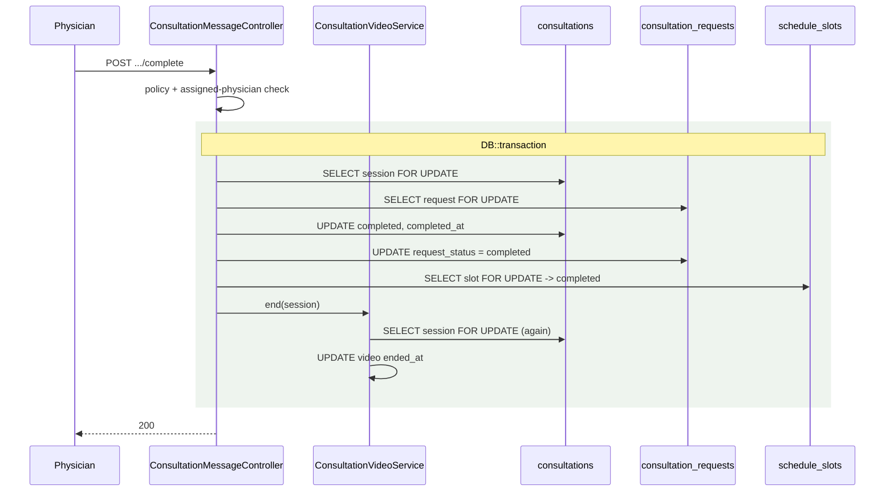
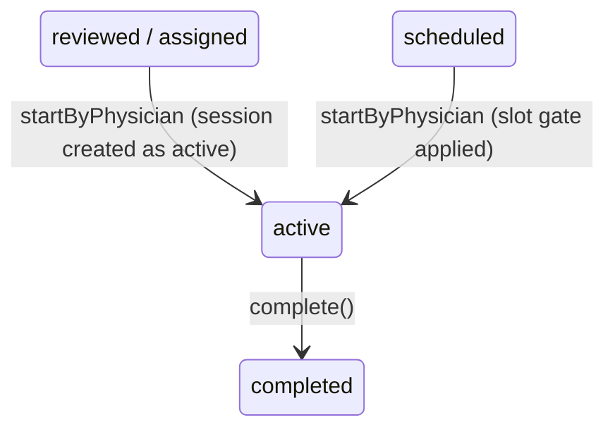

# Active Consultation

> Terminology follows `docs/paper/glossary.md`. Figure and table numbers use the
> `X.n` placeholder pending final manuscript numbering.

## 1. Feature Name

Active Consultation — starting a consultation, the physician's active and scheduled
consultation lists, and completing the encounter.

## 2. Purpose

To move a consultation request from an appointment into a live clinical encounter,
and to close it cleanly when the physician is finished — releasing the schedule
slot, ending any running video call, and notifying the patient, all atomically.

## 3. Actors / Roles

| Actor | Involvement |
|---|---|
| Physician | Starts and completes. Only the assigned physician may do either. |
| Patient | Notified on both events; gains messaging access while active. |

## 4. User Workflow

**Starting.** From the consultation inbox (or the scheduled-consultations page),
the physician POSTs to `.../consultations/{consultation}/start` with their own
`physician_id`. `startByPhysician()` creates the consultation session if it does
not exist, applies the slot gate when the request is `scheduled`, then sets both
tables to `active`.

**During.** The physician works in the messaging screen
(`consultation-messaging.md`), records clinical details
(`clinical-documentation.md`), and may open a video call
(`video-consultation.md`).

**Completing.** The physician POSTs to `.../consultation-sessions/{session}/complete`.
In one transaction the session and request become `completed`, the booked slot
becomes `completed`, and any running video session is ended.

## 5. Routes

| Method | URI | Name |
|---|---|---|
| POST | `/physicians/{physician}/consultations/{consultation}/start` | `physician.consultations.start` |
| GET | `/physicians/{physician}/active_consultation` | `physician.active_consultation` |
| GET | `/physicians/{physician}/scheduled_consultation` | `physician.scheduled_consultation` |
| POST | `/consultation-sessions/{session}/complete` | `consultations.messaging.complete` |

## 6. Controllers

`PhysicianController::startConsultation`, `::activeConsultations`,
`::scheduledConsultations`; `ConsultationMessageController::complete`.

## 7. Services

`ConsultationOwnershipService::startByPhysician()` for the start transition.
`ConsultationVideoService::end()`, injected into `complete()` as a method
dependency. `NotificationService::sendUnique()` for both notifications.

**Completion does not go through `ConsultationOwnershipService`.** It holds its own
transaction and locks inside `ConsultationMessageController::complete`.

## 8. Models

`Consultation`, `ConsultationSession`, `ScheduleSlot`, `ConsultationVideoSession`.

## 9. Database

**Start** writes:

| Table | Change |
|---|---|
| `consultation_requests` | `request_status = 'active'`, `assigned_physician_id` |
| `consultations` | created if absent; `physician_id`, `consultation_status = 'active'`, `started_at = now()` |

**Complete** writes:

| Table | Change |
|---|---|
| `consultations` | `consultation_status = 'completed'`, `completed_at = now()` |
| `consultation_requests` | `request_status = 'completed'` |
| `schedule_slots` | `booked` or `missed` → `completed` |
| `consultation_video_sessions` | any row with null `ended_at` → `ended_at = now()` |

## 10. Validation and Authorization

**Start:** `authorizePhysician()`, then `physician_id` is validated as required
integer and compared to `Auth::id()` (403 on mismatch). The id passed to the
service is always `Auth::id()`.

**Complete:** two layers —

```php
$this->authorize('viewMessaging', $session);      // ConsultationSessionPolicy

abort_unless(
    Auth::user()->role === 'physician' && (int) $session->physician_id === (int) Auth::user()->user_id,
    403,
    'Only the assigned physician can complete this consultation.'
);
```

The policy permits the patient too, so the explicit `abort_unless` is what makes
completion physician-only. This is one of the few places a registered policy and an
ad-hoc check are layered.

## 11. Business Rules

| # | Rule | Enforced by | Enforcement type |
|---|---|---|---|
| BR-1 | Only `reviewed`, `assigned`, or `scheduled` requests may be started | Status re-check under the lock | **Application (transaction + lock)** |
| BR-2 | A request held by another physician cannot be started | `assigned_physician_id` guard under the lock | **Application** |
| BR-3 | A scheduled consultation needs a valid slot to start | `$shouldApplyScheduledGate` branch | **Application** |
| BR-4 | The slot must be owned by the starter **or** claimed by them through takeover | `$ownsSlot \|\| $claimedByTakeover` | **Application** |
| BR-5 | The slot must be `booked` or `missed` | `in_array($slot->status, ['booked','missed'], true)` | **Application** |
| BR-6 | A booked slot may be started from 15 minutes before its start until its end | `$canStartAt = $slotStart->subMinutes(15)`; refusals on both sides | **Application** |
| BR-7 | A missed or taken-over slot bypasses the time window | `if ($slot->status === 'booked' && !$claimedByTakeover)` | **Application** |
| BR-8 | Only the assigned physician may complete | `abort_unless` in `complete()` | **Application** |
| BR-9 | Only an `active` consultation may be completed | `abort_if($session->consultation_status !== 'active', 422)` | **Application** |
| BR-10 | Completion is idempotent | Early-return when both session and request are already `completed` | **Application** |
| BR-11 | Session, request, slot, and video close together or not at all | One `DB::transaction` wrapping all four | **Application (transaction)** |
| BR-12 | A session exists at most once per request | `consultations_request_id_unique_ownership` | **Database** |

Only BR-12 has database backing.

## 12. Concurrency

**Start** takes up to three locks in one transaction: the request row, the session
row (created then immediately re-selected `lockForUpdate()` if it was absent), and
the slot row.

**Complete** takes three locks in its own transaction — session, request, slot —
and ends the video session **inside** that same transaction. The comment states the
reason: *"Close any running video call last, inside this same transaction, so the
room can never outlive the consultation and a rollback leaves it open."*



*Figure X.14 — Completion. `ConsultationVideoService::end()` re-locks the session
row it is already inside the transaction for, which is safe because the lock is
re-entrant within one transaction.*

A test proves the atomicity claim directly: *"rolls back the video closure when the
completion transaction fails."*

## 13. Status / State Transitions



*Figure X.15 — Both tables move together at each transition. `consultations` also
has a `cancelled` enum value on MySQL, but no code path in this feature writes it.*

## 14. Error and Edge-Case Handling

| Case | Response | Evidence |
|---|---|---|
| Wrong status to start | 422 *"Only reviewed, assigned, or scheduled consultations can be started."* | `startByPhysician` |
| Another physician holds it | 422 | Same |
| Scheduled with no slot | 422 *"This consultation has no assigned schedule slot yet."* | Same |
| Slot not owned and not taken over | 422 *"The assigned schedule slot is not ready to start."* | Same |
| Started too early | 422 *"This consultation cannot be started yet."* | Same |
| Slot window ended (still `booked`) | 422 *"This schedule slot window has already ended. Please reschedule…"* | Same; test: *"still blocks starting while the slot is booked but outside its time window"* |
| Slot `missed` | Start permitted immediately | Comment: *"A missed slot is by definition already past its window"* |
| Taken over | Time guards skipped | Comment in `startByPhysician` |
| Completing a non-active session | 422 *"Only active consultations can be completed."* | `complete()` |
| Completing twice | Idempotent 200 with the existing status and `completed_at` | `complete()`; test: *"stays idempotent on a second completion and does not overwrite ended_at"* |
| Non-assigned physician completes | 403 | `abort_unless` |
| Missing request row | 404 | `abort_unless($consultationRequest, 404)` |
| No video session existed | Completes normally, creating none | *"completes a consultation that never had a video session without creating one"* |
| Another consultation's video call | Untouched | *"does not close another consultation's active video session"* |

## 15. UI Implementation

**`resources/views/physician/active_consultation.blade.php`** — the physician's
list of consultations at `request_status = 'active'` assigned to them. Verified by
test:

- the **consultation type column was dropped**;
- the symptoms cell is **capped at 3 chips with a dynamic "+N more" indicator**, and
  shows no indicator at 3 or fewer;
- the **assigned nurse column was dropped**, and the submitted date is formatted
  like the consultation inbox;
- the modal carries StatusBadge tokens, additional information, and routed
  attachment URLs;
- a follow-up consultation is **marked** in the list; an initial one is not.

Patient presence and attachment URLs are computed in the controller, not the view,
with comments saying why: so the presence rule stays the one already used by the
consultation inbox, and so `serializeAttachmentUrls()` remains the one place that
knows a stored attachment may be a Cloudinary URL or a local fallback path.

**Completion** is triggered from the messaging screen. On success the Alpine
component sets `videoActive = false` and switches `activeTab = 'assessment'`, and
the composer is replaced by a read-only notice — asserted by
`ConsultationMessagingUiTest`: *"replaces the composer with a read-only notice once
the consultation is completed."*

## 16. Tests

| File | Cases | Covers |
|---|---|---|
| `tests/Feature/PhysicianActiveConsultationTableTest.php` | 7 | Column composition, symptom chip cap, modal payload, follow-up marking |
| `tests/Feature/ConsultationCompletionVideoTest.php` | 11 | Video closed on completion, history preserved, room name untouched, idempotency, slot completed alongside, isolation from other consultations, and **rollback of the video closure when the transaction fails** |
| `tests/Feature/PhysicianStartMissedSlotTest.php` | 1 | The booked-but-outside-window refusal |
| `tests/Feature/ConsultationConcurrencyTest.php` | 8 (3 relevant) | Single-winner start; start after cancellation; cancellation after start |

**Coverage gap:** the 15-minute early-start allowance (BR-6) has no test asserting
the *lower* boundary — only the window-ended refusal is covered.

## 17. Source-Code Evidence

| Claim | Evidence |
|---|---|
| Start creates the session when absent | `ConsultationOwnershipService::startByPhysician`, the `if (!$session)` branch, followed by an immediate re-lock |
| Scheduled gate | `$shouldApplyScheduledGate = $consultation->request_status === 'scheduled';` |
| Takeover-aware slot matching | `$claimedByTakeover` / `$ownsSlot` |
| 15-minute allowance | `$canStartAt = $slotStart->subMinutes(15);` |
| Completion is physician-only | `abort_unless(Auth::user()->role === 'physician' && (int) $session->physician_id === ...)` |
| Completion idempotency | The early-return block comparing both statuses to `completed` |
| Video closed inside the transaction | `$videoSessions->end($lockedSession);` as the last statement in the transaction, with its comment |
| Slot completed on completion | `if ($lockedSlot && in_array($lockedSlot->status, ['booked','missed'], true))` |
| Patient notification | `NotificationService::sendUnique(... CONSULTATION_COMPLETED ...)` |

## 18. Limitations / Gaps

| # | Limitation |
|---|---|
| AC-1 | **`activeConsultations()` performs writes on a GET request.** It backfills a missing consultation session with `ConsultationSession::firstOrCreate()`, and will also rewrite `physician_id` and `consultation_status` on an existing session. The comment calls this a backfill "for active records created before messaging rollout", but it runs on every page load, unconditionally, with **no transaction and no lock** — unlike every other session write in the system. |
| AC-2 | **That backfill can silently reassign a session.** `if ((int) $session->physician_id !== (int) Auth::id()) { $session->update(['physician_id' => Auth::id()]); }` executes for any `active` request whose `assigned_physician_id` is the viewer. It bypasses `ConsultationOwnershipService` entirely and has no takeover audit trail. |
| AC-3 | **Completion bypasses `ConsultationOwnershipService`.** It is a correct, well-locked transaction, but it lives in `ConsultationMessageController` rather than the service that owns every other state transition. A future change to completion rules must be found there rather than in the obvious place. |
| AC-4 | **The 15-minute early-start allowance is a duplicated literal.** It appears in `startByPhysician` (enforcement) and `buildCanStartInfoFromSlot` (display). Compare `TAKEOVER_GRACE_MINUTES`, a shared constant, and `takeoverEligibleAt()`, a shared method. See gap SC-4. |
| AC-5 | **`consultations.consultation_status = 'cancelled'` is unreachable from this feature.** The MySQL enum permits it and `create_consultations_table` also defines a `cancellation_reason` column, but no code path in the start/complete lifecycle writes either. |
| AC-6 | **No test for the early-start lower boundary.** The upper boundary (window ended) is tested; starting one minute before `slotStart - 15min` is not. |
| AC-7 | **`started_at` is overwritten on every start.** The final `$session->update([... 'started_at' => now()])` runs unconditionally, so a session that was somehow started twice would lose its original start time. The status guard makes this unreachable in practice. |
