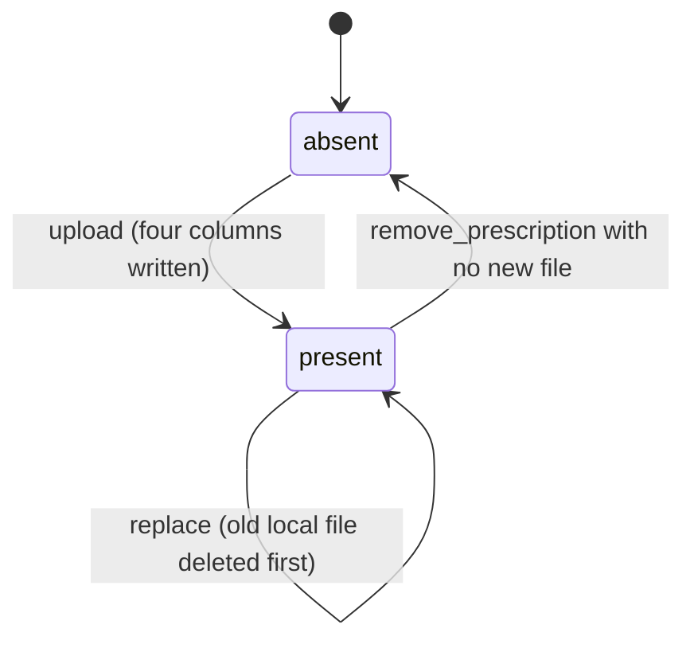

# Attachments and Prescriptions

> Terminology follows `docs/paper/glossary.md`. Note the glossary's three-way
> distinction: **request attachments**, **message attachments**, and
> **prescriptions** are separate mechanisms stored and served differently. Figure
> and table numbers use the `X.n` placeholder pending final manuscript numbering.

## 1. Feature Name

Attachments and Prescriptions — file upload, storage, and authorized download for
message attachments and consultation prescriptions, including the Cloudinary-first
storage strategy and the migration of local files off the public disk.

## 2. Purpose

To let participants exchange clinical files, and the physician issue a
prescription, without ever placing patient data behind a URL that bypasses
authorization.

That second half is the design story worth telling. The private disk exists because
the public disk does not authorize:

> *"It is deliberately not the public disk: files there are served straight off the
> filesystem by the web server through the public/storage symlink, which would
> bypass the authorization every download action in this controller performs."*
> — `ConsultationMessageController::PRIVATE_DISK` docblock

## 3. Actors / Roles

| Actor | Involvement |
|---|---|
| Patient | Uploads message attachments; downloads attachments and their prescription. |
| Physician | Uploads message attachments and the prescription; downloads both. |
| Nurse | **Blanket access to request attachments only** (`AttachmentController`), never to message attachments or prescriptions. |

## 4. User Workflow

**Message attachment.** A participant attaches up to three files to a message. Each
is uploaded to Cloudinary; if that throws, the file is stored on the **private
disk** `message_attachments` under `message-attachments/{sessionId}/`. Either way a
`message_attachments` row records `file_name`, `file_path`, `mime_type`,
`file_size`.

**Prescription.** The assigned physician uploads a file through the clinical-details
endpoint. Same Cloudinary-first strategy, stored under
`consultation-prescriptions/{sessionId}/`. The previous prescription file is
deleted before the new one is recorded. A `remove_prescription` flag with no new
file clears all four columns.

**Download.** Every download authorizes first, then branches on whether the stored
value begins with `http`.

## 5. Routes

| Method | URI | Name | Serves |
|---|---|---|---|
| GET | `/consultation-message-attachments/{attachment}/download` | `consultations.messaging.attachments.download` | message attachments |
| GET | `/consultation-sessions/{session}/prescription/download` | `consultations.messaging.prescription.download` | prescriptions |
| GET | `/consultations/{consultation}/attachments/{file}` | `consultation.attachment` | **request** attachments |
| POST | `/consultation-sessions/{session}/messages` | `consultations.messaging.store` | upload |
| POST | `/consultation-sessions/{session}/clinical-details` | `consultations.messaging.clinical_details.update` | prescription upload |

## 6. Controllers

`ConsultationMessageController::store`, `::updateClinicalDetails`,
`::downloadAttachment`, `::downloadPrescription`, plus private
`forceCloudinaryDownload` and `deletePrescriptionFile`.
`AttachmentController::show` and `::canViewAttachments` for request attachments.

## 7. Services

**None.** Uploads call the Cloudinary facade directly from the controller.

One console command participates: `MoveMessageAttachmentsToPrivateDisk`
(`attachments:move-to-private`).

## 8. Models

`App\Models\MessageAttachment` — table `message_attachments`, PK `attachment_id`,
`belongsTo(Message::class, 'message_id', 'message_id')`.

Prescriptions have **no model of their own** — they are four columns on
`consultations`.

## 9. Database

**`message_attachments`** (`2026_07_20_111811`):

| Column | Type | Notes |
|---|---|---|
| `attachment_id` | bigint | **PK** |
| `message_id` | FK → `consultation_messages.message_id` | cascade on delete |
| `file_name` | string | original client name |
| `file_path` | string | **either a Cloudinary URL or a private-disk relative path** |
| `mime_type` | string(100) | |
| `file_size` | unsignedBigInteger | |

**Prescription columns on `consultations`** (`2026_07_20_111240`):
`prescription_file_name`, `prescription_file_path`, `prescription_mime_type`,
`prescription_file_size` — all nullable.

**Request attachments** live in `consultation_requests.file_attachments`, a
`longText` column cast to `array`, holding a list of URLs.

**Disks** (`config/filesystems.php`): `local`, `public`, `s3`, and the project's own
**`message_attachments`** disk. The private disk is asserted by test to be *"outside
the public web root and unserveable by the framework."*

## 10. Validation and Authorization

**Message attachment validation** (`store`):

| Rule | Value |
|---|---|
| Count | max **3** per message (`MAX_ATTACHMENTS_PER_MESSAGE`) |
| Extensions | `jpg, jpeg, png, pdf, doc, docx, mp4` (`ATTACHMENT_EXTENSIONS`) |
| Non-video size | 10 MB (`MAX_FILE_SIZE_MB`) |
| Video size | 50 MB (`MAX_VIDEO_SIZE_MB`) |
| Videos per message | **1** (`MAX_VIDEOS_PER_MESSAGE`) |

The per-type size cap and the one-video cap are enforced in a `$validator->after()`
closure, because they depend on which file is being inspected and *"can't be
expressed as static rule strings."* MP4 is the only video format, deliberately:
*"it is the one format both Cloudinary and every modern browser play back without
transcoding, which this application does not do."*

**Prescription validation**: `nullable|file|max:10240|mimes:pdf,jpg,jpeg,png,doc,docx`
— note **no mp4**, unlike message attachments.

**Authorization:**

| Endpoint | Guard |
|---|---|
| `downloadAttachment` | `authorize('viewMessaging', $session)` — resolved from the attachment → message → session chain |
| `downloadPrescription` | `authorize('viewMessaging', $session)` |
| prescription upload | `authorize('viewMessaging')` **plus** an explicit assigned-physician `abort_unless` **plus** `abort_if` on non-`active` status |
| `AttachmentController::show` | `canViewAttachments()` — nurse: always; physician: own request **or** one still in `PHYSICIAN_POOL_STATUSES`; everyone else including the owning patient: refused |

## 11. Business Rules

| # | Rule | Enforced by | Enforcement type |
|---|---|---|---|
| BR-1 | Cloudinary first, local private disk on failure | `try/catch` then `if (!$storedPath)` | **Application** |
| BR-2 | A stalled upload must not hold a worker for the SDK's 60 s default | `'timeout'`/`'connect_timeout'` from `config('cloudinary.upload_timeout')` | **Application (config)** |
| BR-3 | Local files never land on the public disk | `$file->store(..., self::PRIVATE_DISK)` | **Application** |
| BR-4 | Every download authorizes before reading bytes | `authorize()` precedes every `Storage::download` | **Application (policy)** |
| BR-5 | Download branches on URL vs path | `str_starts_with($path, 'http')` | **Application** |
| BR-6 | Cloudinary prescriptions download rather than open inline | `forceCloudinaryDownload()` inserts `fl_attachment` | **Application** |
| BR-7 | Attachments may be browser-cached privately, prescriptions never | `Cache-Control: private, max-age=3600` on attachments only | **Application** |
| BR-8 | Replacing a prescription deletes the old local file | `deletePrescriptionFile()` before the new `forceFill` | **Application** |
| BR-9 | A Cloudinary-hosted prescription is never deleted locally | `deletePrescriptionFile()` returns early on an `http` path | **Application** |
| BR-10 | Deleting a message removes its attachments | `cascadeOnDelete()` on `message_id` | **Database** |

BR-10 is the only database-enforced rule.

**Why attachments may be cached but prescriptions may not** — both comments are
explicit and worth quoting in the manuscript:

- Attachment: *"A stored attachment is immutable: replacing a file means a new row
  and therefore a new URL… Deliberately 'private', never 'public': this is patient
  data and must not sit in a shared or proxy cache."*
- Prescription: *"a prescription is served from a per-session URL whose file can be
  replaced in place, so caching it would risk showing a superseded prescription."*

## 12. Concurrency

**None.** No upload or download path opens a transaction or takes a lock.
Attachments are append-only inserts. The prescription columns are last-write-wins:
two physicians cannot collide because only the assigned physician may write, and
`updateClinicalDetails` additionally requires the session to be `active`.

The one ordering hazard is in the prescription replace path —
`deletePrescriptionFile()` runs **before** `$session->save()`. If the save then
failed, the old file would already be gone while the row still referenced it.
Recorded as gap AP-5.

## 13. Status / State Transitions

Files have no status column. The only lifecycle is the prescription's presence:

*Figure X.16 — Prescription presence on a consultation session.*

## 14. Error and Edge-Case Handling

| Case | Behaviour | Evidence |
|---|---|---|
| Cloudinary throws | Logged, file stored on the private disk, request succeeds | `store()` / `updateClinicalDetails()` |
| Cloudinary stalls | Bounded by the configured timeout | Test: *"bounds the cloudinary upload timeout well below the sdk default"* |
| Over-size image or document | 422 *"This file is too large. Images and documents must be 10 MB or smaller."* | `$validator->after()` |
| Over-size video | 422 *"This video is too large. Videos must be 50 MB or smaller."* | Same |
| Two videos | 422 *"You can attach only 1 video per message."* | Same |
| Four attachments | 422 | Test: *"rejects 4 attachments on one message"* |
| Unsupported type | 422 *"This file type is not supported."* | Custom message |
| Unrelated user downloads | 403 | Tests for both attachment and prescription |
| Guest downloads | Redirected to login | Two dedicated tests |
| Prescription missing | 404 | `abort_unless($session->prescription_file_path, 404)` |
| Physician views a pooled request's attachment | Allowed | `PhysicianAttachmentAccessTest` |
| Physician views a request that left the pool and belongs to another | Blocked | Same file |
| Patient views their own request attachment via `AttachmentController` | **Blocked** — they reach it through `ConsultationController` instead | `canViewAttachments()` docblock and test |
| Migration command re-run | Safe; Cloudinary rows untouched | `AttachmentPrivateStorageTest` |
| Migration source file missing | Reported, not silently skipped | Same |
| Migration dry run | Touches nothing | Same |

## 15. UI Implementation

Within `messaging.blade.php`:

- A pending file can be removed before sending, and previews as an image where
  applicable.
- A sent image attachment previews inline in the chat bubble through a shared
  popup.
- A **video attachment opens in that shared popup rather than navigating to it** —
  asserted by test.
- The prescription preview popup has **image-only thumbnail gates**, so a PDF or
  DOCX prescription shows no broken thumbnail.
- The physician can cancel a selected prescription file before saving.
- `@keydown.escape.window` closes the preview.

Download URLs are always route URLs (`route('consultations.messaging.attachments.download', $attachment)`
in `serializeMessage()`), never raw storage paths — so the authorization step can
never be skipped by the client.

## 16. Tests

| File | Cases | Covers |
|---|---|---|
| `tests/Feature/ConsultationMessageAttachmentLimitsTest.php` | 14 | Every size, count, and type boundary in both directions |
| `tests/Feature/AttachmentPrivateStorageTest.php` | 14 | Private-disk storage for attachments and prescriptions, participant-only download, guest refusal, disk unserveable by the framework, and the full migration command including idempotency, missing-source reporting, and dry run |
| `tests/Feature/PhysicianAttachmentAccessTest.php` | 5 | The `AttachmentController` pool rule for physicians, nurse blanket access, patient refusal |
| `tests/Feature/ConsultationMessagePerformanceTest.php` | 7 (3 relevant) | Working download URLs, private-not-public caching, outsider and guest refusals |

This is a well-covered feature — 36 relevant cases.

## 17. Source-Code Evidence

| Claim | Evidence |
|---|---|
| Private disk rationale | `ConsultationMessageController::PRIVATE_DISK` docblock |
| Disk name | `private const PRIVATE_DISK = 'message_attachments';` |
| Fallback path | `$file->store('message-attachments/' . $session->id, self::PRIVATE_DISK)` with its comment |
| Prescription fallback path | `$file->store('consultation-prescriptions/' . $session->id, self::PRIVATE_DISK)` |
| Per-type caps in `after()` | The `$validator->after(function ($validator) use ($request) {...})` block |
| MP4-only rationale | `ATTACHMENT_EXTENSIONS` docblock |
| Cloudinary timeout rationale | The comment in `store()` explaining `buildUploadParams()` whitelisting |
| `fl_attachment` insertion | `forceCloudinaryDownload()` and its docblock |
| Caching policy | `ATTACHMENT_CACHE_SECONDS` docblock and the `Cache-Control` header |
| Request-attachment pool rule | `AttachmentController::PHYSICIAN_POOL_STATUSES` and `canViewAttachments()` |
| Public→private migration | `MoveMessageAttachmentsToPrivateDisk`, `PUBLIC_DISK`/`PRIVATE_DISK` constants |

## 18. Limitations / Gaps

| # | Limitation |
|---|---|
| AP-1 | **Three attachment mechanisms with three different security postures.** Message attachments are private-disk and policy-gated. Prescriptions are the same. **Request attachments are not** — `ConsultationController::store` writes its Cloudinary fallback to the **public** disk as `asset('storage/...')`, a publicly reachable URL, and `AttachmentController` reads from `disk('public')`. The hardening applied to messaging was never applied to submission. See gap CR-4. |
| AP-2 | **The patient cannot use `AttachmentController`.** `canViewAttachments()` refuses every role except nurse and physician, including the patient who uploaded the file. The docblock says patients "reach their own attachments through ConsultationController instead", which renders them in the consultation-details view rather than through this route. |
| AP-3 | **Cloudinary-hosted files are never deleted.** `deletePrescriptionFile()` returns early for an `http` path, and nothing deletes a Cloudinary message attachment at any point. Replaced and removed files persist in the Cloudinary account indefinitely. |
| AP-4 | **A Cloudinary URL is a bearer URL.** `downloadAttachment` authorizes, then `redirect()->away($attachment->file_path)`. Once a participant has the URL, it is fetchable by anyone who obtains it, with no further authorization — the authorization protects the route, not the file. The private-disk path does not have this property. |
| AP-5 | **The old prescription file is deleted before the row is saved.** `deletePrescriptionFile()` runs ahead of `$session->save()`, with no transaction. A failure in between leaves the row pointing at a file that no longer exists. |
| AP-6 | **Prescription MIME types differ from attachment types for no stated reason.** Attachments accept `mp4`; prescriptions do not. Sensible, but undocumented in the code. |
| AP-7 | **Uploads happen inside the request cycle.** A 50 MB video is uploaded to Cloudinary synchronously while the PHP worker blocks. The configured timeout bounds the damage; queueing would remove it, but `QUEUE_CONNECTION=database` and no job exists. |
| AP-8 | **`file_path` is polymorphic.** One `string` column holds either an absolute URL or a disk-relative path, distinguished only by a `str_starts_with($path, 'http')` test repeated in four places (`downloadAttachment`, `downloadPrescription`, `deletePrescriptionFile`, `AttachmentController::show`). |
