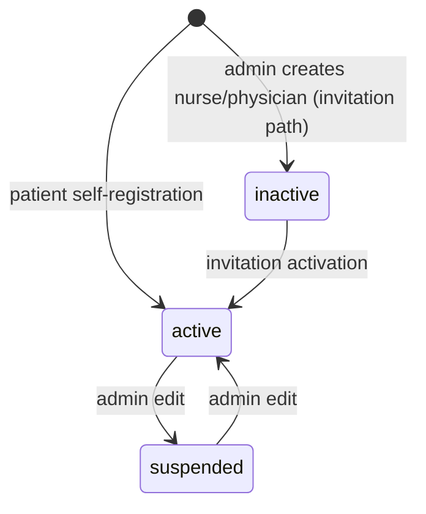

# Authentication and Registration

> Terminology follows `docs/paper/glossary.md`. Figure and table numbers use the
> `X.n` placeholder pending final manuscript numbering.

## 1. Feature Name

Authentication and Registration — patient self-registration, email verification,
login and logout, password reset, and self-service profile and password management.

## 2. Purpose

To establish and maintain user identity for all four roles, and to enforce that
only holders of an official CLSU email address may create a patient account.

Two purposes are enforced by code rather than merely intended:

1. **Institutional restriction.** Registration rejects any address that is not
   `@clsu.edu.ph` or `@clsu2.edu.ph` (`RegisteredUserController::store`).
2. **Role asymmetry.** Only patients may self-register. The registration path
   hard-codes `'role' => 'patient'`; nurses and physicians are provisioned by
   invitation (see `staff-invitation-and-activation.md`) and admins are created
   directly by another admin.

## 3. Actors / Roles

| Actor | Involvement |
|---|---|
| Patient | The only role that can self-register. Verifies email, logs in, resets password, edits profile. |
| Nurse, Physician | Do not register. They log in, reset passwords, and edit profiles once activated. |
| Admin | Does not register. Created directly; auto-verified on creation. |
| Guest | May reach registration, login, forgot-password, and reset-password only. |

## 4. User Workflow

**Patient registration**

1. Guest opens `GET register` (`resources/views/auth/register.blade.php`).
2. Submits first name, last name, CLSU ID, email, password, password confirmation.
3. `RegisteredUserController::store` validates. A non-CLSU address fails with the
   message *"Only official CLSU email addresses (@clsu.edu.ph or @clsu2.edu.ph) are
   allowed to register."*
4. A `User` row is created with `role = 'patient'`, `account_status = 'active'`,
   `online_status = 'offline'`, `user_type = null`.
5. `event(new Registered($user))` fires, sending the verification email.
6. The user is logged in immediately and redirected to `dashboard`.
7. Because the main route group requires `verified`, the user lands on the
   verification prompt until they click the emailed link.

**Login**

1. Guest submits email and password to `POST login`.
2. `LoginRequest::authenticate()` checks the rate limiter, then `Auth::attempt()`.
3. **Only after credentials succeed** is `account_status` checked. A non-`active`
   account is logged straight back out with *"This account is inactive."*
4. On success the session is regenerated and the user is sent to `dashboard`,
   where `DashboardController::index` branches on role.

**Logout**

1. `POST logout` → `AuthenticatedSessionController::destroy`.
2. If the user is a physician, `PhysicianAvailabilityService::close($user)` runs
   **first**, so a physician who logs out stops appearing to accept new
   consultation requests.
3. The session is invalidated and regenerated, then `online_status` is set to
   `offline` and `last_seen_at` to now.

**Password reset** — standard Laravel broker: request a link at
`POST forgot-password`, set a new password at `POST reset-password`, redirect to
login.

**Profile and password self-service** — `GET profile` renders three partials;
profile fields post to `PATCH profile`, password to `PUT password`.

## 5. Routes

All declared in `routes/auth.php` unless noted.

| Method | URI | Name | Middleware |
|---|---|---|---|
| GET | `register` | `register` | `guest` |
| POST | `register` | — | `guest` |
| GET | `login` | `login` | `guest` |
| POST | `login` | — | `guest` |
| GET | `forgot-password` | `password.request` | `guest` |
| POST | `forgot-password` | `password.email` | `guest` |
| GET | `reset-password/{token}` | `password.reset` | `guest` |
| POST | `reset-password` | `password.store` | `guest` |
| GET | `verify-email` | `verification.notice` | `auth` |
| GET | `verify-email/{id}/{hash}` | `verification.verify` | `auth`, `signed`, `throttle:6,1` |
| POST | `email/verification-notification` | `verification.send` | `auth`, `throttle:6,1` |
| GET | `confirm-password` | `password.confirm` | `auth` |
| POST | `confirm-password` | — | `auth` |
| PUT | `password` | `password.update` | `auth` |
| POST | `logout` | `logout` | `auth` |
| GET | `/profile` | `profile.edit` | `auth` (in `routes/web.php`) |
| PATCH | `/profile` | `profile.update` | `auth` (in `routes/web.php`) |

Note the profile routes sit in an `auth`-only group in `routes/web.php`, **not**
the `auth`+`verified` group that guards the rest of the application.

## 6. Controllers

`Auth\RegisteredUserController`, `Auth\AuthenticatedSessionController`,
`Auth\VerifyEmailController`, `Auth\EmailVerificationPromptController`,
`Auth\EmailVerificationNotificationController`, `Auth\PasswordResetLinkController`,
`Auth\NewPasswordController`, `Auth\PasswordController`,
`Auth\ConfirmablePasswordController`, `ProfileController`.

## 7. Services

Only one, and only on logout: `PhysicianAvailabilityService::close()`, called from
`AuthenticatedSessionController::destroy`. Everything else uses the framework's
`Auth` and `Password` facades directly; there is no bespoke authentication service.

## 8. Models

`App\Models\User` (table `users`, PK `user_id`), implementing `MustVerifyEmail`.

Relevant members:

- `$casts`: `email_verified_at => datetime`, `password => hashed`,
  `last_seen_at => datetime`.
- `$hidden`: `password`, `remember_token`.
- `User::INVITED_ROLES = ['nurse', 'physician']`.
- `User::booted()` — a `creating` hook that sets `email_verified_at = now()` when
  the role is `admin` and the field is empty. Nurses and physicians are
  deliberately excluded, because they verify by accepting their invitation.

## 9. Database

**Table `users`** (`0001_01_01_000000_create_users_table.php`), PK `user_id`.

| Column | Type | Notes |
|---|---|---|
| `user_id` | bigint, auto-increment | **PK** |
| `first_name`, `last_name` | string(100) | required |
| `email` | string(150) | **unique** |
| `email_verified_at` | timestamp, nullable | |
| `password` | string(255) | `NOT NULL` — significant for invited staff |
| `role` | enum | `patient`, `nurse`, `physician`, `admin`; default `patient` |
| `account_status` | enum | `inactive`, `active`, `suspended`; default `active` |
| `online_status` | enum | `offline`, `online`; default `offline` |
| `clsu_id` | string(50), nullable | |
| `user_type` | enum → later nullable | `student`, `staff`, `faculty` |
| `department`, `staff_position`, `specialization` | string(100), nullable | |
| `contact_num` | string(20), nullable | |
| `last_seen_at` | timestamp, nullable | |
| `remember_token`, `created_at`, `updated_at` | | |

**`user_type` was made nullable** by
`2026_09_01_000000_make_user_type_nullable_on_users_table.php`, because patient
self-registration writes `null` to it. That migration takes different paths for
SQLite and MySQL, and its `down()` backfills `'student'` before restoring
`NOT NULL`.

**Table `password_reset_tokens`**
(`2026_07_15_000000_create_password_reset_tokens_table.php`): `email` (indexed),
`token`, `created_at`. Broker expiry 60 minutes, throttle 60 seconds
(`config/auth.php`).

**Table `sessions`**, created alongside `users`, holds session payloads keyed by a
string `id` with a nullable indexed `user_id`.

## 10. Validation and Authorization

**Registration** (`RegisteredUserController::store`):

| Field | Rules |
|---|---|
| `first_name`, `last_name` | required, string, max 100 |
| `clsu_id` | **required**, string, max 50 |
| `email` | required, string, lowercase, email, max 150, `unique:users`, and `regex:/^[a-zA-Z0-9._%+-]+@clsu2?\.edu\.ph$/i` |
| `password` | required, confirmed, `Rules\Password::defaults()` |

**Login** (`LoginRequest`): `email` required/email, `password` required/string.
Rate limited at **5 attempts** per `email|ip` key (`ensureIsNotRateLimited`), with
a `Lockout` event on trip.

**Password reset** (`NewPasswordController::store`): `token`, `email`, and a
confirmed `password` meeting `Rules\Password::defaults()`.

**Password update** (`PasswordController::update`): `current_password` must match,
new `password` confirmed and meeting defaults; errors go to the `updatePassword`
error bag.

**Profile update** (`ProfileUpdateRequest`): `first_name` and `last_name` required
(max 255); `clsu_id`, `department`, `contact_num` nullable. **Email and role are
not in the rule set**, so a user cannot change either through this form.

**Authorization** is entirely middleware-based here — `guest` on the pre-login
routes, `auth` (plus `signed` and `throttle` on verification) afterwards. No
policy governs this feature.

## 11. Business Rules

| # | Rule | Enforced by | Enforcement type |
|---|---|---|---|
| BR-1 | Only `@clsu.edu.ph` / `@clsu2.edu.ph` addresses may self-register | `RegisteredUserController::store` regex | **Application** |
| BR-2 | Self-registration always produces a `patient` | Hard-coded `'role' => 'patient'` | **Application** |
| BR-3 | Email addresses are unique | `users.email` unique index **and** the `unique:` validation rule | **Database and application** |
| BR-4 | Account status is revealed only after correct credentials | `LoginRequest::authenticate` ordering | **Application** |
| BR-5 | A non-`active` account cannot hold a session | `LoginRequest::authenticate` logs the user back out | **Application** |
| BR-6 | Admins are verified at creation; nurses and physicians are not | `User::booted()` creating hook | **Application** |
| BR-7 | Changing your own email clears verification | `ProfileController::update` nulls `email_verified_at` when the attribute is dirty | **Application** |
| BR-8 | A physician who logs out stops accepting new consultation requests | `AuthenticatedSessionController::destroy` closes the intake session first | **Application** |

Note BR-3 is the only rule in this feature with database backing. Everything else
is application-enforced and would not survive a direct database write.

## 12. Status / State Transitions

This feature touches `users.account_status` and `users.online_status` only.

*Figure X.1 — `users.account_status` transitions. The `inactive → active` edge is
owned by the staff invitation feature, not by this one.*

`online_status` toggles `offline ↔ online`, written by `TrackUserPresence` on every
authenticated request and forced to `offline` on logout.

## 13. Error and Edge-Case Handling

| Case | Behaviour | Evidence |
|---|---|---|
| Non-CLSU email at registration | Validation error with a custom message | `RegisteredUserController::store` |
| Wrong password | `auth.failed` message; limiter incremented | `LoginRequest::authenticate` |
| Correct password, inactive account | Logged straight back out, limiter incremented, *"This account is inactive."* | `LoginRequest::authenticate` |
| Six or more failed logins | `Lockout` event, throttle message with remaining seconds | `LoginRequest::ensureIsNotRateLimited` |
| Already-verified user clicks the verification link | Redirected to dashboard with `?verified=1`, no second `Verified` event | `VerifyEmailController::__invoke` |
| Verification link with a bad hash | Rejected by `EmailVerificationRequest` (signed middleware) | `tests/Feature/Auth/EmailVerificationTest.php` |
| Unknown email at forgot-password | Returns the broker status as a field error rather than confirming existence | `PasswordResetLinkController::store` |
| Wrong `current_password` on password update | Validation error in the `updatePassword` bag | `PasswordController::update` |
| Reset token flashed back on validation failure | Prevented — `bootstrap/app.php` adds `token` to `dontFlash` | `StaffInvitationHardeningTest.php` asserts this for both token types |
| Physician logout when intake close fails | The close runs *before* logout, so a failure leaves the session intact and retryable rather than stranding a logged-out user | Comment and ordering in `AuthenticatedSessionController::destroy` |

## 14. UI Implementation

Blade + Tailwind, guest layout for pre-login screens. Verified by reading the
views, not inferred from the controllers.

| View | Form action | Fields |
|---|---|---|
| `auth/register.blade.php` | `route('register')` | `first_name`, `last_name`, `clsu_id`, `email`, `password`, `password_confirmation`; link to login |
| `auth/login.blade.php` | `route('login')` | `email`, `password`, `remember` checkbox; link to `password.request` |
| `auth/forgot-password.blade.php` | `route('password.email')` | `email` |
| `auth/reset-password.blade.php` | `route('password.store')` | hidden `token`, `email`, `password`, `password_confirmation` |
| `auth/verify-email.blade.php` | `route('verification.send')` and `route('logout')` | resend button and a logout button |
| `auth/confirm-password.blade.php` | `route('password.confirm')` | `password` |
| `profile/edit.blade.php` | includes three partials | `account-overview`, `update-profile-information-form` (`route('profile.update')`), `update-password-form` (`route('password.update')`) |

Alpine is used only for the password-reveal toggle (`x-data` on the password
inputs, via the `components/password-reveal.blade.php` component). There is no
client-side validation substituting for server rules.

## 15. Tests

| File | Cases | Covers |
|---|---|---|
| `tests/Feature/Auth/RegistrationTest.php` | 3 | screen renders; users can register; **CLSU ID is required** |
| `tests/Feature/Auth/AuthenticationTest.php` | 5 | screen renders; valid login; invalid password; **inactive users cannot authenticate**; logout |
| `tests/Feature/Auth/EmailVerificationTest.php` | 6 | verification screen; email verified; invalid hash rejected; **admins verified immediately on creation**; **nurses and physicians not verified on creation**; clearing a staff verification is not silently undone on save |
| `tests/Feature/Auth/PasswordResetTest.php` | 4 | link screen; link requested; reset screen; reset with a valid token |
| `tests/Feature/Auth/PasswordUpdateTest.php` | 2 | password updated; correct current password required |
| `tests/Feature/Auth/PasswordConfirmationTest.php` | 3 | screen; confirmation succeeds; invalid password rejected |
| `tests/Feature/ProfileTest.php` | 4 | profile displayed; information updated; verification unchanged when email unchanged; **account-deletion route no longer exists** |

**Coverage gap:** no test asserts the CLSU email-domain regex (BR-1) directly. The
registration suite covers the required CLSU ID but not the domain restriction.

## 16. Source-Code Evidence

| Claim | Evidence |
|---|---|
| CLSU domain restriction | `RegisteredUserController::store`, `email` rule `regex:/^[a-zA-Z0-9._%+-]+@clsu2?\.edu\.ph$/i` |
| Self-registration is patient-only | `RegisteredUserController::store`, `'role' => 'patient'` |
| `user_type` written as null at registration | `RegisteredUserController::store`, `'user_type' => null` |
| Status checked after credentials | `LoginRequest::authenticate`, with an explanatory comment on the ordering |
| Login rate limit of 5 | `LoginRequest::ensureIsNotRateLimited`, `RateLimiter::tooManyAttempts($this->throttleKey(), 5)` |
| Physician intake closed on logout | `AuthenticatedSessionController::destroy` |
| Admin auto-verification | `User::booted()` |
| Email change clears verification | `ProfileController::update` |
| Token never flashed | `bootstrap/app.php`, `$exceptions->dontFlash(['token'])` |
| Password reset broker at 60 minutes | `config/auth.php`, `passwords.users.expire => 60` |

## 17. Limitations / Gaps

| # | Limitation |
|---|---|
| A-1 | **BR-1 is untested.** The CLSU email-domain restriction — arguably the most institution-specific rule in the feature — has no test asserting it. A regression would pass CI. |
| A-2 | **Profile routes are not `verified`-gated.** `/profile` sits in an `auth`-only group in `routes/web.php`, unlike the main application group. An authenticated but unverified user can reach and edit their profile. |
| A-3 | **`clsu_id` is required at registration but nullable in the schema and optional in `ProfileUpdateRequest`.** The three layers disagree; only registration enforces presence. |
| A-4 | **Account deletion has been removed.** `ProfileTest` asserts the route no longer exists. There is no self-service or administrative delete — accounts are suspended, not deleted. |
| A-5 | **Email uniqueness is the only database-enforced rule here.** Everything else in section 11 is application-level and bypassable by a direct database write. |
| A-6 | **`user_type` is inconsistent across creation paths.** Only two application paths write it: `RegisteredUserController::store` writes `null`, and `Admin\UserManagementController::store` writes `'staff'` unconditionally. The `student` and `faculty` enum values are written by nothing in `app/` — the only place they appear is `database/factories/UserFactory.php`, which generates test data. The column's enum therefore describes an intent the application no longer implements. |
