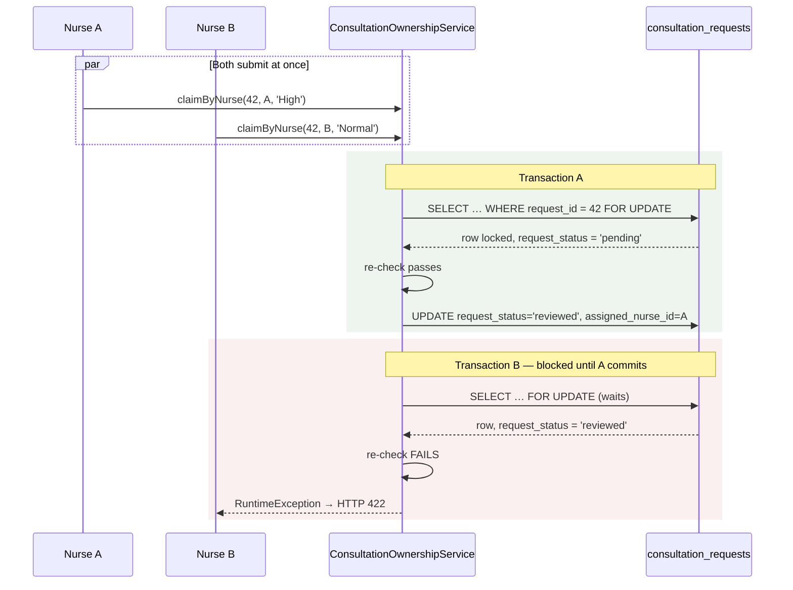

# Concurrency and State Transitions

> Terminology follows `docs/paper/glossary.md`. Figure and table numbers use the
> `X.n` placeholder pending final manuscript numbering.
>
> This is a cross-cutting feature: it has no route and no user interface. It is
> documented separately because it spans every workflow feature, and because it is
> the strongest technical claim the system makes.

## 1. Feature Name

Concurrency Control and State Transitions — the pessimistic-locking pattern that
guards every consultation workflow transition, and the complete map of which
transitions exist.

## 2. Purpose

Two nurses open the same pending consultation request. Both click Approve. Without
protection, both succeed, the second overwrites the first, and the request records
the wrong owner. The same hazard applies to two physicians starting one
consultation, two physicians claiming one takeover, and a patient cancelling while
a physician starts.

`ConsultationOwnershipService` exists to make exactly one of each pair win.

## 3. Actors / Roles

None directly. Every role's workflow action passes through this layer — except the
paths listed in section 9, which do not.

## 4. The pattern

Every transition follows the same four steps:

```php
return DB::transaction(function () {
    $row = Model::query()
        ->where(...)
        ->lockForUpdate()      // 1. acquire the row lock
        ->firstOrFail();

    if ($row->status !== $expected) {   // 2. RE-CHECK under the lock
        throw new \RuntimeException('…');
    }

    $row->update([...]);       // 3. write
    return $row->fresh();      // 4. return committed state
});
```

**The critical distinction, and the one a panel is most likely to probe:**

> The lock **serialises**; the **re-check decides**.

`SELECT … FOR UPDATE` makes the second transaction wait. It does not reject it.
What rejects it is re-reading the status *after* acquiring the lock and finding it
is no longer what the transition requires. A lock without a re-check would let the
loser overwrite the winner; a re-check without a lock would let both read the old
value before either wrote.

## 5. Which row is locked, and why

A recurring decision across three services: **lock the row that always exists.**

| Service | Locks | Stated reason |
|---|---|---|
| `PhysicianAvailabilityService::open()` | the physician's `users` row | *"That row always exists, whereas the session row may not, and a lock cannot be taken on a row that has yet to be inserted"* |
| `ConsultationVideoService::startForPhysician()` | the parent `consultations` row | *"unlike locking the video row, which may not exist yet and therefore cannot reliably block a concurrent insert"* |
| `Admin\UserManagementController::resendInvitation()` | the invitee's `users` row | the token row is deleted and re-inserted by `createToken()` |

Both service docblocks name `ConsultationOwnershipService` as the pattern they are
following. This consistency is worth presenting as a deliberate architectural
choice rather than a coincidence.

## 6. The transitions

`ConsultationOwnershipService` has **eleven** public transition methods plus one
public static helper.

| Method | From → To | Locks taken |
|---|---|---|
| `claimByNurse` | request `pending` → `reviewed` | request |
| `rejectByNurse` | request `pending` → `rejected` | request |
| `cancelByPatient` | request `pending`/`reviewed` → `cancelled` | request (scoped by `patient_id`) |
| `rejectReviewedByPhysician` | request `reviewed` → `rejected` | request |
| `scheduleByPhysician` | request `reviewed`/`assigned`/`scheduled` → `scheduled` | request, slot, session, previous slot |
| `startByPhysician` | request `reviewed`/`assigned`/`scheduled` → `active` | request, session, slot |
| `takeOverByPhysician` | **no status change** — assignment moves | request, session, slot |
| `forwardFollowUpByNurse` | follow-up `pending` → `forwarded` | follow-up request |
| `rejectFollowUpByNurse` | follow-up `pending` → `rejected` | follow-up request |
| `cancelFollowUpByPatient` | follow-up `pending`/`forwarded` → `cancelled` | follow-up request (scoped by `patient_id`) |
| `decideFollowUpByPhysician` | follow-up `forwarded` → `approved`/`rejected` | follow-up request, source session, existence check, slot |
| `takeoverEligibleAt` *(static)* | — | none; a pure helper shared with the inbox renderer |

## 7. The complete state map

```mermaid
stateDiagram-v2
    [*] --> pending : ConsultationController::store
    pending --> reviewed : claimByNurse
    pending --> rejected : rejectByNurse
    pending --> cancelled : cancelByPatient
    reviewed --> rejected : rejectReviewedByPhysician
    reviewed --> cancelled : cancelByPatient
    reviewed --> scheduled : scheduleByPhysician
    reviewed --> active : startByPhysician
    scheduled --> scheduled : scheduleByPhysician (reschedule) / takeOverByPhysician
    scheduled --> active : startByPhysician
    active --> completed : ConsultationMessageController::complete
    completed --> [*]
    rejected --> [*]
    cancelled --> [*]
```

*Figure X.23 — `consultation_requests.request_status`. The `assigned` enum value is
deliberately absent: it exists in the database enum but no code path writes it.*

**Dead values that must never appear in a state diagram:**

| Value | Column | Status |
|---|---|---|
| `assigned` | `consultation_requests.request_status` | In the enum, written by nothing. `Consultation::MEANINGFUL_STATUSES` omits it by design. |
| `expired` | `follow_up_requests.status` | In the enum, written by nothing. (It *is* written on `physician_availability_sessions.status` — a different column.) |
| `cancelled` | `consultations.consultation_status` | In the MySQL enum, written by no path in the consultation lifecycle. |

## 8. Two-table synchrony

Because a consultation lives across `consultation_requests` and `consultations`,
several transitions must write both. Each does so **inside one transaction**, and
the takeover docblock states the reason explicitly: both are written *"in this one
transaction, so they can never disagree."*

| Transition | Writes request | Writes session | Writes slot |
|---|---|---|---|
| `scheduleByPhysician` | `scheduled` | created/updated `scheduled` | → `booked`, previous → `available` |
| `startByPhysician` | `active` | created/updated `active` | — |
| `takeOverByPhysician` | `assigned_physician_id` | `physician_id` + 3 audit columns | **untouched by design** |
| `complete()` | `completed` | `completed`, `completed_at` | → `completed` |
| `decideFollowUpByPhysician` | new request created | new session created | → `booked` |

## 9. What is *not* protected — and this matters

Not every state change goes through this layer. The manuscript should be honest
about the exceptions rather than claiming uniform protection.

| Path | Protection | Consequence |
|---|---|---|
| `ConsultationController::store` — one-open-request rule | **None.** A bare `exists()`, no transaction, no lock, no unique index | Two simultaneous submissions from one patient could both succeed (CR-1) |
| `ConsultationMessageController::complete` | **Full** — its own transaction, three locks | Correct, but lives outside the service (AC-3) |
| `PhysicianController::createFollowUpConsultationFromSource` | Locks, but in the controller; caller supplies the transaction | Duplicates the service's logic with **different** locks (FU-1) |
| `PhysicianController::syncMissedSlotsForPhysician` | **None** | Contrast `MarkMissedScheduleSlots`, which locks three rows per slot (MS-2) |
| `PhysicianController::activeConsultations` backfill | **None**, and it writes on a GET | Can reassign a session's `physician_id` with no audit (AC-1) |
| `PhysicianController::saveScheduleSlots` | **None** | Overlapping-but-distinct slots can both be inserted (SS-1) |
| `FollowUpRequestController::store` duplicate check | **None** (the create *is* wrapped, the check is not) | Two simultaneous follow-up requests could both be created (FU-5) |
| `NotificationService::sendUnique` | **None** | Check-then-insert; duplicates possible in principle (NF-3) |

## 10. Locks versus database constraints

This is the distinction the documentation instruction asked to be drawn explicitly,
and it is stark.

**Database-enforced invariants in the entire consultation workflow — the complete list:**

| Constraint | Table | Guarantees |
|---|---|---|
| `consultations_request_id_unique_ownership` | `consultations` | one session per consultation request |
| `consultations_follow_up_request_id_unique_ownership` | `consultations` | one session per follow-up request |
| `schedule_slots_physician_id_slot_date_start_time_unique` | `schedule_slots` | no two slots start at the same time for one physician on one date |
| `physician_schedules` unique `(physician_id, day_of_week, start_time)` | `physician_schedules` | no duplicate recurring window start |
| `consultation_video_sessions.room_name` unique | `consultation_video_sessions` | no duplicate Jitsi room |
| `users.email` unique | `users` | one account per address |
| `staff_invitation_tokens.email` primary key | `staff_invitation_tokens` | one live invitation per address |
| foreign keys with `cascadeOnDelete` / `nullOnDelete` | many | referential integrity |

**Everything else is application logic.** Specifically, **no database constraint
enforces**:

- that only one nurse may claim a request,
- that only one physician may own a consultation,
- that a slot holds only one session (**`consultations.slot_id` has no unique index**),
- that a physician has at most one open intake session,
- that a consultation may be taken over only once,
- that a status transition is legal at all — every enum permits any value in any order.

The `PhysicianAvailabilitySession` docblock is candid about why one of these was not
constrained: *"a partial unique index is unsupported on MySQL and a plain unique on
(physician_id, status) would wrongly forbid a physician from ever having two closed
sessions."* That is a real engineering trade-off, correctly reasoned, and the
manuscript should present it as such — an invariant held in the service layer by
choice, not an oversight.

## 11. The worked example



*Figure X.24 — The canonical single-winner case. Nurse B's transaction is not
rejected by the lock; it is rejected by the status re-check the lock made
trustworthy.*

## 12. Tests

`tests/Feature/ConsultationConcurrencyTest.php` — **8 cases**, using real
concurrent transactions rather than mocks:

| Case | Proves |
|---|---|
| *"allows only one physician to successfully start the same consultation request"* | single-winner start |
| *"allows only one nurse to claim the same pending consultation request"* | single-winner claim |
| *"allows only one nurse to forward the same follow-up request"* | single-winner forward |
| *"rejects physician start after patient cancellation commits first"* | cross-transition ordering |
| *"rejects nurse claim after patient cancellation commits first"* | cross-transition ordering |
| *"rejects patient cancellation after physician start commits first"* | the reverse ordering |
| *"allows only one physician approval path for forwarded follow-up and creates one follow-up session"* | no duplicate follow-up |
| *"rejects physician follow-up decision after patient follow-up cancellation commits first"* | follow-up ordering |

Plus, in other files: *"allows exactly one physician to win two concurrent claim
attempts"* (`PhysicianTakeoverTest`), *"cannot create a duplicate active video
session from repeated concurrent starts"* and *"locks the parent consultation
session before reading the active video session"* (video tests), *"never leaves a
physician with two open sessions across repeated opens"*
(`PhysicianAvailabilityServiceTest`), and *"serialized resends never leave two valid
invitations"* (`StaffInvitationResendTest`).

**A caveat for the defense.** These tests run against the **in-memory SQLite** test
database (`phpunit.xml`), whose locking semantics differ from MySQL's row-level
`SELECT … FOR UPDATE`. The tests demonstrate that the *application logic* rejects
the loser; they are not a proof of MySQL row-lock behaviour. The logic is correct
on both engines because the re-check — not the lock — is what decides.

## 13. Source-Code Evidence

| Claim | Evidence |
|---|---|
| Eleven transitions plus one static helper | `ConsultationOwnershipService` method list |
| The lock-then-check pattern | Any transition method, e.g. `claimByNurse` |
| Lock the row that always exists | `PhysicianAvailabilityService::open()` and `ConsultationVideoService` class docblocks, both naming `ConsultationOwnershipService` |
| Both tables written together | `takeOverByPhysician` docblock |
| No new status on takeover | `2026_09_01_120000_add_takeover_columns_to_consultations_table.php` docblock |
| `assigned` is dead | `Consultation::MEANINGFUL_STATUSES` docblock |
| Why no partial unique index | `PhysicianAvailabilitySession` class docblock |
| Bulk update is safe where there is no cross-table invariant | `PhysicianAvailabilityService::expireStaleSessions()` docblock, contrasting itself with `MarkMissedScheduleSlots` |
| Grace period shared between display and enforcement | `ConsultationOwnershipService::takeoverEligibleAt()` docblock |

## 14. Limitations / Gaps

| # | Limitation |
|---|---|
| CX-1 | **Protection is not uniform.** Eight paths that change state do not use this layer (section 9). The three most consequential are the one-open-request rule (no protection at all), the duplicated follow-up creation (FU-1), and the GET-request session backfill (AC-1). |
| CX-2 | **No status transition is constrained by the database.** Every status column is a plain enum; the legality of `pending → completed` is enforced only by the absence of code that would do it. A direct `UPDATE` can move any row to any enum value. |
| CX-3 | **`consultations.slot_id` has no unique index.** Double-booking a slot is prevented solely by the `status === 'available'` re-check under the slot lock (SC-1). |
| CX-4 | **Concurrency tests run on a different engine than production.** SQLite in tests, MySQL in dev and production. See the caveat in section 12. |
| CX-5 | **Lock ordering is not documented anywhere in the code.** `scheduleByPhysician` takes request → slot → session → previous slot; `startByPhysician` takes request → session → slot. The orders differ between methods. No deadlock has been observed and the paths do not obviously interleave, but nothing enforces a global ordering, and no test exercises two *different* transitions against overlapping rows simultaneously. |
| CX-6 | **`RuntimeException` is the only failure channel.** Every guard throws the same class, distinguished only by message text, which controllers surface as a 422 body. A caller cannot programmatically tell "wrong status" from "owned by someone else". |
| CX-7 | **Completion lives outside the service.** `ConsultationMessageController::complete` is correctly locked but is the one full lifecycle transition not in `ConsultationOwnershipService` (AC-3). |
