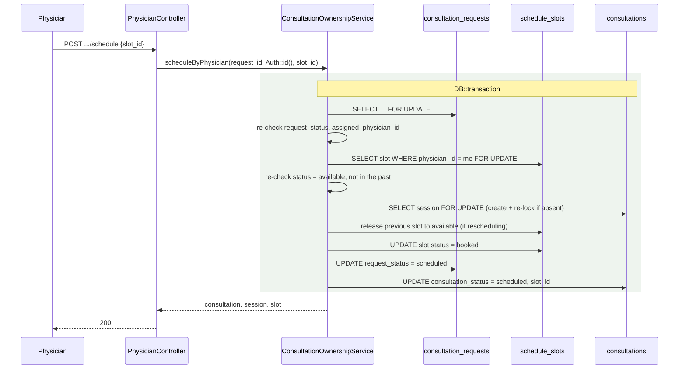
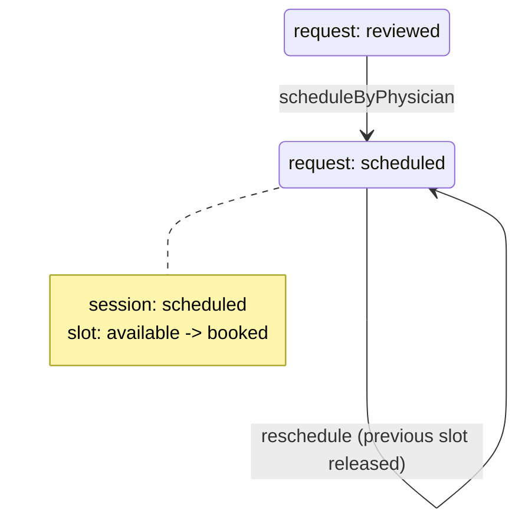

# Consultation Scheduling (Slot Booking)

> Terminology follows `docs/paper/glossary.md`. Figure and table numbers use the
> `X.n` placeholder pending final manuscript numbering.

## 1. Feature Name

Consultation Scheduling — a physician books a nurse-reviewed **consultation
request** onto one of their own **schedule slots**, creating the **consultation
session** that will carry the clinical encounter.

## 2. Purpose

This is the step that turns an abstract request into an appointment. It is also
the only place in the system where a `consultations` row and a `schedule_slots`
booking are created together, and it doubles as the **reschedule** path.

## 3. Actors / Roles

| Actor | Involvement |
|---|---|
| Physician | Selects a slot and books it. Only their own slots are offered. |
| Patient | Notified with the scheduled date and time. |

## 4. User Workflow

1. From the consultation inbox modal, the physician requests
   `GET .../consultations/{consultation}/available-slots`.
2. The endpoint returns the physician's own `available` slots dated today or
   later, with already-elapsed slots filtered out, each with a display label.
3. The physician picks one and POSTs to `.../consultations/{consultation}/schedule`
   with `physician_id` and `slot_id`.
4. `ConsultationOwnershipService::scheduleByPhysician()` runs the whole booking in
   one transaction under four row locks.
5. The patient is notified with the formatted date and start time.

**Rescheduling uses the same path.** A request already at `scheduled` may be
scheduled again; the service releases the previously booked slot back to
`available` before booking the new one.

## 5. Routes

| Method | URI | Name |
|---|---|---|
| GET | `/physicians/{physician}/consultations/{consultation}/available-slots` | `physician.consultations.available_slots` |
| POST | `/physicians/{physician}/consultations/{consultation}/schedule` | `physician.consultations.schedule` |

## 6. Controllers

`PhysicianController::availableScheduleSlotsForConsultation` and
`::scheduleConsultation`, plus the private `serializeScheduledSlot`,
`resolveCanStart`, and `buildCanStartInfoFromSlot` that render scheduling state
into the inbox.

## 7. Services

`ConsultationOwnershipService::scheduleByPhysician()` — the sole writer of this
transition. `NotificationService::sendUnique()` for the patient notification.

## 8. Models

`Consultation` (`consultation_requests`), `ConsultationSession` (`consultations`),
`ScheduleSlot` (`schedule_slots`, PK `slot_id`, `slot_date` cast to `date`,
`start_time`/`end_time` deliberately uncast wall-clock strings).

## 9. Database

Three tables are written in one transaction:

| Table | Change |
|---|---|
| `consultation_requests` | `request_status = 'scheduled'`, `assigned_physician_id` |
| `consultations` | created if absent, then `physician_id`, `consultation_status = 'scheduled'`, `slot_id` |
| `schedule_slots` | chosen slot → `booked`; a previously booked slot → back to `available` |

When the session is created here it is seeded with placeholder clinical text:

```php
'assessment'      => 'Initial assessment pending.',
'plan'            => 'Plan to be documented during consultation.',
'recommendations' => 'Recommendations to follow after evaluation.',
'assigned_at'     => now(),
```

Those three columns are `NOT NULL` in `create_consultations_table`, which is why
placeholders exist at all. `ConsultationSession::hasMeaningfulAssessment()` and its
siblings exist precisely to distinguish these placeholders from real clinical
content — see `clinical-documentation.md`.

**Relevant constraint:** `consultations_request_id_unique_ownership`
(`2026_08_20_120000`) makes `consultations.request_id` unique, so one consultation
request can never acquire two sessions. **There is no unique index on
`consultations.slot_id`.**

## 10. Validation and Authorization

`PhysicianController::authorizePhysician()` first. Then:

```php
$validated = $request->validate([
    'physician_id' => 'required|integer',
    'slot_id'      => 'required|integer',
]);

if ((int) $validated['physician_id'] !== (int) Auth::id()) {
    return response()->json([...], 403);
}
```

The submitted `physician_id` is a redundant confirmation, not the authority — the
id passed to the service is always `Auth::id()`.

The slot lookup itself is **scoped by physician in the query**:

```php
$slot = ScheduleSlot::query()
    ->where('slot_id', $selectedSlotId)
    ->where('physician_id', $physicianId)
    ->lockForUpdate()
    ->first();
```

So another physician's slot cannot be booked — it simply does not exist in this
query.

## 11. Business Rules

| # | Rule | Enforced by | Enforcement type |
|---|---|---|---|
| BR-1 | Only `reviewed`, `assigned`, or `scheduled` requests may be scheduled | Status re-check **under the lock** | **Application (transaction + lock)** |
| BR-2 | A request held by another physician cannot be scheduled | `assigned_physician_id` guard under the lock | **Application (under lock)** |
| BR-3 | Only the acting physician's own slots may be booked | `where('physician_id', $physicianId)` inside the locked query | **Application** |
| BR-4 | The slot must still be `available` | `if (!$slot || $slot->status !== 'available')` under the lock | **Application (under lock)** |
| BR-5 | A slot whose start time has passed cannot be booked | `isScheduleSlotInPast()` — `now() >= slotStart` | **Application** |
| BR-6 | Rescheduling releases the previous slot | Previous slot locked, and set back to `available` if still `booked` | **Application (under lock)** |
| BR-7 | One session per consultation request | `consultations_request_id_unique_ownership` | **Database (unique index)** |
| BR-8 | One session per slot | **Not enforced anywhere** — see gap SC-1 | **None** |
| BR-9 | Only future-or-current slots are offered | `whereDate('slot_date','>=',today)` plus the `isScheduleSlotInPast()` filter | **Application** |

BR-7 is the only rule here with database backing.

## 12. Concurrency

`scheduleByPhysician()` is the most lock-heavy transition in the system. Inside one
`DB::transaction` it takes **up to four** `lockForUpdate()` locks, in this order:

1. the `consultation_requests` row,
2. the chosen `schedule_slots` row (scoped to this physician),
3. the `consultations` row — and if it had to be created, it is **immediately
   re-selected `lockForUpdate()`** so the new row is held under the same lock as
   everything else,
4. the previously booked `schedule_slots` row, when rescheduling.



*Figure X.8 — Slot booking. Every guard is re-evaluated after its row is locked.*

**Lock versus constraint.** The locks serialise competing bookings and the
re-checks reject the loser. Only BR-7 has a database constraint. In particular,
**nothing at the database level prevents two consultation sessions pointing at the
same `slot_id`** — the "one session per slot" rule is entirely a product of
BR-4's `status !== 'available'` check happening under the slot lock.

## 13. Status / State Transitions



*Figure X.9 — Scheduling transitions across all three tables.*

## 14. Error and Edge-Case Handling

| Case | Response | Evidence |
|---|---|---|
| Request not in a schedulable status | 422 *"Only reviewed, assigned, or scheduled consultations can be scheduled."* | `scheduleByPhysician` |
| Request held by another physician | 422 *"This consultation is already being handled by another physician."* | Same |
| Slot taken, missing, or not the physician's | 422 *"Selected slot is no longer available."* — one message covers all three so no slot ownership is disclosed | Same |
| Slot already started | 422 *"Selected slot is already in the past. Please choose a future slot."* | `isScheduleSlotInPast()` |
| `physician_id` mismatch in the payload | 403 | `scheduleConsultation` |
| Consultation not schedulable when listing slots | 422 *"This consultation cannot be scheduled."* | `availableScheduleSlotsForConsultation` |
| Physician has no usable slots | `no_slots: true` plus a `manage_schedule_url` pointing at the slot manager | Same method |

## 15. UI Implementation

The scheduling controls live in the physician consultation inbox modal, not on a
page of their own. Each inbox row is serialised server-side with an
`available_slots_url` and a `schedule_url`
(`PhysicianController::serializeConsultations`), because the inbox table is drawn
with Alpine `x-for` and cannot use per-row Blade components.

The slots endpoint returns a ready-made `label` (`'g:i A' - 'g:i A'`) so the modal
renders no time formatting of its own, and `no_slots` plus `manage_schedule_url`
so an empty result becomes a link to the slot manager rather than a dead end.

Scheduled state is fed back into the inbox by `serializeScheduledSlot()`, and
whether the Start button is enabled comes from `resolveCanStart()`:

| Situation | `can_start` | Message |
|---|---|---|
| Status `reviewed` / `assigned` | true | "This consultation can be started immediately." |
| Slot missing or not `booked`/`missed` | false | "Assigned slot is missing or not booked." |
| Slot `completed` | false | "Assigned slot is already completed and cannot be reused." |
| Slot `missed` | true | "Assigned slot was missed. You can start now or reschedule to a new slot." |
| Slot `booked`, window ended | false | "This schedule slot window has already ended. Reschedule…" |
| Slot `booked`, within 15 minutes of start | true | "Consultation is ready to start." |
| Slot `booked`, too early | false | "Start will be available at …" |

The **15-minute early-start allowance** (`$slotStart->subMinutes(15)`) is duplicated
in `buildCanStartInfoFromSlot()` for display and in
`ConsultationOwnershipService::startByPhysician()` for enforcement — see gap SC-4.

## 16. Tests

| File | Cases | Relevance |
|---|---|---|
| `tests/Feature/ConsultationConcurrencyTest.php` | 8 | Concurrent start/claim/cancel interleavings against the same locked rows |
| `tests/Feature/PhysicianConsultationInboxTableTest.php` | 8 | `can_start` gate and `starts_at_iso` slot formatting |
| `tests/Feature/PhysicianTakeoverTest.php` | 19 | Exercises scheduled consultations extensively as a precondition |

**Coverage gap:** there is no test file dedicated to `scheduleByPhysician`. Neither
the happy path, the reschedule-releases-previous-slot behaviour (BR-6), the
past-slot refusal (BR-5), nor the slot-ownership scoping (BR-3) is directly
asserted.

## 17. Source-Code Evidence

| Claim | Evidence |
|---|---|
| Four locks in one transaction | `ConsultationOwnershipService::scheduleByPhysician` — four `lockForUpdate()` calls |
| New session immediately re-locked | `$session = ConsultationSession::query()->whereKey($session->id)->lockForUpdate()->firstOrFail();` |
| Slot scoped by physician in the query | `->where('slot_id', $selectedSlotId)->where('physician_id', $physicianId)` |
| Reschedule releases the old slot | The `$previousSlotId > 0 && $previousSlotId !== (int) $slot->slot_id` block |
| Past-slot rule uses `>=` slot **start** | `ConsultationOwnershipService::isScheduleSlotInPast` |
| Placeholder clinical text | The `ConsultationSession::create([...])` payload |
| One session per request | `2026_08_20_120000_add_consultation_session_uniques.php` |
| 15-minute allowance | `$canStartAt = $slotStart->subMinutes(15)` in both `startByPhysician` and `buildCanStartInfoFromSlot` |
| Payload `physician_id` is confirmation only | `scheduleConsultation` compares it to `Auth::id()` then passes `Auth::id()` onward |

## 18. Limitations / Gaps

| # | Limitation |
|---|---|
| SC-1 | **No database constraint prevents double-booking a slot.** `consultations.slot_id` has no unique index; `2026_08_20_120000` adds unique indexes on `request_id` and `follow_up_request_id` only. One-session-per-slot holds because BR-4 re-checks `status === 'available'` under the slot lock — correct for every caller that goes through the service, and unprotected against anything that does not. |
| SC-2 | **Scheduling is untested.** The system's most lock-heavy transition has no dedicated test file. The reschedule path (BR-6), which mutates two slots in one transaction, is the least-covered branch. |
| SC-3 | **Placeholder clinical text is written as real data.** Three `NOT NULL` columns receive sentinel strings at session creation. Any query counting "sessions with an assessment" must use `hasMeaningfulAssessment()` rather than a null check. |
| SC-4 | **The 15-minute early-start allowance is duplicated.** It exists as a literal `subMinutes(15)` in both the service (enforcement) and the controller (display), unlike `TAKEOVER_GRACE_MINUTES`, which is a shared constant. They can drift. |
| SC-5 | **`isScheduleSlotInPast()` is duplicated too.** There is a private copy in `ConsultationOwnershipService` and another in `PhysicianController`, with the same logic. |
| SC-6 | **"Past" means the slot has *started*, not ended.** `isScheduleSlotInPast()` compares against `slotStart` with `>=`, so a slot currently in progress cannot be booked. That is defensible but differs from the missed-slot rule, which uses `slotEnd`. |
| SC-7 | **The available-slots endpoint applies no capacity or conflict logic beyond status.** It lists every `available` future slot; it does not exclude slots overlapping another of the physician's booked slots, because slot generation already prevents overlaps at creation time. |
