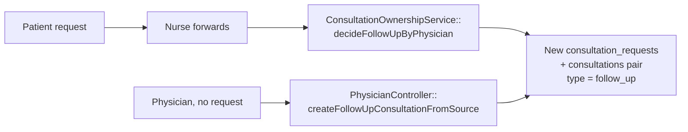
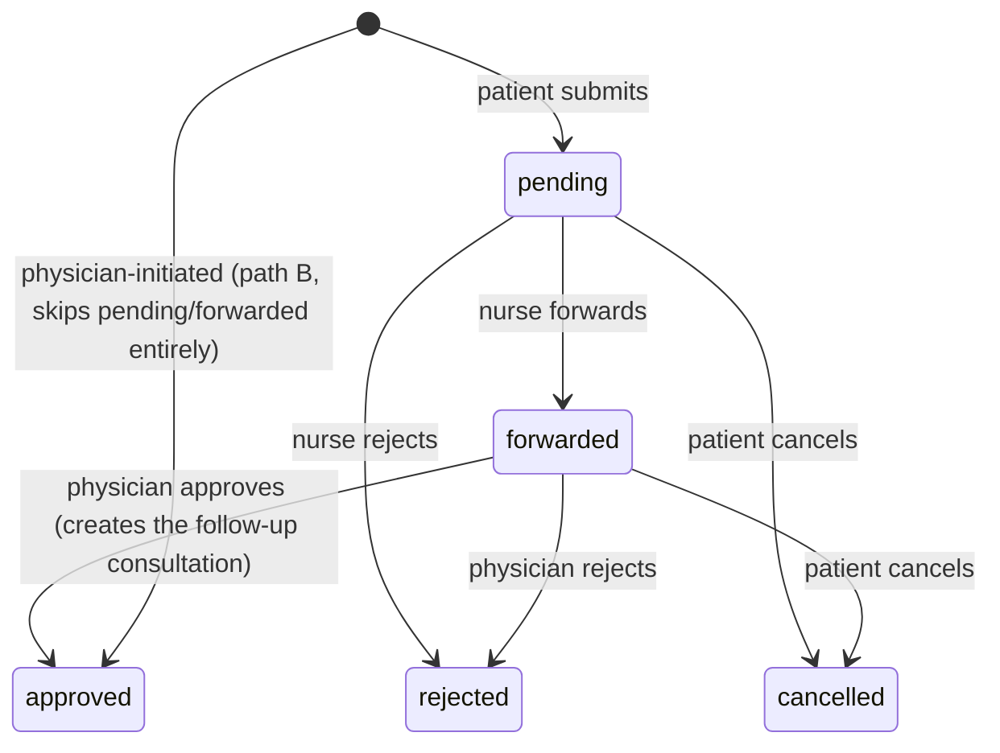

# Follow-Up Consultation

> Terminology follows `docs/paper/glossary.md` §6: a **follow-up request** is the
> `follow_up_requests` row; a **follow-up consultation** is the new
> `consultation_requests` + `consultations` pair it produces. Figure and table
> numbers use the `X.n` placeholder pending final manuscript numbering.

## 1. Feature Name

Follow-Up Consultation — the patient-initiated follow-up request, nurse triage of
it, the physician's decision, and the physician-initiated shortcut that bypasses
both.

## 2. Purpose

To let care continue after a consultation is completed, without asking the patient
to submit a fresh request and re-enter everything. A follow-up consultation
inherits the parent's concern category, symptoms, online reason, priority,
attachments, and assigned nurse verbatim.

## 3. Actors / Roles

| Actor | Involvement |
|---|---|
| Patient | Requests a follow-up on a completed session; may cancel while `pending` or `forwarded`. |
| Nurse | Forwards a pending request to physicians, or rejects it. |
| Physician | Decides a forwarded request (approve immediate/scheduled, or reject), **or** creates a follow-up directly from a session they completed. |

## 4. User Workflow — three paths that converge

**Path A — patient → nurse → physician.**
Patient submits on `/follow-up-list` → `FollowUpRequestController::store` creates a
`pending` row and fans out to nurses → a nurse forwards (`forwarded`) or rejects →
a physician decides. On approval, `ConsultationOwnershipService::decideFollowUpByPhysician()`
creates the follow-up consultation.

**Path B — physician-initiated.**
`PhysicianController::createPhysicianFollowUp` creates the consultation through the
controller's own private `createFollowUpConsultationFromSource()`, then writes a
`follow_up_requests` row that is **already `approved`** with
`reviewed_by_nurse_id = null` and the reason *"Physician scheduled a follow-up
consultation directly."* No nurse ever sees it.

**Path C — patient cancels.** While `pending` or `forwarded`, via
`cancelFollowUpByPatient()`.

Both approval paths produce the same thing: a new `Consultation` of
`type = 'follow_up'` with `parent_consultation_id` pointing at the **originating
session** (`consultations.id`), plus its own `ConsultationSession`.

## 5. Routes

| Method | URI | Name | Actor |
|---|---|---|---|
| GET | `/follow-up-list` | `patient.follow_up_list` | patient |
| POST | `/consultation-sessions/{session}/follow-up-requests` | `patient.follow_up_requests.store` | patient |
| POST | `/follow-up-requests/{followUpRequest}/cancel` | `patient.follow_up_requests.cancel` | patient |
| GET | `/nurses/{nurse}/follow-up-requests` | `nurse.follow_up_requests` | nurse |
| POST | `/nurses/{nurse}/follow-up-requests/{followUpRequest}/forward` | `nurse.follow_up_requests.forward` | nurse |
| POST | `/nurses/{nurse}/follow-up-requests/{followUpRequest}/reject` | `nurse.follow_up_requests.reject` | nurse |
| GET | `/physicians/{physician}/follow-up-requests` | `physician.follow_up_requests` | physician |
| GET | `.../follow-up-requests/{followUpRequest}/available-slots` | `physician.follow_up_requests.available_slots` | physician |
| GET | `.../consultation-sessions/{session}/follow-up/available-slots` | `physician.follow_up.available_slots` | physician |
| POST | `.../follow-up-requests/{followUpRequest}/decide` | `physician.follow_up_requests.decide` | physician |
| POST | `.../consultation-sessions/{session}/follow-up` | `physician.follow_up.create` | physician |

## 6. Controllers

`FollowUpRequestController::index/store/cancel`;
`NurseController::followUpRequests/forwardFollowUpRequest/rejectFollowUpRequest`;
`PhysicianController::followUpRequests/decideFollowUpRequest/createPhysicianFollowUp/availableSlotsForFollowUpRequest/availableSlotsForPhysicianFollowUp`
and the private `createFollowUpConsultationFromSource`.

## 7. Services

`ConsultationOwnershipService::forwardFollowUpByNurse`, `::rejectFollowUpByNurse`,
`::cancelFollowUpByPatient`, `::decideFollowUpByPhysician`.

**Path B does not use the service** — this is the feature's defining structural
problem, detailed in section 12.

## 8. Models

`App\Models\FollowUpRequest` — table `follow_up_requests`, PK `id`. Relations:
`consultation()` → the **source** `ConsultationSession`; `followUpConsultation()` →
the **produced** session via `follow_up_request_id`; `patient()`,
`reviewedByNurse()`, `decidedByPhysician()`.

## 9. Database

**`follow_up_requests`** (`2026_08_06_172148`):

| Column | Notes |
|---|---|
| `id` | PK |
| `consultation_id` | FK → `consultations.id` — the **source session** |
| `patient_id` | FK → `users.user_id` |
| `reviewed_by_nurse_id`, `decided_by_physician_id` | nullable FKs, `nullOnDelete` |
| `reason` | text |
| `status` | enum `pending`, `forwarded`, `approved`, `rejected`, `cancelled`, `expired` |
| `decision_notes` | text, nullable |
| `reviewed_at`, `decided_at` | nullable timestamps |

**`expired` is never written by any code path** — see gap FU-6.

**On `consultation_requests`** (`2026_08_06_180500`): `type` enum
`initial`/`follow_up` default `initial`, and `parent_consultation_id` → `consultations.id`.

**On `consultations`** (`2026_08_17_182744`): `follow_up_request_id`, made
**unique** by `consultations_follow_up_request_id_unique_ownership`
(`2026_08_20_120000`).

## 10. Validation and Authorization

| Action | Guard | Validation |
|---|---|---|
| Request | `role === 'patient'` **and** the session's `patient_id` matches | `reason` required, max 2000 |
| Cancel | `role === 'patient'` **and** `patient_id` matches, then re-scoped in the locked query | — |
| Nurse forward | `authorizeNurse()` | `decision_notes` nullable, max 2000 |
| Nurse reject | `authorizeNurse()` | `decision_notes` **required**, max 2000 |
| Physician decide | `authorizePhysician()` | `decision` in `approved,rejected`; `mode` `required_if:decision,approved` and in `immediate,scheduled`; `slot_id` nullable int; `decision_notes` nullable |
| Physician create | `authorizePhysician()` **plus** assigned-physician check **plus** source must be `completed` | `mode` required; `decision_notes` **required**, max 2000 |

Note the asymmetry: nurse *rejection* requires notes, nurse *forwarding* does not;
physician *direct creation* requires notes, physician *decision* does not.

## 11. Business Rules

| # | Rule | Enforced by | Enforcement type |
|---|---|---|---|
| BR-1 | A follow-up may be requested only for a **completed** session | `store()` checks `consultation_status` and `completed_at` | **Application** |
| BR-2 | Only within **7 days** of completion | `$session->completed_at->lt(now()->subDays(7))` | **Application** |
| BR-3 | Only one live follow-up request per session | `whereIn('status', ['pending','forwarded','approved'])->exists()` | **Application** (no unique index) |
| BR-4 | Only one live follow-up consultation per parent session | `whereIn('request_status', ['pending','scheduled','active'])->exists()`, **under a lock** in both approval paths | **Application (lock)** |
| BR-5 | Only `pending` requests may be forwarded or nurse-rejected | Status re-check under the lock | **Application (lock)** |
| BR-6 | Only `forwarded` requests may be physician-decided | Status re-check under the lock | **Application (lock)** |
| BR-7 | Only `pending` or `forwarded` may be patient-cancelled | Status re-check under the lock | **Application (lock)** |
| BR-8 | Approval requires a valid mode | `in_array((string) $mode, ['immediate','scheduled'], true)` | **Application** |
| BR-9 | Scheduled approval requires an available, future slot owned by the physician | Slot locked, `status === 'available'`, `isScheduleSlotInPast()` | **Application (lock)** |
| BR-10 | A session links to at most one follow-up request | `consultations_follow_up_request_id_unique_ownership` | **Database** |
| BR-11 | The follow-up inherits the parent's clinical context | The `Consultation::create()` payload copies seven fields | **Application** |
| BR-12 | Physician-initiated follow-ups need a completed session they own | Two controller checks before the transaction | **Application** |

BR-10 is the only database-enforced rule.

## 12. Concurrency — and the duplicated logic

Both approval paths take locks, but **they are not the same code and they do not
take the same locks.**

| | Path A — `decideFollowUpByPhysician` | Path B — `createFollowUpConsultationFromSource` |
|---|---|---|
| Owns the transaction | **Yes** (`DB::transaction` inside the service) | **No** — the caller `createPhysicianFollowUp` wraps it |
| Locks the follow-up request row | **Yes** | n/a — creates one afterwards |
| Locks the source session | Yes | Yes |
| **Locks the source request row** | **No** | **Yes** |
| Locks the existing-follow-up existence check | Yes | Yes |
| Locks the slot | Yes | Yes |
| Sets `follow_up_request_id` on the new session | Yes — the real id | **Passes `null`** from `createPhysicianFollowUp` |

The consultation-creation block itself — the `Consultation::create()` payload, the
`$newSessionData` array, the placeholder clinical text, the slot booking — is
**duplicated almost line for line** between the two.

*Figure X.20 — Two independent implementations converging on one outcome. A change
to slot booking or locking in one does not reach the other.*

**Consequence to state plainly in the manuscript:** this is a known maintenance
risk, not a design pattern. `SymptomAnalytics`' own docblock already has to name
both paths when explaining why follow-ups must be excluded from symptom counts —
evidence that the duplication has already leaked into unrelated code.

## 13. Status / State Transitions

*Figure X.21 — `follow_up_requests.status`. `expired` is in the enum and is written
by nothing; it is not a state.*

## 14. Error and Edge-Case Handling

| Case | Response | Test |
|---|---|---|
| Session not completed | Validation error on `reason` | `store()` |
| Past the 7-day window | *"Follow-up requests are only allowed within 7 days of completion."* | `store()` |
| A live request already exists | *"A follow-up request already exists for this consultation."* | `store()` |
| A live follow-up consultation already exists | *"A follow-up consultation is already in progress…"* | `store()` |
| Approval with no mode | 422, request stays `forwarded` | *"rejects approval without a mode and leaves the follow-up request forwarded"* |
| Invalid mode | 422, request stays `forwarded` | *"rejects an invalid approval mode…"* |
| Physician rejects | No consultation created | *"does not create a consultation when a physician rejects a forwarded follow-up request"* |
| Second approval | Refused — no duplicate consultation | *"prevents a second approval from creating a duplicate follow-up consultation"* |
| Two nurses forward at once | Exactly one wins | *"allows only one nurse to forward the same follow-up request"* |
| Two physicians approve at once | One follow-up session created | *"allows only one physician approval path… and creates one follow-up session"* |
| Decision after patient cancellation | Refused | *"rejects physician follow-up decision after patient follow-up cancellation commits first"* |
| Cancel after approval | Refused | *"lets a patient cancel… when pending or forwarded but not after approval"* |
| Scheduled approval, slot taken | 422 *"Selected slot is no longer available."* | `decideFollowUpByPhysician` |
| Scheduled approval, no slot id | 422 *"A schedule slot is required…"* | Same |

## 15. UI Implementation

- **`resources/views/patient/follow_up_list.blade.php`** lists sessions completed
  within the last 7 days — `index()` applies the same `subDays(7)` window as the
  submission rule, so an ineligible session is never offered.
- **`resources/views/nurse/follow_up_requests.blade.php`** lists every `pending`
  request across all patients, eager-loading `patient`, `consultation.request`, and
  `consultation.physician`.
- **`resources/views/physician/follow_up_request.blade.php`** offers approve
  (immediate or scheduled) and reject, with slots fetched from the available-slots
  endpoints.
- The **patient dashboard** surfaces follow-up state through
  `getPatientFollowUpStatus()` and `getPhysicianInitiatedFollowUp()`. Tested
  behaviour: a physician-initiated card is shown with scheduled details, is
  preferred over completed follow-up data, is hidden once completed, is hidden when
  the patient initiated it themselves, and the status card is hidden when the
  latest request was rejected.
- The physician consultation-history row carries `has_existing_follow_up`, and the
  schedule-follow-up action is hidden for consultations that already have one.

Both nurse endpoints return JSON when `expectsJson()` and redirect otherwise, so
the same controller serves both the AJAX and non-AJAX forms.

## 16. Tests

| File | Cases | Focus |
|---|---|---|
| `tests/Feature/FollowUpRequestTest.php` | **20** | Both approval modes, both rejection paths, direct physician creation, duplicate prevention, the request↔consultation↔parent linkage, dashboard cards, and history filtering |
| `tests/Feature/ConsultationConcurrencyTest.php` | 8 (3 relevant) | Single-winner nurse forward, single-winner physician approval, decision-after-cancellation |

**Coverage gap:** no test asserts the **7-day window** (BR-2), and none asserts that
`follow_up_request_id` is left null on path B (FU-3).

## 17. Source-Code Evidence

| Claim | Evidence |
|---|---|
| Two independent implementations | `ConsultationOwnershipService::decideFollowUpByPhysician` vs `PhysicianController::createFollowUpConsultationFromSource` |
| Path B locks the source request too | `Consultation::query()->where('request_id', ...)->lockForUpdate()->first()` — absent from path A |
| Path B passes a null follow-up id | `createPhysicianFollowUp` calls the helper with four arguments, omitting `$followUpRequestId` |
| Path B fabricates an approved request | `FollowUpRequest::create([... 'status' => 'approved', 'reviewed_by_nurse_id' => null, 'reason' => 'Physician scheduled a follow-up consultation directly.'])` |
| Inheritance of parent context | The seven copied fields in both `Consultation::create()` payloads |
| `parent_consultation_id` points at the session | `'parent_consultation_id' => $sourceSession->id` |
| 7-day window | `->where('completed_at', '>=', now()->subDays(7))` in `index()`, `->lt(now()->subDays(7))` in `store()` |
| Duplication already leaked | `SymptomAnalytics` class docblock naming **both** creation paths |
| Unique link | `2026_08_20_120000_add_consultation_session_uniques.php` |

## 18. Limitations / Gaps

| # | Limitation |
|---|---|
| **FU-1** | **Two duplicated implementations of follow-up creation.** The consultation-creation block is near-identical in `ConsultationOwnershipService::decideFollowUpByPhysician` and `PhysicianController::createFollowUpConsultationFromSource`, and they do not take the same locks — path B additionally locks the source request row, path A does not. A fix applied to one will not reach the other. |
| **FU-2** | **Path B bypasses the ownership service entirely.** Every other workflow transition is funnelled through `ConsultationOwnershipService`; this one is not, and its transaction lives in the controller. |
| FU-3 | **Path B leaves `follow_up_request_id` null on the new session.** `createPhysicianFollowUp` creates the `FollowUpRequest` **after** the consultation, so the session is never linked back. `FollowUpRequest::followUpConsultation()` therefore returns null for every physician-initiated follow-up, and the unique index (BR-10) protects a column that path B never populates. |
| FU-4 | **Path B writes a fabricated request record.** It stores a synthetic `reason`, `status = 'approved'`, `reviewed_by_nurse_id = null`, and a `reviewed_at` timestamp for a review that never happened. Any report counting "follow-up requests reviewed by a nurse" must exclude these, and `reviewed_at` is misleading as an audit field. |
| FU-5 | **BR-3 has no unique index.** The one-live-request-per-session rule is an `exists()` check **outside** any transaction in `store()` — the only guard between two simultaneous patient submissions. BR-4's equivalent check *is* locked in both approval paths; BR-3's is not. |
| FU-6 | **`expired` is a dead enum value.** Present in `follow_up_requests.status`, written by nothing. Verified by searching every `'expired'` occurrence in `app/` — all belong to `physician_availability_sessions` or the admin invitation label. Must not appear in a state diagram. |
| FU-7 | **The 7-day window is a hardcoded literal in two places.** `subDays(7)` appears in both `index()` and `store()`, with no constant and no config entry, unlike `TAKEOVER_GRACE_MINUTES`. It is also untested. |
| FU-8 | **Notes requirements are inconsistent.** Nurse rejection requires notes; nurse forwarding does not. Physician direct creation requires notes; physician decision does not — so a physician can reject a follow-up with no recorded reason, and the patient is told *"Reason: No reason provided."* |
| FU-9 | **A follow-up inherits `symptoms_desc` verbatim.** This is correct for continuity but means the copy is not a new patient report — `SymptomAnalytics` must exclude follow-ups to avoid double-counting, a coupling the manuscript should mention when describing analytics. |
