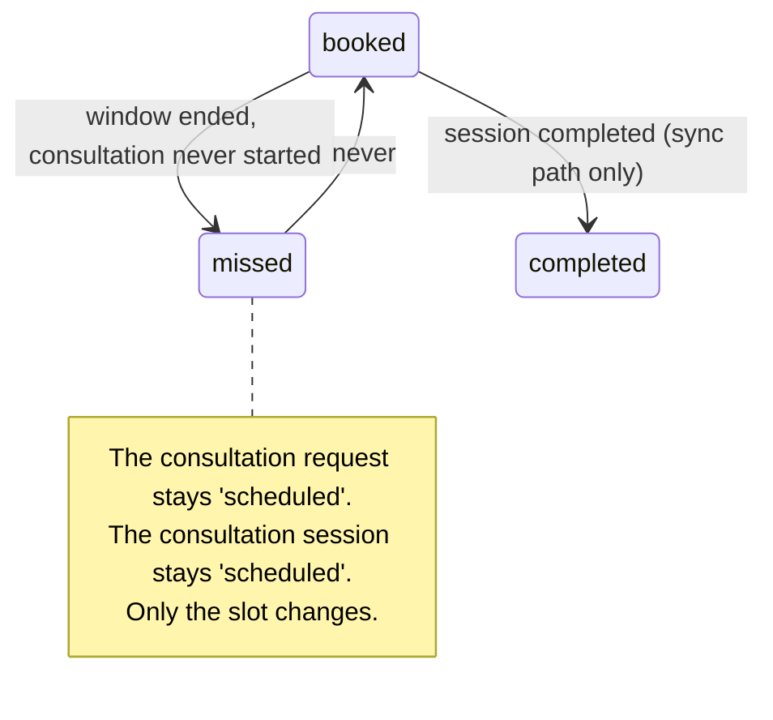

# Missed Schedule Slot Handling

> Terminology follows `docs/paper/glossary.md`. Figure and table numbers use the
> `X.n` placeholder pending final manuscript numbering.

## 1. Feature Name

Missed Schedule Slot Handling — reclaiming a booked **schedule slot** whose window
has passed without the consultation starting, and notifying both parties.

## 2. Purpose

A booked slot represents time a physician has committed. If the consultation never
starts and the window closes, the slot must not stay `booked` forever: it would
misrepresent the physician's availability and leave the patient with no signal that
anything went wrong.

## 3. Actors / Roles

| Actor | Involvement |
|---|---|
| Scheduler | Runs `consultations:mark-missed-slots` every minute. |
| Physician | Triggers the same reconciliation implicitly by opening their scheduled-consultations page, and is notified. |
| Patient | Notified that their consultation was missed. |

## 4. User Workflow

There is no user action. Two independent mechanisms mark a slot `missed`:

**A. The scheduled command** (`MarkMissedScheduleSlots`), every minute. It
collects candidate session ids, then processes each in **its own transaction under
three row locks**, re-checking every precondition before writing. It sends **no
notifications**.

**B. The on-page sync** (`PhysicianController::syncMissedSlotsForPhysician`), run
when a physician opens their scheduled-consultations view. It does the same
`booked → missed` transition **for that physician only**, plus two things the
command does not do: it reconciles `booked → completed` for slots belonging to
completed sessions, and it **sends notifications** to the patient and the physician.

## 5. Routes

None of its own. The sync is reached through
`GET /physicians/{physician}/scheduled_consultation`
(`physician.scheduled_consultation`) via
`getScheduledConsultationsForPhysician()`.

The command is registered in `routes/console.php`:

```php
Schedule::command('consultations:mark-missed-slots')
    ->everyMinute()
    ->withoutOverlapping();
```

## 6. Controllers

`PhysicianController::scheduledConsultations` → private
`getScheduledConsultationsForPhysician()` → private `syncMissedSlotsForPhysician()`.

## 7. Services

**None.** Neither mechanism goes through `ConsultationOwnershipService`. The
command holds its own transaction and locks; the controller sync holds neither.

`NotificationService::sendUnique()` is used by the sync path only.

## 8. Models

`ConsultationSession` (`consultations`), `Consultation` (`consultation_requests`),
`ScheduleSlot` (`schedule_slots`).

## 9. Database

Writes exactly one column: `schedule_slots.status`, set to `'missed'` (or
`'completed'` in the sync's reconciliation branch).

**Nothing else changes.** The consultation request stays `scheduled`, the
consultation session stays `scheduled`, and no timestamp is recorded. There is no
`missed_at` column — the only temporal evidence is the slot's own `end_time` and
`updated_at`.

Both `missed` and `completed` were added to the `schedule_slots.status` enum by
`2026_08_05_125250_alter_status_enum_on_schedule_slots_table.php`, which returns
early on SQLite — so these two values are enum-constrained on MySQL only.

## 10. Validation and Authorization

The command has no authorization; it runs as the scheduler.

The sync is reached only through `scheduledConsultations`, which is guarded by
`authorizePhysician()`, and every query inside it is scoped with
`->where('assigned_physician_id', $physicianId)` and
`->where('physician_id', $physicianId)` so one physician's page can never
reconcile another physician's slots.

## 11. Business Rules

| # | Rule | Enforced by | Enforcement type |
|---|---|---|---|
| BR-1 | A slot is missed only when **all three** of session, request, and slot are still in their scheduled/booked state | The command's three re-checks under lock; the sync's `whereHas` conditions | **Application** |
| BR-2 | The window must have **ended**, not merely started | `if (now()->lessThanOrEqualTo($slotEndsAt)) return;` | **Application** |
| BR-3 | Marking a slot missed never changes the consultation | Only `$slot->update(['status' => 'missed'])` is executed | **Application (by omission)** |
| BR-4 | A missed consultation can still be started | `startByPhysician` accepts slot status `booked` **or** `missed`, and skips the time-window guards for a missed slot | **Application** |
| BR-5 | A completed session's booked slot is reconciled to `completed` | The sync's first query | **Application** |
| BR-6 | Notifications are de-duplicated | `NotificationService::sendUnique()` keyed on the `schedule_slot_id` in the payload | **Application** |
| BR-7 | Overlapping command runs are prevented | `->withoutOverlapping()` on the schedule entry | **Framework (scheduler lock)** |

No database constraint participates in any rule here.

## 12. Concurrency — the two mechanisms differ, and it matters

This is a case where two code paths implement the same rule with **different**
concurrency guarantees, and the manuscript should say so rather than describing
"the missed-slot feature" as one thing.

**The command is fully protected.** It deliberately does not bulk-update. It plucks
candidate ids, then for each one opens a transaction and takes three locks in
order — session, request (via `$session->request()->lockForUpdate()->first()`), and
slot — re-checking each status after acquiring it:

```php
DB::transaction(function () use ($sessionId, &$markedAsMissedCount) {
    $session = ConsultationSession::query()->whereKey($sessionId)->lockForUpdate()->first();
    if (!$session || $session->consultation_status !== 'scheduled' || !$session->slot_id) return;

    $request = $session->request()->lockForUpdate()->first();
    if (!$request || $request->request_status !== 'scheduled') return;

    $slot = ScheduleSlot::query()->where('slot_id', $session->slot_id)->lockForUpdate()->first();
    if (!$slot || $slot->status !== 'booked') return;
    // … time check, then update
});
```

`PhysicianAvailabilityService::expireStaleSessions()` explicitly contrasts itself
with this, saying it uses a single bulk statement because it has "no cross-table
invariant to hold here — unlike MarkMissedScheduleSlots, which locks and re-checks
because it spans session, request and slot."

**The on-page sync is not protected.** `syncMissedSlotsForPhysician()` contains no
`DB::transaction` and no `lockForUpdate()`. It reads sessions with an eager-loaded
slot, then calls `$slot->update(['status' => 'missed'])` in a loop. A physician
loading the page at the same moment the scheduler runs could therefore both write
the same slot. The write is idempotent (`missed` set twice is still `missed`), so
the practical consequence is limited — but the **notifications are not idempotent
by the write**; they rely instead on `sendUnique()` de-duplicating on
`schedule_slot_id`.

The race that actually matters is with **`startByPhysician`**: it locks the slot
and accepts `booked` or `missed`, so a start committing just as the sync runs is
safe on the command path (which re-checks `booked` under the lock) but relies on
ordering on the sync path.

## 13. Status / State Transitions



*Figure X.11 — `schedule_slots.status` transitions owned by this feature. A missed
slot is terminal: nothing returns it to `available`, so the inventory is consumed.*

## 14. Error and Edge-Case Handling

| Case | Behaviour | Evidence |
|---|---|---|
| No candidates | *"No scheduled booked slots to evaluate."*, exit success | `MarkMissedScheduleSlots::handle` |
| Session changed state between pluck and lock | Silently skipped | The three re-checks |
| Slot already `missed`, `completed`, or `available` | Skipped — only `booked` is processed | `if (!$slot || $slot->status !== 'booked') return;` |
| Window not yet over | Skipped | `lessThanOrEqualTo($slotEndsAt)` |
| Command runs twice | Idempotent; the second finds no `booked` candidates | Status re-check |
| Scheduler not running | **Nothing marks slots missed except a physician opening the page.** The gate is not self-correcting the way intake is | See gap MS-1 |
| Patient record missing | Patient notification skipped; physician still notified | `if ($patientId)` guard in the sync |
| Starting a missed consultation | Allowed, and the time-window guards are bypassed | `startByPhysician`'s comment: *"A missed slot is by definition already past its window, so the physician can start immediately"* |

## 15. UI Implementation

There is no dedicated interface. The effect surfaces in two places:

- **The physician inbox**, through `resolveCanStart()`: a `missed` slot yields
  `can_start: true` with the message *"Assigned slot was missed. You can start now
  or reschedule to a new slot."* A `completed` slot yields `can_start: false` with
  *"Assigned slot is already completed and cannot be reused."*
- **Notifications**, via the bell UI, with
  `NotificationType::CONSULTATION_MISSED` — one to the patient (*"Your scheduled
  consultation was missed. Please contact the infirmary to reschedule."*) and one
  to the physician (*"A scheduled consultation slot was missed. Please reschedule
  the consultation."*).

## 16. Tests

| File | Cases | Relevance |
|---|---|---|
| `tests/Feature/PhysicianStartMissedSlotTest.php` | 1 | *"still blocks starting while the slot is booked but outside its time window"* — the boundary between a still-`booked` slot and a `missed` one |
| `tests/Feature/PhysicianTakeoverTest.php` | 19 (1 relevant) | *"lets the claiming physician start even after the original slot window has ended"* |

**Coverage gap, and it is a large one.** There is **no test for
`MarkMissedScheduleSlots` at all** — not the happy path, not the three re-checks,
not the time boundary, not idempotency, and not its registration on the scheduler.
This contrasts sharply with `ExpireStaleIntakeSessions`, which has 19 dedicated
cases in `PhysicianIntakeExpiryTest.php` including *"registers the expiry command on
the scheduler every minute."* There is likewise no test for
`syncMissedSlotsForPhysician` or its notifications.

## 17. Source-Code Evidence

| Claim | Evidence |
|---|---|
| Per-row transaction and three locks | `MarkMissedScheduleSlots::handle`, the `foreach` over `$candidateSessionIds` |
| Deliberate contrast with bulk update | `PhysicianAvailabilityService::expireStaleSessions()` docblock naming `MarkMissedScheduleSlots` |
| Window must have ended | `CarbonImmutable::parse($slotDate.' '.$slot->end_time)`, then `lessThanOrEqualTo` |
| Only the slot changes | The command's single `$slot->update(['status' => 'missed'])` |
| Sync has no transaction or lock | `PhysicianController::syncMissedSlotsForPhysician` contains neither |
| Sync also reconciles completed | Its first query, `where('consultation_status', 'completed')` → `status => 'completed'` |
| Sync sends both notifications | Two `NotificationService::sendUnique(...)` calls with `NotificationType::CONSULTATION_MISSED` |
| Missed slots remain startable | `startByPhysician` — `in_array($slot->status, ['booked','missed'], true)` and the `$slot->status === 'booked' && !$claimedByTakeover` guard |
| Scheduler registration | `routes/console.php`, `->everyMinute()->withoutOverlapping()` |

## 18. Limitations / Gaps

| # | Limitation |
|---|---|
| MS-1 | **Without a scheduler, only a page visit reclaims slots.** `consultations:mark-missed-slots` fires only under `schedule:run` / `schedule:work`. Unlike intake — where `hasOpenIntake()` re-evaluates freshness at read time so the gate stays correct regardless — nothing here self-corrects. On a deployment without cron, a slot stays `booked` until its physician happens to open the scheduled-consultations page. State this as a deployment requirement in the manuscript. |
| MS-2 | **Two implementations of one rule, with different guarantees.** The command locks three rows and re-checks; the controller sync does neither. They also differ in behaviour: only the sync sends notifications, and only the sync reconciles `booked → completed`. A change to the missed-slot rule must be made in both places. |
| MS-3 | **Notifications depend on which path ran.** If the scheduled command marks a slot missed, **no one is notified** — the command sends nothing. The patient learns of it only if a physician later opens the page, at which point the slot is already `missed` and the sync's loop skips it (`if (!$slot \|\| $slot->status !== 'booked') continue;`). In a correctly-scheduled deployment, the missed-consultation notification may therefore never be sent at all. |
| MS-4 | **No test coverage whatsoever for the command.** Compare `ExpireStaleIntakeSessions`, whose 19 cases include scheduler registration. A regression in `MarkMissedScheduleSlots` would pass CI silently. |
| MS-5 | **A missed slot is consumed permanently.** Nothing returns it to `available`, so the physician's inventory shrinks by one for every missed consultation, and the slot cannot be reused for another patient. |
| MS-6 | **No `missed_at` timestamp.** The transition is recorded only as a status change; `updated_at` is the sole evidence of when it happened, and it would be overwritten by any later update to the row. |
| MS-7 | **The `completed` reconciliation is one-directional and page-triggered.** A completed consultation's slot stays `booked` until a physician opens the scheduled-consultations page. Until then the inbox reports *"Assigned slot is already completed and cannot be reused"* only if the slot was already reconciled. |
