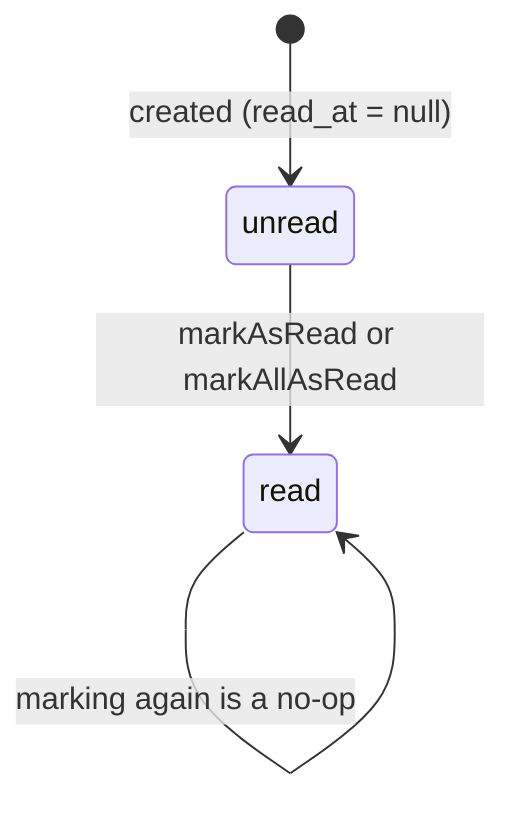

# Notifications

> Terminology follows `docs/paper/glossary.md`. Figure and table numbers use the
> `X.n` placeholder pending final manuscript numbering.

## 1. Feature Name

In-App Notifications — a centralized service for creating notifications, a typed
vocabulary of event kinds, de-duplication for events that can re-fire, and the
header dropdown plus full notifications page that read them.

## 2. Purpose

To tell each participant what happened without email and without polling the
workflow tables. The design rule is stated in the service docblock: *"Controllers
should call NotificationService::send() or NotificationService::sendUnique()
instead of creating Notification records directly."*

These are **application notifications stored in the project's own `notifications`
table** — not Laravel's built-in notification system. The only Laravel
`Notification` class in the project is `StaffAccountInvitation`, which is an email
and unrelated to this feature.

## 3. Actors / Roles

All four roles receive notifications. No role can send one directly; notifications
are side effects of workflow actions.

## 4. User Workflow

1. A workflow action completes — a request is submitted, triaged, scheduled,
   started, completed, missed; a message or attachment arrives; a follow-up moves.
2. The acting controller calls `NotificationService::send()`, `::sendToRole()`, or
   `::sendUnique()`.
3. The recipient's header dropdown polls `GET /notifications/unread-count` and
   `GET /notifications`.
4. `GET /notifications/all` renders the full page, **server-rendering the first
   page of results** so there is no loading-spinner flash; its Alpine component
   then fetches subsequent pages from the same JSON endpoint the dropdown uses.
5. Reading marks individual notifications, or all of them, as read.

## 5. Routes

| Method | URI | Name |
|---|---|---|
| GET | `/notifications` | `notifications.index` |
| GET | `/notifications/all` | `notifications.all` |
| GET | `/notifications/unread-count` | `notifications.unread_count` |
| PATCH | `/notifications/{notification}/read` | `notifications.read` |
| PATCH | `/notifications/read-all` | `notifications.read_all` |

All inside `auth` + `verified`.

## 6. Controllers

`NotificationController::index`, `::all`, `::unreadCount`, `::markAsRead`,
`::markAllAsRead`, and the private `serialize`.

## 7. Services

**`App\Services\NotificationService`** — three static creators plus a private
de-duplication helper. All methods are `static`; the service is never injected.

| Method | Behaviour |
|---|---|
| `send()` | One notification. Returns null on an invalid type or a non-positive recipient id. |
| `sendToRole()` | Fans out to every **active** user of a role via a single `DB::table('notifications')->insert()` bulk write. Returns the count. |
| `sendUnique()` | Like `send()`, but returns null if `alreadyNotified()` finds a matching prior notification. |
| `alreadyNotified()` | Intersects `$data`'s keys with six recognised entity keys and matches each with `whereJsonContains`. |

## 8. Models

`App\Models\Notification` — table `notifications`, PK **`notification_id`**,
`$casts` `data => array`, `read_at => datetime`; scopes `unread()` and
`forUser($userId)`.

`App\Enums\NotificationType` — a **backed string enum with 19 cases** and a static
`isValid()`.

## 9. Database

**`notifications`** (`2026_08_10_135652`):

| Column | Type | Notes |
|---|---|---|
| `notification_id` | bigint | **PK** |
| `user_id` | unsignedBigInteger | FK → `users.user_id`, cascade on delete |
| `type` | string | **not an enum** — validated in PHP only |
| `title` | string | |
| `message` | text | |
| `data` | **json**, nullable | the one true JSON column in the schema |
| `read_at` | timestamp, nullable | |

**Indexes:** `(user_id, read_at)` and `type` — both well-matched to the queries
this feature actually runs.

`data` being a real `json` column is why `alreadyNotified()` can use
`whereJsonContains('data->'.$key, ...)`.

## 10. The type vocabulary

`NotificationType` groups 19 cases:

| Group | Cases |
|---|---|
| Consultation workflow | `consultation_submitted`, `consultation_reviewed`, `consultation_assigned`, `consultation_scheduled`, `consultation_rescheduled`, `consultation_starting_soon`, `consultation_started`, `consultation_completed`, `consultation_missed` |
| Messaging | `new_message`, `new_attachment` |
| Follow-up | `follow_up_submitted`, `follow_up_approved`, `follow_up_rejected`, `follow_up_scheduled`, `follow_up_starting_soon` |
| Operational | `high_priority_consultation`, `physician_request`, `system_alert` |

The enum docblock states the intent: *"These values are stored in the
`notifications.type` column. Do not scatter raw strings throughout controllers —
use these constants."*

**Four cases are never sent by any code path**: `consultation_rescheduled`,
`consultation_starting_soon`, `follow_up_scheduled`, `follow_up_starting_soon` —
see gap NF-2.

## 11. Validation and Authorization

There is **no policy**. Every endpoint scopes to the authenticated user directly:

- `index`, `unreadCount`, `markAllAsRead` — `->forUser((int) $request->user()->user_id)`.
- `markAsRead` — an explicit ownership check returning 403:
  `if ((int) $notification->user_id !== (int) $request->user()->user_id)`.

A test confirms the scoping cannot be subverted: *"ignores user_id query parameter
and always uses the authenticated user."*

`index` validates its own `date_filter` against `ALLOWED_DATE_FILTERS`, falling back
to `all` for anything unrecognised.

## 12. Business Rules

| # | Rule | Enforced by | Enforcement type |
|---|---|---|---|
| BR-1 | Only valid `NotificationType` values are stored | `NotificationType::isValid()` in all three creators | **Application** — the column is a plain `string`, so nothing constrains it at the database level |
| BR-2 | A non-positive or missing recipient id creates nothing | `if (!$recipientId \|\| $recipientId <= 0) return null;` | **Application** |
| BR-3 | Role fan-out reaches only **active** accounts | `->where('account_status', 'active')` | **Application** |
| BR-4 | `sendUnique()` de-duplicates per type **and** entity | `alreadyNotified()` | **Application** |
| BR-5 | De-duplication requires at least one recognised entity key | `if (empty($entityKeys)) return false;` — with none, it behaves exactly like `send()` | **Application** |
| BR-6 | A user may only mark their own notification read | Ownership check in `markAsRead` | **Application** |
| BR-7 | Marking an already-read notification is a no-op | `if ($notification->read_at === null)` | **Application** |
| BR-8 | Deleting a user deletes their notifications | `onDelete('cascade')` | **Database** |

BR-8 is the only database-enforced rule.

**How de-duplication actually works** — worth stating precisely, because it is
subtler than "don't send twice":

```php
$entityKeys = array_intersect(array_keys($data), [
    'consultation_id', 'follow_up_request_id', 'schedule_slot_id',
    'session_id', 'request_id', 'message_id',
]);
// … then, for each key:
$query->whereJsonContains('data->' . $key, $data[$key]);
```

It matches on recipient + type + **every** recognised entity key present. Adding a
key makes the match *narrower*, so a payload carrying both `consultation_id` and
`session_id` de-duplicates only against notifications carrying both with the same
values.

## 13. Concurrency

**None.** No creator opens a transaction or takes a lock.

`sendUnique()` is therefore a **check-then-insert with no lock**: two simultaneous
calls can both pass `alreadyNotified()` and both insert. Nothing in the schema
prevents it — there is no unique index on `(user_id, type, data)`. In practice the
callers are workflow transitions already serialised by their own locks, which is
why this has not surfaced. Recorded as gap NF-3.

`sendToRole()` uses a single bulk `DB::table()->insert()`, bypassing Eloquent — so
no model events fire and the `data` array must be `json_encode`d by hand, unlike
the other two creators which rely on the model's `array` cast.

## 14. Status / State Transitions



*Figure X.22 — A notification's only state. There is no delete, archive, or dismiss
action anywhere in the system.*

## 15. Error and Edge-Case Handling

| Case | Behaviour | Test |
|---|---|---|
| Invalid type string | Nothing created; `send`/`sendUnique` return null, `sendToRole` returns 0 | *"rejects invalid notification types"* |
| Duplicate event | Second `sendUnique` returns null | *"prevents duplicate notifications for the same event and entity"* |
| Role with no active users | `sendToRole` returns 0 without a query | `if (empty($recipientIds))` |
| Another user's notification | 403 | *"does not allow a user to mark another users notification as read"* |
| `user_id` supplied in the query string | Ignored | *"ignores user_id query parameter…"* |
| Unrecognised `date_filter` | Falls back to `all` | `in_array(..., ALLOWED_DATE_FILTERS, true)` |
| Guest on the all-notifications page | Redirected to login | *"requires authentication to view the all-notifications page"* |

## 16. UI Implementation

`resources/views/layouts/notificationUI.blade.php` renders the header dropdown;
`resources/views/notifications/index.blade.php` the full page.

The full page is server-rendered for its first page via
`'initialResponse' => $this->index($request)->getData(true)` — the controller calls
its own JSON action and hands the array to the view. The comment explains the
choice: no loading-spinner flash on open, and subsequent pages and tab switches
come from the same endpoint the dropdown already uses.

`index` paginates at **20 per page** and returns a `meta` block with
`current_page`, `last_page`, `per_page`, `total`.

Filters exposed in the UI: unread-only (`?unread=1`) and
`?date_filter=today|last_7_days|last_30_days|all`. Both are applied in the query so
the page filters the whole matching set, *"rather than filtering whatever page
happened to load"*.

## 17. Tests

| File | Cases | Covers |
|---|---|---|
| `tests/Feature/NotificationTest.php` | **21** | Creation with type/title/message, JSON data round-trip, invalid-type rejection, de-duplication, role fan-out, per-user scoping, query-parameter tampering, cross-user 403, unread count, single and bulk read, the all-notifications page and its auth requirement, unread and date filters, **plus six end-to-end wiring tests**: nurses notified on submission, physicians on nurse approval, patient on scheduling, physician on a patient message, nurses on a follow-up request, patient on follow-up approval |

## 18. Source-Code Evidence

| Claim | Evidence |
|---|---|
| Centralization rule | `NotificationService` class docblock |
| All creators are static | `public static function send/sendToRole/sendUnique` |
| Type validation is application-only | `NotificationType::isValid()`; `create_notifications_table` declares `$table->string('type')` |
| Active-only fan-out | `->where('account_status','active')` in `sendToRole` |
| Bulk insert bypasses Eloquent | `DB::table('notifications')->insert($rows)` with hand-written `json_encode` and timestamps |
| Six entity keys | The array inside `alreadyNotified()` |
| Narrowing match | The `foreach ($entityKeys as $key) { $query->whereJsonContains(...); }` loop |
| Ownership check | `markAsRead`'s `if ((int) $notification->user_id !== ...)` |
| Server-rendered first page | `all()`'s `$this->index($request)->getData(true)` and its docblock |
| Filter vocabulary is a deliberate copy | `ALLOWED_DATE_FILTERS` docblock explaining why it is not shared with `ConsultationHistoryQuery` |
| Indexes | `$table->index(['user_id', 'read_at']); $table->index('type');` |

## 19. Limitations / Gaps

| # | Limitation |
|---|---|
| NF-1 | **`type` is a plain string column.** `NotificationType` is enforced only by `isValid()` inside the service. A direct insert, or any future code that writes `Notification::create()` directly — which the docblock asks callers not to do but nothing prevents — can store an arbitrary type. |
| NF-2 | **Four enum cases are never sent.** `consultation_rescheduled`, `consultation_starting_soon`, `follow_up_scheduled`, and `follow_up_starting_soon` have no call site. The two `*_starting_soon` cases imply a reminder scheduler that does not exist — there is no command, job, or cron entry that would send them. Do not present them as implemented notification types. |
| NF-3 | **`sendUnique()` is a check-then-insert with no lock.** Two concurrent calls can both insert. No unique index backs it. Safe in practice only because its callers are already serialised by their own transactions. |
| NF-4 | **Notifications cannot be deleted or dismissed.** The table grows without bound; there is no cleanup command, retention policy, or archive — in contrast to `auth:clear-resets staff_invitations`, which does flush its table. |
| NF-5 | **Messaging notifications are not de-duplicated.** `notifyMessageRecipients()` calls `send()`, not `sendUnique()`, so a rapid exchange creates one notification row per message. See gap CM-6. |
| NF-6 | **Cancellation has no dedicated type.** A patient cancellation notifies the nurse as `SYSTEM_ALERT`, making it indistinguishable by type from any other alert. See gap PR-5. |
| NF-7 | **Delivery is in-app only.** Nothing is emailed or pushed. A patient who does not open the application never learns their consultation was scheduled, started, or missed — which compounds gap MS-3, where the missed-consultation notification may never be created at all. |
| NF-8 | **The dropdown polls.** Unread counts are fetched on a timer like everything else in this system; there is no push channel. |
