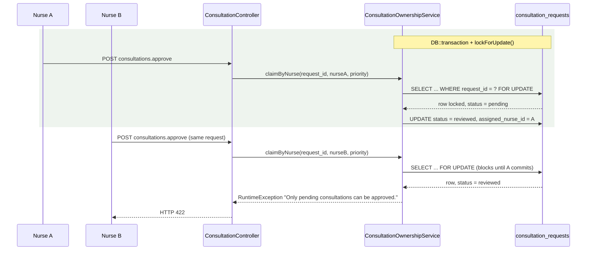
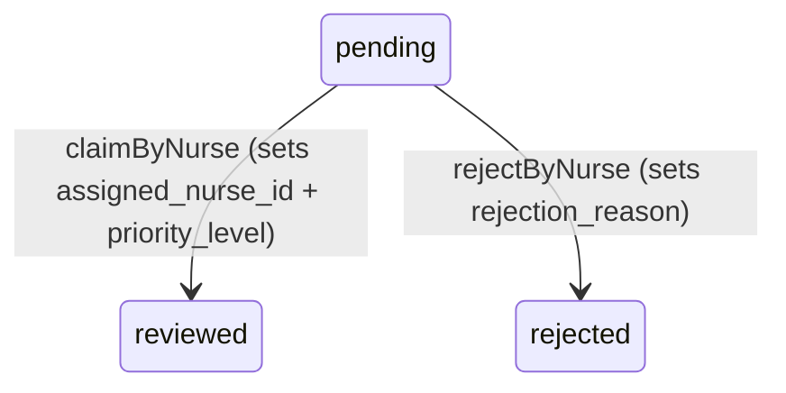

# Nurse Triage and Consultation Inbox

> Terminology follows `docs/paper/glossary.md`. Figure and table numbers use the
> `X.n` placeholder pending final manuscript numbering.

## 1. Feature Name

Nurse Triage and Consultation Inbox — the nurse's queue of pending consultation
requests, and the two decisions a nurse makes on each: claim with a priority level,
or reject with a reason.

## 2. Purpose

To interpose a nurse between patient submission and physician time. A pending
consultation request is not visible to physicians at all; it becomes visible only
once a nurse has claimed it, assigned it a priority level, and moved it to
`reviewed`.

## 3. Actors / Roles

| Actor | Involvement |
|---|---|
| Nurse | Views the inbox, claims (approves) or rejects pending requests. |
| Patient | Notified of the outcome either way. |
| Physician | Notified when a request becomes available, with a distinct notification type for high priority. |

**Important:** the inbox itself is nurse-scoped and properly guarded, but the two
decision endpoints are not role-guarded at all. See section 10 and gap NT-1.

## 4. User Workflow

1. Nurse opens `GET /nurses/{nurse}/consultation-inbox`.
2. The page renders three groupings: pending requests, requests assigned to this
   nurse, and requests assigned to other nurses.
3. A polling loop calls `GET /nurses/{nurse}/consultation-inbox/refresh`, which
   returns the same three groupings as JSON.
4. The nurse opens a request's modal, reviews symptoms, online reason, additional
   information, and attachments.
5. **Claim:** the nurse selects a priority level (`High` or `Normal`) and POSTs to
   `consultations.approve`. `claimByNurse` moves the request to `reviewed`, stamps
   `assigned_nurse_id`, and writes `priority_level`.
6. **Reject:** the nurse supplies a reason and POSTs to `consultations.reject`.
   `rejectByNurse` moves the request to `rejected` and stores the reason.
7. Notifications fan out: the patient always; all physicians on a claim.

## 5. Routes

**Inbox (nurse-scoped, guarded):**

| Method | URI | Name |
|---|---|---|
| GET | `/nurses/{nurse}/consultation-inbox` | `nurse.consultation_inbox` |
| GET | `/nurses/{nurse}/consultation-inbox/refresh` | `nurse.consultation_inbox.refresh` |

**Decisions (not nurse-scoped):**

| Method | URI | Name |
|---|---|---|
| POST | `/consultations/{consultation}/approve` | `consultations.approve` |
| POST | `/consultations/{consultation}/reject` | `consultations.reject` |

Both decision routes sit in the top-level `auth` + `verified` group, **outside** the
`nurses/{nurse}` prefix, and carry no role middleware.

## 6. Controllers

- `NurseController::consultationInbox`, `::consultationInboxRefresh`, and the
  private `getConsultationInboxData`, `serializeConsultations`, `isUserOnline` —
  all guarded by `authorizeNurse()`.
- `ConsultationController::approveConsultation` and `::rejectionConsultation` —
  the two decision actions. Neither calls any authorization method.

## 7. Services

- `ConsultationOwnershipService::claimByNurse()` and `::rejectByNurse()` — both
  wrap the transition in `DB::transaction` with `lockForUpdate()`.
- `NotificationService::send()` and `::sendToRole()`.

## 8. Models

`App\Models\Consultation` (table `consultation_requests`). The inbox eager-loads
`patient`, `nurse`, and `physician`.

Relevant scope: `Consultation::scopeForNurse()`, whose docblock notes
`assigned_nurse_id` is set once by `claimByNurse()` and never cleared, so it is
stable across the whole lifecycle — including a follow-up spawned from a request
this nurse claimed, which inherits the column verbatim.

## 9. Database

Reads and writes `consultation_requests` only. No consultation session is created
by either decision.

| Column | Written by |
|---|---|
| `request_status` | `'reviewed'` on claim, `'rejected'` on reject |
| `assigned_nurse_id` | the acting user's id, on claim |
| `priority_level` | `'High'` or `'Normal'`, on claim — the **first** time this column is ever written |
| `rejection_reason` | the supplied text, on reject |

## 10. Validation and Authorization

**The inbox is properly guarded.** `NurseController::authorizeNurse()`:

```php
if (Auth::user()->role !== 'nurse' || Auth::id() !== $nurse->user_id) {
    abort(403, 'Unauthorized access.');
}
```

A test confirms the refresh endpoint "refuses another nurse's route parameter".

**The decision endpoints are not guarded.** This is the significant finding of this
feature and must be stated plainly rather than smoothed over.

`ConsultationController::approveConsultation` validates only
`priority_level => required|in:High,Normal`, then calls
`claimByNurse($consultation->request_id, auth()->id(), $priority)`.
`ConsultationController::rejectionConsultation` validates only
`rejection_reason => required|string|max:1000`, then calls `rejectByNurse(...)`.

Neither method:

- checks `Auth::user()->role`,
- consults a policy or `Gate`,
- is covered by role middleware on its route,
- is protected by a controller-constructor middleware call — `ConsultationController`'s
  constructor only injects two services and adds no middleware at all.

The service layer does not compensate. `claimByNurse()` enforces only that the
request is `pending` and that no *other* nurse already holds it — it takes the
nurse id as an integer parameter and never verifies the role behind it.

**Consequence:** any authenticated, verified user — including a patient — can POST
to `consultations.approve` for a pending consultation request and become its
`assigned_nurse_id`, setting the priority level and advancing the request to
`reviewed`. The same applies to rejection.

**No test covers this.** Every test that exercises these two routes
(`ConsultationConcurrencyTest`, `ConsultationIntakeGateTest`, `NotificationTest`)
acts as a nurse. There is no negative test asserting that a non-nurse is refused.

This is recorded as gap NT-1. It is reported, not fixed — this documentation task
does not modify application code.

## 11. Business Rules

| # | Rule | Enforced by | Enforcement type |
|---|---|---|---|
| BR-1 | Only a `pending` request may be claimed | `claimByNurse` re-checks status **under the lock** | **Application (transaction + lock)** |
| BR-2 | Only a `pending` request may be rejected | `rejectByNurse`, same pattern | **Application (transaction + lock)** |
| BR-3 | A request already held by another nurse cannot be claimed | `if ($consultation->assigned_nurse_id && (int) $consultation->assigned_nurse_id !== $nurseId)` | **Application (under lock)** |
| BR-4 | Re-claiming your own request is permitted | The same condition passes when the ids match | **Application** |
| BR-5 | Priority is mandatory at claim and limited to `High`/`Normal` | `in:High,Normal` validation | **Application** — the MySQL enum also restricts the values |
| BR-6 | A rejection must carry a reason | `required|string|max:1000` | **Application** |
| BR-7 | High priority produces a different physician notification | `HIGH_PRIORITY_CONSULTATION` vs `CONSULTATION_ASSIGNED` | **Application** |
| BR-8 | A nurse's claim is permanent | `assigned_nurse_id` is never cleared by any code path | **Application (by omission)** |
| BR-9 | Only a nurse may claim or reject | **Not enforced anywhere** — see NT-1 | **None** |

## 12. Concurrency

This is one of the two places the system's pessimistic-locking pattern is most
visible, and it is worth documenting precisely because it is easy to overstate.



*Figure X.5 — Two nurses claiming the same consultation request. The second request
blocks on the row lock, then fails the re-check.*

**What the lock does and does not do.** The lock serialises the two transactions and
the *re-check under the lock* is what rejects the loser — the lock alone would not.
There is **no database uniqueness constraint** preventing two nurses from holding
one request; `consultation_requests` has no unique index on `assigned_nurse_id` or
any related column. The correctness of BR-1 and BR-3 rests entirely on
lock-then-check inside `ConsultationOwnershipService`. This distinction matters: a
direct `UPDATE` bypassing the service would break the invariant with nothing to stop
it.

`ConsultationConcurrencyTest` proves the behaviour with real concurrent
transactions — "allows only one nurse to claim the same pending consultation
request", and the cross-transition cases "rejects nurse claim after patient
cancellation commits first" and "rejects patient cancellation after physician start
commits first".

## 13. Status / State Transitions



*Figure X.6 — Transitions owned by nurse triage. `assigned` is in the enum but is
written by nothing and is not a state.*

## 14. Error and Edge-Case Handling

| Case | Response | Evidence |
|---|---|---|
| Request no longer pending | 422 with the service's message | `claimByNurse` / `rejectByNurse` throw `RuntimeException`, caught and returned as 422 |
| Request held by another nurse | 422 *"This consultation is already being handled by another nurse."* | `claimByNurse` |
| Concurrent claims | Loser blocks, then fails the re-check | `ConsultationConcurrencyTest` |
| Patient cancelled first | 422 — cancellation commits, the claim's re-check fails | "rejects nurse claim after patient cancellation commits first" |
| Missing or invalid priority | Validation error | `in:High,Normal` |
| Missing rejection reason | Validation error | `required` |
| Another nurse's route parameter on refresh | 403 | `NurseConsultationInboxTableTest` |
| Patient offline or stale | Rendered as offline after 2 minutes | "marks a patient last seen over 2 minutes ago as offline, not online" |

## 15. UI Implementation

`resources/views/nurse/consultation_inbox.blade.php`, verified by reading the view
and its tests rather than inferred from the controller.

- Three tables: pending, assigned-to-me, assigned-to-other-nurses.
- The pending table shows **Severity, Status, and Submitted At but no Symptoms
  column**; the assigned-to-me table keeps a Priority column. Both are asserted by
  test.
- Patient presence is rendered as a **visible dot with an accessible label**, using
  the 2-minute freshness rule from `NurseController::isUserOnline()`.
- Attachments render as **thumbnail buttons, not `target="_blank"` links** — a test
  asserts this explicitly.
- The detail modal shows **Additional Information, not Concern Category** — also
  asserted by test.
- An empty state renders when no pending requests exist.
- The auto-refresh poll calls the refresh endpoint and re-renders rows through
  Alpine, which is why the serialiser returns presentation-ready values.

`serializeConsultations()` rewrites each stored attachment value into a
`/consultations/{id}/attachments/{basename}` URL rather than exposing the raw
stored path.

## 16. Tests

| File | Cases | Covers |
|---|---|---|
| `tests/Feature/NurseConsultationInboxTableTest.php` | 9 | Column composition of all three tables, empty state, refresh endpoint, cross-nurse 403, presence dot and staleness, attachment thumbnails |
| `tests/Feature/ConsultationConcurrencyTest.php` | 8 (3 relevant) | Single-winner nurse claim, claim-after-cancellation, follow-up forward concurrency |
| `tests/Feature/ConsultationAdditionalInformationTest.php` | 4 (1 relevant) | The modal shows Additional Information |
| `tests/Feature/NotificationTest.php` | — | Notification fan-out on approval |

**Coverage gap:** no test asserts that a non-nurse is refused by
`consultations.approve` or `consultations.reject`.

## 17. Source-Code Evidence

| Claim | Evidence |
|---|---|
| Inbox authorization | `NurseController::authorizeNurse()`, called first in every public method |
| No authorization on the decisions | `ConsultationController::approveConsultation` and `::rejectionConsultation` — full method bodies contain no role, Gate, policy, or abort call; the constructor adds no middleware |
| Lock-then-check | `ConsultationOwnershipService::claimByNurse` — `DB::transaction`, `->lockForUpdate()->firstOrFail()`, then `if ($consultation->request_status !== 'pending') throw` |
| Other-nurse guard | `if ($consultation->assigned_nurse_id && (int) $consultation->assigned_nurse_id !== $nurseId)` |
| Priority written only here | `claimByNurse`'s `update([... 'priority_level' => $priorityLevel])`; nothing writes it at submission |
| Priority-dependent notification | `$isHighPriority ? NotificationType::HIGH_PRIORITY_CONSULTATION : NotificationType::CONSULTATION_ASSIGNED` |
| Inbox groupings | `NurseController::getConsultationInboxData()` — `pending` in one query, `['reviewed','assigned','active','scheduled']` in another, split by `assigned_nurse_id` |
| Presence freshness | `NurseController::isUserOnline()` — `last_seen_at->gt(now()->subMinutes(2))` |
| Attachment URL rewriting | `serializeConsultations()`'s `url('/consultations/'.$request->request_id.'/attachments/'.basename($path))` |

## 18. Limitations / Gaps

| # | Limitation |
|---|---|
| **NT-1** | **The claim and reject endpoints have no role check.** `consultations.approve` and `consultations.reject` are reachable by any authenticated, verified user. The controller performs no role check, no policy governs `Consultation` beyond `view`, the routes carry no role middleware, and `ConsultationOwnershipService` accepts the nurse id as a bare integer without verifying the role behind it. A patient could claim a pending request, set its priority, and become its recorded `assigned_nurse_id`. Every other role-specific action in the system is guarded by `authorizeNurse()`, `authorizePhysician()`, or `authorizeAdmin()`; these two are the exception. No test covers the negative case. |
| NT-2 | **The inbox shows every nurse every request.** `getConsultationInboxData()` applies no scoping filter — all pending requests and all requests in `['reviewed','assigned','active','scheduled']` are loaded, then split in PHP by `assigned_nurse_id`. This is a deliberate shared-queue design, but it means the request payload of the refresh endpoint contains other nurses' caseloads including patient names and symptom data. |
| NT-3 | **No unique constraint backs the claim.** Single-nurse ownership is held only by lock-then-check in the service. `consultation_requests` has no constraint that would prevent two nurses being recorded, and nothing prevents a direct database write. |
| NT-4 | **`assigned_nurse_id` can never be corrected.** No code path clears or reassigns it. A request claimed by the wrong nurse stays with them for its whole lifecycle, and follow-ups inherit the value verbatim. |
| NT-5 | **Rejection is terminal and unappealable.** `rejectByNurse` requires `pending` and writes `rejected`; no transition leads out of `rejected`. A mistakenly rejected request cannot be reopened — the patient must submit a new one. |
| NT-6 | **The inbox is polled, not pushed.** The refresh endpoint returns the full three-group payload on every poll, serialising every request's symptoms and attachments each time. `ConsultationMessagePerformanceTest` exists for messaging, but there is no equivalent load test for the inbox refresh. |
| NT-7 | **Presence freshness is duplicated.** `NurseController::isUserOnline()` hardcodes `now()->subMinutes(2)`, duplicating `PhysicianController::isUserOnline()` and `PhysicianAvailabilityService::PRESENCE_FRESHNESS_MINUTES`. See gap PI-7. |
