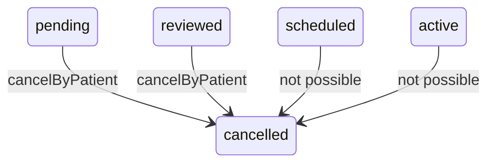

# Patient Request Tracking and Cancellation

> Terminology follows `docs/paper/glossary.md`. Per the approved inventory this
> file also covers **patient cancellation**, because the cancel control lives on
> the page this feature renders. Figure and table numbers use the `X.n`
> placeholder pending final manuscript numbering.

## 1. Feature Name

Patient Request Tracking and Cancellation — the patient's dashboard status card,
the consultation-details page, and withdrawal of an open consultation request.

## 2. Purpose

To give the patient a single, always-current answer to "what is happening with my
consultation?", and a way to withdraw it while it is still withdrawable.

## 3. Actors / Roles

| Actor | Involvement |
|---|---|
| Patient | The only actor. Every entry point checks `role === 'patient'` or is policy-gated to the owner. |
| Nurse | Notified when a patient cancels, if one was assigned. |

## 4. User Workflow

1. The patient lands on `/dashboard`. `DashboardController::index` branches on
   role and assembles the patient view: the active consultation, a plain-language
   summary, follow-up status, any physician-initiated follow-up, and intake
   availability.
2. A polling endpoint, `/dashboard/active-consultation`, returns the same
   consultation and physician-follow-up payload as JSON so the card updates
   without a reload.
3. Opening a specific request goes to `/consultations/{consultation}`, gated by
   `ConsultationPolicy::view`.
4. The cancel control on that page POSTs to `/consultations/{consultation}/cancel`.

## 5. Routes

| Method | URI | Name | Middleware |
|---|---|---|---|
| GET | `/dashboard` | `dashboard` | `auth` + `verified` |
| GET | `/dashboard/active-consultation` | `dashboard.active_consultation` | `auth` + `verified` |
| GET | `/consultations/{consultation}` | `consultations.show` | **`auth` only** |
| POST | `/consultations/{consultation}/cancel` | `consultations.cancel` | `auth` + `verified` |

## 6. Controllers

`DashboardController::index` (patient branch), `::activeConsultation`, and the
private `getPatientActiveConsultation`, `getConsultationSummary`,
`getPatientFollowUpStatus`, `getFollowUpStatusBadgeClass`,
`getPhysicianInitiatedFollowUp`, `serializePatientConsultation`,
`getPatientStatusBadgeClass`.

`ConsultationController::show` and `::cancelConsultation`.

## 7. Services

`PhysicianAvailabilityService` for the availability banner, the next scheduled
window, and the weekly overview. `ConsultationOwnershipService::cancelByPatient()`
for the cancellation. `NotificationService::send()` for the nurse notification.

## 8. Models

`Consultation` (table `consultation_requests`), eager-loading
`consultationSession.slot`, `nurse`, `physician`, and
`parentConsultation.request` on the details page.

## 9. Database

Tracking is read-only. Cancellation writes exactly one column:
`consultation_requests.request_status = 'cancelled'`.

**No `cancelled_at` timestamp and no cancellation reason are recorded.** Note the
asymmetry with rejection, which stores `rejection_reason`, and with
`consultations.cancellation_reason`, a column that exists but is never written by
this path.

## 10. Validation and Authorization

**Tracking:** `DashboardController::index`'s patient branch is reached only for
`role === 'patient'`; `activeConsultation()` and `newconsultation()` each
`abort(403)` otherwise.

**Details page:** the only use of `ConsultationPolicy` in the system —

```php
abort_unless(Gate::allows('view', $consultation), 403, 'Unauthorized access.');
```

```php
public function view(User $user, Consultation $consultation): bool
{
    return $user->role === 'patient' && $consultation->patient_id === $user->user_id;
}
```

So nurses, physicians, and admins are **all refused** this page, not just other
patients.

**Cancellation:** an explicit ownership check in the controller,
`if ($consultation->patient_id !== auth()->id()) return 403`, then the service
re-scopes by `patient_id` inside its own locked query. There is **no role check** —
ownership is the whole guard, which is sufficient because only a patient can be a
`patient_id`.

## 11. Business Rules

| # | Rule | Enforced by | Enforcement type |
|---|---|---|---|
| BR-1 | Only the owning patient may view a request's details | `ConsultationPolicy::view` | **Application (policy)** |
| BR-2 | Only the owner may cancel | Controller check **plus** `where('patient_id', $patientId)` in the locked service query | **Application (double-checked)** |
| BR-3 | Only `pending` or `reviewed` requests may be cancelled | Status re-check **under the lock** | **Application (transaction + lock)** |
| BR-4 | The assigned nurse is told, if there is one | `if ($consultation->assigned_nurse_id)` | **Application** |
| BR-5 | The dashboard shows at most one active consultation | `getPatientActiveConsultation()` returns a single record | **Application** |
| BR-6 | Operational state is never date-filtered | Documented in `DashboardAnalyticsService` and mirrored here | **Application** |

**BR-3 is the important one.** Cancellation is possible only *before* a physician
schedules. Once the request reaches `scheduled` or `active`, the patient cannot
withdraw it through any interface.

## 12. Concurrency

`cancelByPatient()` follows the standard pattern — one `DB::transaction`, a
`lockForUpdate()` on the request row scoped by `patient_id`, then a status re-check
before the write.

Three interleavings are covered by `ConsultationConcurrencyTest`:

- *"rejects nurse claim after patient cancellation commits first"*
- *"rejects physician start after patient cancellation commits first"*
- *"rejects patient cancellation after physician start commits first"*

As everywhere else, the lock serialises and the **re-check** decides. There is no
database constraint preventing a cancelled request from being claimed — that
correctness lives entirely in the service.

## 13. Status / State Transitions



*Figure X.19 — Cancellation is available only from the two pre-scheduling states.*

## 14. Error and Edge-Case Handling

| Case | Response | Evidence |
|---|---|---|
| Not the owner (cancel) | 403 JSON | `cancelConsultation` |
| Not the owner (details page) | 403 | `ConsultationPolicy` |
| Staff open the details page | 403 — the policy admits patients only | Test: *"allows a patient to view only their own consultation details"* |
| Request already `scheduled`/`active`/concluded | 422 *"Only pending or reviewed consultations can be cancelled."* | `cancelByPatient` |
| Concurrent start wins | 422 on the cancel | `ConsultationConcurrencyTest` |
| No assigned nurse | Cancellation succeeds, no notification | `if ($consultation->assigned_nurse_id)` |
| Follow-up request rejected | The dashboard hides the follow-up status card | Test: *"hides the follow-up status card… when latest follow-up request is rejected"* |
| No physician assigned yet | The details page omits the physician section | Test: *"omits the assigned physician section when no physician has been assigned yet"* |

## 15. UI Implementation

**`resources/views/patient/dashboard.blade.php`** renders the status card, the
follow-up status, any physician-initiated follow-up, and the intake availability
banner. When intake is closed it additionally shows `nextScheduledWindow()` and the
deduplicated `weeklyScheduleOverview()` — **with no physician identity**, asserted
by `ConsultationIntakeAvailabilityUiTest`.

Status presentation is resolved in the controller, not the view
(`getPatientStatusBadgeClass()`, `getFollowUpStatusBadgeClass()`), so the polling
JSON and the server-rendered page agree.

**`resources/views/patient/consultation-details.blade.php`** carries the cancel
control at line 154 as `data-cancel-url="{{ route('consultations.cancel', $consultation) }}"`.
Verified by test, the page also:

- shows a **follow-up badge and a link back to the original consultation** for a
  follow-up;
- shows the **assigned physician's name and specialization**, and omits that
  section entirely when none is assigned.

## 16. Tests

| File | Cases | Relevance |
|---|---|---|
| `tests/Feature/ConsultationAccessTest.php` | 4 | Owner-only access, follow-up badge and parent link, physician details section present/absent |
| `tests/Feature/FollowUpRequestTest.php` | 20 (5 relevant) | Dashboard follow-up cards: physician-initiated shown, preferred over completed data, hidden when completed, hidden when patient-initiated, hidden when rejected |
| `tests/Feature/ConsultationConcurrencyTest.php` | 8 (3 relevant) | All three cancellation interleavings |
| `tests/Feature/ConsultationIntakeAvailabilityUiTest.php` | 16 (4 relevant) | Dashboard availability banner, next window, weekly hours, no identity leak |
| `tests/Feature/MobileBottomNavigationTest.php` | — | Dashboard nav rendering |

**Coverage gap:** no test asserts the cancellation happy path itself — that a
pending request becomes `cancelled` and the nurse is notified. Only the concurrency
interleavings touch `cancelByPatient`.

## 17. Source-Code Evidence

| Claim | Evidence |
|---|---|
| Role branch | `DashboardController::index`'s `switch ($user->role)` with `default: abort(403)` |
| Nurse redirect rather than render | `case 'nurse': return redirect()->route('nurse.dashboard', ...)` |
| Physician branch mirrors rather than redirects | The comment explaining a redirect would turn 200 into 302 and break `MobileBottomNavigationTest` |
| Next window only when unavailable | `$nextScheduledWindow = $intakeAvailable ? null : $this->availabilityService->nextScheduledWindow();` |
| Policy is the only `ConsultationPolicy` use | `ConsultationController::show`'s `Gate::allows('view', $consultation)` |
| Cancellation ownership double-check | Controller `if ($consultation->patient_id !== auth()->id())` and the service's `->where('patient_id', $patientId)` |
| Cancellable statuses | `if (!in_array($consultation->request_status, ['pending', 'reviewed'], true))` |
| Nurse notified | `NotificationService::send($consultation->assigned_nurse_id, NotificationType::SYSTEM_ALERT, ...)` |
| Cancel control location | `resources/views/patient/consultation-details.blade.php:154` |

## 18. Limitations / Gaps

| # | Limitation |
|---|---|
| PR-1 | **Cancellation is impossible after scheduling.** Once a physician books a slot, the patient has no way to withdraw. There is no "request cancellation" flow and no patient-facing reschedule. A patient who cannot attend can only fail to appear, which produces a missed slot. |
| PR-2 | **No cancellation reason or timestamp.** `rejection_reason` exists for staff rejections; nothing equivalent records why a patient cancelled or when. `consultations.cancellation_reason` exists in the schema and is never written by any code path. |
| PR-3 | **`consultations.show` is not `verified`-gated.** It sits in the `auth`-only group at the bottom of `routes/web.php`, unlike the cancel route immediately above it in the `auth`+`verified` group. |
| PR-4 | **The cancellation happy path is untested.** Only the three concurrency interleavings exercise `cancelByPatient`; nothing asserts the ordinary success case or the nurse notification. |
| PR-5 | **The notification uses `SYSTEM_ALERT`.** There is no `CONSULTATION_CANCELLED` case in `NotificationType`, so a cancellation is indistinguishable by type from any other system alert — relevant if notifications are ever filtered or reported by type. |
| PR-6 | **`getPatientActiveConsultation()` duplicates the "one open request" query.** The same `whereIn` status list and session sub-condition appear in `ConsultationController::create`, `::store`, and `DashboardController::newconsultation`. Four copies of one business rule. |
| PR-7 | **Dashboard reads are unpaginated and uncached.** Each page load runs the active-consultation lookup, the follow-up status lookup, the physician-follow-up lookup, and up to three availability queries; the polling endpoint repeats two of them on a timer. |
