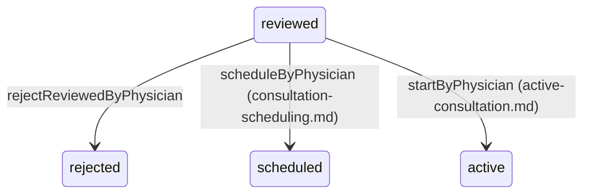

# Physician Consultation Inbox and Reviewed-Request Decision

> Terminology follows `docs/paper/glossary.md`. Figure and table numbers use the
> `X.n` placeholder pending final manuscript numbering.

## 1. Feature Name

Physician Consultation Inbox and Reviewed-Request Decision — the shared physician
queue of nurse-triaged consultation requests, and the physician's decision to
reject one with a reason.

Scheduling and starting a request are separate features
(`consultation-scheduling.md`, `active-consultation.md`); this file covers the
queue itself and the rejection path.

## 2. Purpose

To present every physician with the same pool of nurse-reviewed consultation
requests, split by priority, with enough context to decide whether to schedule,
start, take over, or reject — without assigning requests to individual physicians
in advance.

## 3. Actors / Roles

| Actor | Involvement |
|---|---|
| Physician | Views the shared queue; may reject a reviewed request with a reason. |
| Patient | Notified when their request is rejected by the physician. |
| Nurse | Not an actor here; appears in the inbox as the request's assigned nurse. |

## 4. User Workflow

1. Physician opens `GET /physicians/{physician}/consultation-inbox`.
2. The controller loads every request in `['reviewed','assigned','scheduled']` —
   **with no filter on `assigned_physician_id`** — and splits it into
   `highPriorityConsultations` and `normalPriorityConsultations`.
3. Rows are rendered from a server-serialised payload; a polling loop calls
   `GET /consultation-inbox/refresh` for the same two groupings as JSON.
4. Opening a row's modal shows patient details, symptoms, severity, attachments,
   the assigned nurse, and — pre-resolved server-side — whether Start is currently
   permitted and why not if it isn't.
5. **Reject:** the physician supplies a reason and POSTs to
   `physician.consultations.reject_reviewed`. `rejectReviewedByPhysician` moves the
   request to `rejected`, stores the reason, and **stamps
   `assigned_physician_id` with the rejecting physician**.
6. The patient is notified.

## 5. Routes

All under `physicians/{physician}` in the `auth` + `verified` group.

| Method | URI | Name |
|---|---|---|
| GET | `/consultation-inbox` | `physician.consultation_inbox` |
| GET | `/consultation-inbox/refresh` | `physician.consultation_inbox.refresh` |
| POST | `/consultations/{consultation}/reject-reviewed` | `physician.consultations.reject_reviewed` |
| POST | `/consultations/{consultation}/approve-reviewed` | `physician.consultations.approve_reviewed` |

The inbox rows also carry URLs for start, take-over, available-slots, and schedule,
documented in their own feature files.

## 6. Controllers

`PhysicianController::consultationInbox`, `::consultationInboxRefresh`,
`::rejectReviewedConsultation`, and the private `getConsultationInboxData`,
`serializeConsultations`, `isUserOnline`, `serializeAttachmentUrls`,
`resolveCanStart`, `resolveTakeoverInfo`, `serializeScheduledSlot`.

All public methods begin with `authorizePhysician()`.

## 7. Services

`ConsultationOwnershipService::rejectReviewedByPhysician()` — transaction plus
`lockForUpdate()` plus a status re-check.
`NotificationService::send()` for the patient notification.
`App\Support\StatusBadge` supplies presentation tokens.

## 8. Models

`App\Models\Consultation` (table `consultation_requests`), eager-loading `patient`,
`nurse`, `physician`, `consultationSession.slot`, and
`consultationSession.originalPhysician`.

## 9. Database

Reads `consultation_requests` joined to `consultations` and `schedule_slots`.

Rejection writes three columns on `consultation_requests`:

| Column | Value |
|---|---|
| `request_status` | `'rejected'` |
| `rejection_reason` | the supplied text |
| `assigned_physician_id` | the rejecting physician's id |

The last one is deliberate and worth documenting: `Consultation::scopeForPhysician`
scopes on `assigned_physician_id` rather than `consultations.physician_id`, and its
docblock explains why — *"a request the physician rejected never gets a
ConsultationSession, and scoping on the request keeps that rejection in the
physician's own numbers."* A rejected request therefore still appears in that
physician's analytics.

## 10. Validation and Authorization

**Authorization.** `PhysicianController::authorizePhysician()` checks both
`Auth::user()->role === 'physician'` and `Auth::id() === $physician->user_id`. This
is **controller-level, not a policy**. Unlike the nurse decision endpoints (see
`nurse-triage-and-inbox.md`, gap NT-1), the physician rejection endpoint **is**
properly guarded, because it lives under the `physicians/{physician}` prefix and
goes through `PhysicianController`.

**Validation.** `rejection_reason => required|string|max:1000`.

**Service-level guard.** `rejectReviewedByPhysician` additionally refuses when
`assigned_physician_id` is already set to a *different* physician.

## 11. Business Rules

| # | Rule | Enforced by | Enforcement type |
|---|---|---|---|
| BR-1 | The queue is a shared pool, not per-physician | `getConsultationInboxData()` applies no `assigned_physician_id` filter | **Application (by design)** |
| BR-2 | The queue contains exactly `reviewed`, `assigned`, `scheduled` | `whereIn('request_status', ['reviewed','assigned','scheduled'])` | **Application** |
| BR-3 | Only a `reviewed` request may be rejected by a physician | Status re-check **under the lock** | **Application (transaction + lock)** |
| BR-4 | A request already held by another physician cannot be rejected | `if ($consultation->assigned_physician_id && (int) $consultation->assigned_physician_id !== $physicianId)` | **Application (under lock)** |
| BR-5 | A rejection must carry a reason | Validation | **Application** |
| BR-6 | Rejection records the deciding physician | `assigned_physician_id` written in the same update | **Application** |
| BR-7 | Rows are split by `priority_level` | `->where('priority_level', 'Normal')` / `'High'` in PHP after one query | **Application** |
| BR-8 | Attachments are exposed as routed URLs, never raw stored values | `serializeAttachmentUrls()` | **Application** |

No database constraint participates in any rule here. Single-physician ownership is
held by lock-then-check in the service, exactly as with nurse claim.

## 12. Concurrency

`rejectReviewedByPhysician` follows the same pattern as every other transition in
`ConsultationOwnershipService`:

```php
return DB::transaction(function () {
    $consultation = Consultation::query()
        ->where('request_id', $consultationRequestId)
        ->lockForUpdate()
        ->firstOrFail();

    if ($consultation->request_status !== 'reviewed') {
        throw new \RuntimeException('Only reviewed consultations can be rejected.');
    }
    // … other-physician guard, then update
});
```

**Lock versus constraint, stated precisely.** The `SELECT … FOR UPDATE` serialises
concurrent attempts; the **re-read of `request_status` inside the lock** is what
rejects the loser. There is no unique index or check constraint on
`consultation_requests` enforcing that only one physician may decide a request. The
invariant exists only in this service method, and only for callers that go through
it.

## 13. Status / State Transitions



*Figure X.7 — Transitions available from `reviewed`. The queue also displays
requests already at `scheduled`; `assigned` appears in the enum and in this
feature's query but is never written by any code path, so it is a queue filter
value that can never match a real row.*

## 14. Error and Edge-Case Handling

| Case | Response | Evidence |
|---|---|---|
| Request no longer `reviewed` | 422 *"Only reviewed consultations can be rejected."* | `rejectReviewedByPhysician` |
| Request held by another physician | 422 *"This consultation is already being handled by another physician."* | Same method |
| Missing rejection reason | Validation error | `required|string|max:1000` |
| Another physician's route parameter | 403 | `authorizePhysician()` |
| No symptom scored | The row reports **N/A severity** rather than an empty badge | `PhysicianConsultationInboxTableTest`: "reports N/A severity rather than an empty badge when no symptom is scored" |
| A stored attachment path that is not web-reachable | Rewritten to a `consultation.attachment` route URL | `serializeAttachmentUrls()`, whose comment explains the stored value may be a local disk path |
| Cloudinary URL carrying a query string | Basename normalised with `parse_url(..., PHP_URL_PATH)` so it still matches on the way back in | Same method |
| Start not currently permitted | The row carries `can_start` and `can_start_message`, used to disable the button with an explanation | "carries the can_start gate the modal uses to disable the Start button" |

## 15. UI Implementation

`resources/views/physician/consultation_inbox.blade.php`, verified by reading the
view and its tests.

The inbox renders rows with **Alpine `x-for`** so the AJAX refresh can re-render
without a page load. That design choice has a documented consequence, stated in the
controller comment: because rows are drawn by `x-for`, they **cannot use the
`<x-dash.badge>` Blade component per row**, so every presentation token is resolved
server-side instead.

`serializeConsultations()` therefore returns, per row, alongside the data:

- `severity` and `severity_badge` from `StatusBadge::highestSeverity()` / `::severity()`
- `status_badge` from `StatusBadge::status()`
- `priority_badge` from `StatusBadge::priority()`
- fully-built `reject_url`, `start_url`, `available_slots_url`, `schedule_url`,
  `takeover_url`
- `scheduled_slot` (formatted date plus an unbroken `starts_at_iso`)
- `can_start` and `can_start_message`
- takeover fields merged in from `resolveTakeoverInfo()`
- `file_attachments` as routed URLs

Patient presence uses the same 2-minute freshness rule as the nurse inbox.

Tests assert the payload shape directly: that the page "embeds assigned
consultations and the refresh endpoint URL the auto-refresh poll uses", that badges
are serialised, that a non-empty badge renders for the `assigned` status the query
actually filters on, and that the slot date is formatted "without breaking
starts_at_iso".

## 16. Tests

| File | Cases | Covers |
|---|---|---|
| `tests/Feature/PhysicianConsultationInboxTableTest.php` | 8 | Embedded payload and refresh URL, priority split via the refresh endpoint, StatusBadge token serialisation, the `assigned` status badge, N/A severity, routed attachment URLs, the `can_start` gate, slot date formatting |
| `tests/Feature/ConsultationConcurrencyTest.php` | 8 (2 relevant) | Single-winner physician start; rejection after cancellation commits first |

**Coverage gap:** there is no dedicated test for
`rejectReviewedConsultation` — neither the happy path, the wrong-status refusal,
the other-physician refusal, nor the patient notification.

## 17. Source-Code Evidence

| Claim | Evidence |
|---|---|
| Shared pool, no physician filter | `PhysicianController::getConsultationInboxData()` — `whereIn('request_status', ['reviewed','assigned','scheduled'])` with no `where('assigned_physician_id', …)` |
| The pool definition is mirrored elsewhere | `AttachmentController::PHYSICIAN_POOL_STATUSES = ['reviewed','assigned','scheduled']`, whose docblock explicitly refers back to this method |
| Authorization | `PhysicianController::authorizePhysician()` |
| Lock-then-check | `ConsultationOwnershipService::rejectReviewedByPhysician` |
| Rejection stamps the physician | `$consultation->update([... 'assigned_physician_id' => $physicianId])` |
| Why rejections stay in the physician's numbers | `Consultation::scopeForPhysician` docblock |
| Server-side badges because of `x-for` | The comment above the `severity`/`status_badge` keys in `serializeConsultations()` |
| Attachment URL normalisation | `serializeAttachmentUrls()` |
| Patient notification | `NotificationService::send($consultation->patient_id, NotificationType::CONSULTATION_REVIEWED, 'Consultation Rejected', …)` |

## 18. Limitations / Gaps

| # | Limitation |
|---|---|
| PX-1 | **The queue filters on a status that can never exist.** `getConsultationInboxData()` includes `'assigned'` in its `whereIn`, and `AttachmentController::PHYSICIAN_POOL_STATUSES` repeats it. No code path ever writes `assigned` (see `Consultation::MEANINGFUL_STATUSES`), so the filter value is inert. A test even asserts a badge renders for it. This is harmless but should be described honestly as a vestigial value, never as a workflow state. |
| PX-2 | **Every physician sees every patient's data.** The shared-pool design means the inbox payload — patient names, symptoms, online reasons, additional information, attachment URLs — is served to every physician for every reviewed request, not only those they will handle. `AttachmentController` mirrors this rule for attachment access. This is a deliberate triage-pool decision with a real privacy consequence worth stating. |
| PX-3 | **`rejectReviewedConsultation` has no dedicated test.** Unlike the nurse claim path, neither the success case nor either refusal branch of the physician rejection is covered by a test file of its own. |
| PX-4 | **Physician ownership has no database backing.** The other-physician guard lives only in the service method, under the lock. Nothing in `consultation_requests` constrains `assigned_physician_id`. |
| PX-5 | **Rejection is terminal.** As with nurse rejection, no transition leads out of `rejected`. |
| PX-6 | **The refresh endpoint re-serialises the whole pool on every poll.** Each response rebuilds severity, badges, five route URLs, slot data, takeover data, and attachment URLs for every row in the queue. There is no pagination and no performance test for this endpoint. |
| **PX-7** | **`approve-reviewed` is a broken route: the controller method does not exist.** `routes/web.php:115` registers `physician.consultations.approve_reviewed` pointing at `PhysicianController::approveReviewedConsultation`. That method exists nowhere in `app/` — a repository-wide search returns no definition. The route **is** registered (confirmed with `php artisan route:list --name=approve_reviewed`), so any POST to it reaches Laravel's controller dispatcher and fails at runtime rather than returning 404. Nothing references it: no Blade view builds the URL, and no test exercises it, so it is unreachable through the interface and has never failed in practice. Documented here as dead-and-broken rather than described as a working endpoint. |
| PX-8 | **Presence freshness is duplicated.** `PhysicianController::isUserOnline()` hardcodes `now()->subMinutes(2)`. See gap PI-7. |
