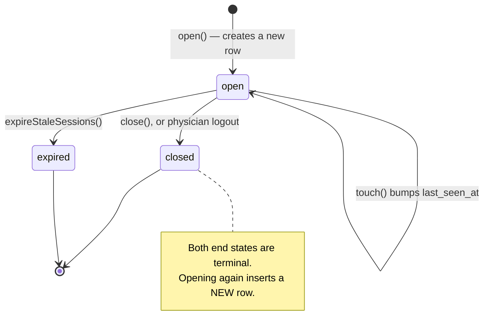

# Physician Consultation Intake (and Presence Tracking)

> Terminology follows `docs/paper/glossary.md`. Per the approved inventory, this
> file also covers **presence tracking**, because presence is one of the inputs
> intake availability depends on. Figure and table numbers use the `X.n`
> placeholder pending final manuscript numbering.

## 1. Feature Name

Physician Consultation Intake — recurring intake hours, the live open/close/heartbeat
intake session, staleness expiry, the patient-facing availability gate, and the
global presence tracking that feeds it.

## 2. Purpose

To answer one question: **can the telemedicine service accept a new consultation
request right now?**

The service class states the boundary explicitly. "Intake is open" says nothing
about whether a physician is assigned to anyone, whether a nurse is working the
queue, or whether any consultation is running. Closing or expiring intake never
touches a consultation — the service has no method that can claim, assign, start,
schedule, complete, or cancel one, and `PhysicianAvailabilitySession` has no
relationship into the consultation tables. That is deliberate: **an active
consultation must survive its physician going offline.**

Intake is also **not** presence. `users.online_status` is written automatically and
answers "is this person connected?"; it cannot express intent. Intake changes only
through an explicit open or close, a logout, or expiry.

## 3. Actors / Roles

| Actor | Involvement |
|---|---|
| Physician | Defines recurring intake hours; opens and closes intake; their browser heartbeats keep it alive. |
| Patient | Sees the resulting availability as a banner and a gate, with **no physician identity ever disclosed**. |
| All roles | Have presence written on every authenticated request by `TrackUserPresence`. |
| Scheduler | Runs `consultations:expire-intake-sessions` every minute. |

## 4. User Workflow

**Defining intake hours.** The physician opens `GET /physicians/{physician}/consultation-intake`
and adds recurring weekly windows (e.g. "Monday 14:00–17:00"). Windows may be
created, updated, activated/deactivated, and deleted.

**Opening intake.** The physician clicks the control on the intake status card.
`consultationIntakeOpen` delegates to `PhysicianAvailabilityService::open()`, which
creates one `physician_availability_sessions` row with `status = 'open'` and a
`mode` of `scheduled` or `overtime` decided at that instant.

**Staying open.** The application-wide authenticated heartbeat in
`layouts/app.blade.php` bumps `last_seen_at` on the open session. The intake page
issues no heartbeat of its own — the controller comment notes there is deliberately
no `heartbeat_url` in the page payload, because the one shared heartbeat keeps
beating on every page, not only this one.

**Closing intake.** Explicitly via the Stop control, or implicitly on logout
(`AuthenticatedSessionController::destroy`), or by expiry when the heartbeat stops.

**Patient effect.** `isServiceAvailable()` gates `ConsultationController::store`
and drives the banners on the patient dashboard and the new-consultation page.

## 5. Routes

All under `physicians/{physician}` in `routes/web.php`, inside `auth` + `verified`.

| Method | URI | Name |
|---|---|---|
| GET | `/consultation-intake` | `physician.consultation_intake` |
| POST | `/consultation-intake/schedules` | `physician.consultation_intake.schedules.store` |
| PUT | `/consultation-intake/schedules/{schedule}` | `physician.consultation_intake.schedules.update` |
| DELETE | `/consultation-intake/schedules/{schedule}` | `physician.consultation_intake.schedules.destroy` |
| POST | `/consultation-intake/open` | `physician.consultation_intake.open` |
| POST | `/consultation-intake/close` | `physician.consultation_intake.close` |
| POST | `/consultation-intake/heartbeat` | `physician.consultation_intake.heartbeat` |

Plus, for presence: `POST /presence/heartbeat` (`presence.heartbeat`), which is
**CSRF-exempt** (`bootstrap/app.php`, `validateCsrfTokens(except: ['presence/heartbeat'])`).

The route file carries two comments worth quoting in the manuscript: that these
routes are deliberately named nowhere near `scheduled_consultation`, which manages
`schedule_slots` — "a different concept" — and that the `{physician}` parameter on
the live controls exists only for authorization consistency, since the session
acted on is always the authenticated user's.

## 6. Controllers

`PhysicianController::consultationIntake`, `consultationIntakeOpen`,
`consultationIntakeClose`, `consultationIntakeHeartbeat`, `storePhysicianSchedule`,
`updatePhysicianSchedule`, `destroyPhysicianSchedule`, plus the private
`authenticatedPhysician`, `serializeIntakeState`, `serializePhysicianSchedules`,
`assertScheduleWindowIsValid`, `normalizeScheduleTime`.

`PresenceController::heartbeat` for presence.

The three live-control actions are deliberately thin. The controller comment states
that every state transition belongs to the service, which owns the transaction, the
lock, idempotency, and the mode classification — and that nothing in the controller
writes to `physician_availability_sessions` directly.

## 7. Services

**`PhysicianAvailabilityService` (537 lines) — the single writer of
`physician_availability_sessions`.**

| Method | Responsibility |
|---|---|
| `open()` | Idempotently open a session under a lock |
| `close()` | Close the open session; null (a success) when nothing was open |
| `touch()` | Bump `last_seen_at` on an already-open session only |
| `currentSessionFor()` | Read-only lookup |
| `serializeIntakeState()` | Physician-facing state, shared with `DashboardController` |
| `dashboardIntakeSummary()` | Intake state + today's windows + the schedule warning |
| `expireStaleSessions()` | Bulk-expire stale open sessions |
| `isServiceAvailable()` | `hasOpenIntake() && pendingQueueHasCapacity()` |
| `hasOpenIntake()` | At least one eligible physician with a fresh open session |
| `pendingQueueHasCapacity()` | `Consultation::pending()->count() < queue_limit` |
| `nextScheduledWindow()` | Earliest upcoming window across all eligible physicians |
| `weeklyScheduleOverview()` | This week's windows, deduplicated and anonymised |

The class docblock states that **authorization is the caller's job**: the methods
take a `User` model rather than an id so a controller cannot accidentally address
another physician's session by passing a bare integer, but they do not check who is
asking.

## 8. Models

**`PhysicianSchedule`** — one recurring weekly window. Its docblock is emphatic
that this is **not** `schedule_slots`, and that `day_of_week` uses 0 = Sunday … 6 =
Saturday to match `CarbonImmutable::dayOfWeek` with no conversion. Changing it to
ISO-8601 numbering would silently shift every stored row by one day. `start_time`
and `end_time` are **deliberately uncast** — they are local wall-clock strings, and
casting them to datetime would attach a meaningless date.

**`PhysicianAvailabilitySession`** — one continuous period of deliberate
availability. `closed` and `expired` are terminal; starting intake again inserts a
new row rather than reopening. The docblock explains why the one-open-session
invariant lives in the service rather than the schema: a partial unique index is
unsupported on MySQL, and a plain unique on `(physician_id, status)` would wrongly
forbid a physician from ever having two closed sessions.

**`User`** — `online_status`, `last_seen_at`.

## 9. Database

**`physician_schedules`** (`2026_09_06_120000`):

| Column | Type | Notes |
|---|---|---|
| `id` | bigint | PK |
| `physician_id` | FK → `users.user_id` | cascade on update and delete |
| `day_of_week` | unsignedTinyInteger | 0 = Sunday … 6 = Saturday |
| `start_time`, `end_time` | time | wall-clock |
| `is_active` | boolean | default `true` |
| `created_at`, `updated_at` | | |

**Unique** on `(physician_id, day_of_week, start_time)`; **index** on
`(physician_id, day_of_week)`.

**`physician_availability_sessions`** (`2026_09_06_120100`):

| Column | Type | Notes |
|---|---|---|
| `id` | bigint | PK |
| `physician_id` | FK → `users.user_id` | cascade |
| `started_at`, `last_seen_at` | dateTime | not null |
| `ended_at` | dateTime, nullable | |
| `status` | enum | `open`, `closed`, `expired`; default `open` |
| `mode` | enum | `scheduled`, `overtime` |

**Indexes** on `(status, last_seen_at)` and `(physician_id, status)`. The migration
carries a comment noting it uses `Schema::create()` with `enum()` rather than a
later MySQL `ALTER`, so the values exist in the test schema too.

**Configuration** (`config/consultations.php`): `intake.queue_limit` (default 20,
env `CONSULTATION_QUEUE_LIMIT`) and `intake.stale_after_seconds` (default 120, env
`CONSULTATION_INTAKE_STALE_AFTER`). The file explains both are config rather than
constants because they are staffing decisions an administrator may need to change
without a deployment — unlike `TAKEOVER_GRACE_MINUTES`, which encodes a fixed
clinical rule. 120 seconds lets a physician miss two consecutive 60-second beats.

## 10. Validation and Authorization

**Authorization** is `PhysicianController::authorizePhysician()`:

```php
if (Auth::user()->role !== 'physician' || Auth::id() !== $physician->user_id) {
    abort(403, 'Unauthorized access.');
}
```

This is **controller-level, not a policy**. It checks both the role and that the
route-bound physician is the acting user.

Two further structural guards:

- `authenticatedPhysician()` returns `Auth::user()`, so the physician whose intake
  changes is always taken from the session, never the route parameter. The comment
  says this changes no behaviour but makes the guarantee structural rather than
  incidental — mattering most for the heartbeat, the endpoint JavaScript calls
  repeatedly.
- `updatePhysicianSchedule` scopes the schedule **inside the query** rather than
  fetching by bare id and checking afterwards, so another physician's schedule
  "simply does not exist in this query".

**Validation** is in `StorePhysicianScheduleRequest` / `UpdatePhysicianScheduleRequest`
plus `assertScheduleWindowIsValid()`, which enforces that `end_time` is later than
`start_time`, that a window may not cross midnight, and that it may not overlap
another **active** window of the same physician on the same day. Windows are
half-open `[start, end)`, so adjacent windows never both match.

**The heartbeat's CSRF asymmetry is deliberate.** `touch()` can only bump an
already-open session — it never creates one and never reopens a closed or expired
one — *because the presence endpoint that drives it is CSRF-exempt*. A CSRF-exempt
request must not be able to bring intake into existence. Opening intake is always a
CSRF-protected action.

## 11. Business Rules

| # | Rule | Enforced by | Enforcement type |
|---|---|---|---|
| BR-1 | At most one open session per physician | `open()` locks the physician's `users` row, then checks for an existing open session | **Application (pessimistic lock)** — explicitly *not* a database constraint; see the model docblock |
| BR-2 | Opening intake is idempotent | Existing open session refreshed and returned rather than duplicated | **Application** |
| BR-3 | A session's `mode` is fixed at open and never recomputed | `evaluateMode()` is called once, in `create()` | **Application** |
| BR-4 | Schedule windows are half-open `[start, end)` | `greaterThanOrEqualTo($start) && lessThan($end)` | **Application** |
| BR-5 | A physician's windows must not overlap or cross midnight | `assertScheduleWindowIsValid()` | **Application** — the model docblock states neither can be expressed as a constraint |
| BR-6 | Two windows may not start at the same time on the same day | `unique(physician_id, day_of_week, start_time)` | **Database** |
| BR-7 | A heartbeat can never create or reopen a session | `touch()` queries only `status = 'open'` | **Application** |
| BR-8 | Staleness is evaluated at **read** time, not trusted from the stored status | `hasOpenIntake()` adds `last_seen_at > staleBefore()` | **Application** |
| BR-9 | Only eligible physicians count: role + active account + online + fresh presence | `hasOpenIntake()`'s `whereHas('physician', …)` | **Application** |
| BR-10 | The pending queue ceiling is global, not per physician | `Consultation::pending()->count()` — a request has no assigned physician when created | **Application** |
| BR-11 | Ending availability can never reach a consultation | There is no relationship from `PhysicianAvailabilitySession` into the consultation tables | **Structural (schema + model design)** |
| BR-12 | No physician identity is ever disclosed to a patient | `isServiceAvailable()` returns a plain boolean; `weeklyScheduleOverview()` aggregates and deduplicates without names | **Application** |

**Database-enforced vs application-enforced.** Only BR-6 is a database constraint,
plus BR-11 which is structural (an absence of foreign keys). The central invariant —
one open session per physician — is held by a **pessimistic lock in the service**,
and the model docblock explains exactly why a constraint was not used. This is the
clearest example in the system of a deliberate application-level invariant, and the
manuscript should present it as such rather than implying schema backing.

**Why the lock is on the `users` row and not the session row:** the `users` row
always exists, whereas the session row may not, and a lock cannot be taken on a row
that has yet to be inserted. Locking one user row leaves every other physician free
to open intake concurrently. The same pattern appears in
`ConsultationVideoService::startForPhysician()` and the staff-invitation resend.

## 12. Status / State Transitions



*Figure X.4 — `physician_availability_sessions.status`. Note `expired` is genuinely
written here by `expireStaleSessions()` — unlike the dead `expired` value on
`follow_up_requests`.*

`mode` is `scheduled` or `overtime`, stamped once at creation.

The physician-facing display state is derived by `serializeIntakeState()` into
`open`, `closed`, or `expired`. The `expired` display exists *purely so the
physician reads the right explanation*; the comment stresses it is never used to
decide whether intake is open, and neither branch reopens anything.

## 13. Error and Edge-Case Handling

| Case | Behaviour | Evidence |
|---|---|---|
| Non-physician row reaches `open()` | `RuntimeException` — a data-integrity guard, not authorization | `open()`; the comment distinguishes the two |
| Second open click / second tab | Same session refreshed and returned | `PhysicianAvailabilityServiceTest`: "never leaves a physician with two open sessions across repeated opens" |
| Close with nothing open | Returns null; treated as success | "treats closing with nothing open as a no-op" |
| Heartbeat after the session ended | No-op reporting `open: false`, letting the page stop its loop | `consultationIntakeHeartbeat` |
| Heartbeat against a closed or expired session | Never reopens | "does not reopen a closed session on heartbeat", "does not reopen an expired session on heartbeat" |
| Schedule evaluation throws | Logged, session falls back to `overtime` — the label must never stop a physician opening intake | `evaluateMode()`'s `catch (Throwable)` |
| Expiry command run twice in a minute | Second run matches nothing | "leaves closed and already expired sessions alone" |
| Heartbeat racing the expiry sweep | The `WHERE` is re-evaluated under the row lock at write time; the session is either expired or spared, both safe | `expireStaleSessions()` docblock |
| Scheduler never runs | Intake still closes correctly to new requests, because `hasOpenIntake()` checks freshness at read time. The command only makes the stored status honest | `ExpireStaleIntakeSessions` docblock |
| Editing a schedule after opening | Never rewrites the open session's mode | "changing a schedule's time never rewrites an already-open session's mode" |
| Schedule CRUD | Never opens, closes, or expires a session, and never touches consultations, requests, slots or presence | Four dedicated tests in `PhysicianConsultationIntakeTest` |

## 14. UI Implementation

**`resources/views/physician/consultation_intake.blade.php`** — one Alpine
component, `consultationIntakeManager(window.consultationIntakeData)`, bootstrapped
from a server-rendered payload. It groups `schedules` into `schedulesByDay` by
filtering on `day_of_week`, renders `<template x-for="day in schedulesByDay">`, and
shows per-window controls including an inactive marker
(`x-show="!window.is_active"`). The add/edit form uses `x-model="form.day_of_week"`
and posts to either `routes.store_url` or the update URL built from
`update_url_template` with `__ID__` substituted. A `saving` flag swaps the button
label between "Save" and "Saving...".

**`resources/views/components/physician/intake-status-card.blade.php`** — the shared
status card, used by both the intake page and the physician dashboard so the two
can never disagree. It keys entirely off `intake.state`: the indicator dot is
`bg-brand-green` when `open`, `bg-amber-500` when `expired`, `bg-slate-300` when
`closed`; `intake.mode_label` shows only while open; distinct explanatory lines
appear for `expired` and `closed`; and the Start/Stop controls swap on
`x-show="intake.state !== 'open'"` / `x-show="intake.state === 'open'"`.

**Patient-facing surfaces** are documented in
`consultation-request-submission.md` (the wizard banner) and the patient dashboard,
which additionally renders `nextScheduledWindow()` and `weeklyScheduleOverview()`
when intake is closed.

Both physician pages are **server-rendered first** specifically so the page never
flashes the wrong intake status while JavaScript boots.

### Presence tracking

`TrackUserPresence` is registered as **global `web` middleware** in
`bootstrap/app.php`, so it runs for **every authenticated request by every role** —
not only physicians and not only consultation activity. It issues a direct
`DB::table('users')->update()` of `online_status = 'online'` and `last_seen_at = now()`,
bypassing Eloquent (so no model events fire and `updated_at` is untouched).

`PresenceController::heartbeat` performs the identical update and exists for pages
that would otherwise sit idle without generating requests. It is CSRF-exempt.

Presence is consumed here as the `PRESENCE_FRESHNESS_MINUTES = 2` guard in
`hasOpenIntake()` and `dashboardIntakeSummary()`. The constant is deliberately not a
config key: it mirrors the freshness rule `NurseController::isUserOnline()` and
`PhysicianController::isUserOnline()` already apply, and only the intake session's
own staleness is configurable.

The separate **in-session presence** used by messaging is a different mechanism and
is documented in `consultation-messaging.md`.

## 15. Tests

**5 files, 148 cases** — the most heavily tested area of the consultation workflow.

| File | Cases | Focus |
|---|---|---|
| `PhysicianAvailabilityServiceTest.php` | 43 | Open idempotency, mode evaluation including window boundaries, close, touch, expiry, and all of `isServiceAvailable()`'s refusal conditions |
| `PhysicianConsultationIntakeTest.php` | 34 | Schedule CRUD, cross-physician authorization, overlap and midnight rules, and four isolation tests proving schedule CRUD never touches sessions, consultations, slots, or presence |
| `PhysicianIntakeControlsTest.php` | 34 | Open/close/heartbeat endpoints, logout closing intake, the rendered card states, and isolation from every other subsystem |
| `PhysicianIntakeExpiryTest.php` | 19 | The expiry command, the configured threshold, scheduler registration, and heartbeat behaviour across page navigation |
| `PhysicianIntakeFoundationTest.php` | 16 | Schema shape, defaults, cascade deletes, and that the config exposes exactly its documented keys |

Patient-side gating is covered by `ConsultationIntakeGateTest.php` (22) and
`ConsultationIntakeAvailabilityUiTest.php` (16), documented in
`consultation-request-submission.md`.

## 16. Source-Code Evidence

| Claim | Evidence |
|---|---|
| Single writer of the session table | `PhysicianAvailabilityService` class docblock |
| Lock on the `users` row, and why | `open()` — `User::query()->whereKey(...)->lockForUpdate()->firstOrFail()` plus its concurrency comment |
| One-open-session invariant is application-level | `PhysicianAvailabilitySession` docblock, naming the MySQL partial-index limitation |
| Mode fixed at open | `evaluateMode()` called only inside `create()`; `serializeIntakeState()` "never re-evaluates the recurring schedule" |
| Half-open windows | `$now->greaterThanOrEqualTo($start) && $now->lessThan($end)` |
| Heartbeat cannot create a session | `touch()`'s `openSessionQuery()` plus its CSRF rationale |
| Read-time freshness | `hasOpenIntake()` — `where('last_seen_at', '>', $this->staleBefore())` |
| Eligibility definition | `whereHas('physician', fn ($q) => $q->where('role','physician')->where('account_status','active')->where('online_status','online')->where('last_seen_at','>',$presenceCutoff))` |
| Global queue ceiling | `Consultation::pending()->count() < (int) config('consultations.intake.queue_limit')` |
| No path from availability to consultations | Absence of any consultation relationship on `PhysicianAvailabilitySession` |
| Anonymised patient view | `weeklyScheduleOverview()` — deduplicated labels, no physician names |
| Presence is global middleware | `bootstrap/app.php`, `$middleware->web(append: [TrackUserPresence::class])` |
| Presence heartbeat CSRF exemption | `bootstrap/app.php`, `validateCsrfTokens(except: ['presence/heartbeat'])` |
| Logout closes intake | `AuthenticatedSessionController::destroy` |

## 17. Limitations / Gaps

| # | Limitation |
|---|---|
| PI-1 | **The one-open-session invariant has no database backing.** It is held entirely by a pessimistic lock in `open()`. The model docblock explains the reasoning (MySQL lacks partial unique indexes), and `openSessionQuery()` orders `latest('id')` defensively "if one ever appeared anyway" — an acknowledgement that the invariant is not structurally guaranteed. |
| PI-2 | **Window overlap and the midnight rule are application-only.** Only `(physician_id, day_of_week, start_time)` is unique. Two overlapping windows with different start times are rejected by `assertScheduleWindowIsValid()` alone and would be accepted by a direct database write. |
| PI-3 | **Overlap is checked only against *active* windows.** A test documents this: "does not let an inactive window block a new active window from overlapping it." Reactivating a deactivated window could therefore produce an overlap that the create path would have refused. |
| PI-4 | **The expiry command needs a scheduler.** `consultations:expire-intake-sessions` fires only under `schedule:run` / `schedule:work`. The service compensates by checking freshness at read time, so the *gate* stays correct — but without the scheduler the physician's own page can show an open session that no longer counts. |
| PI-5 | **Presence is a blunt instrument.** `TrackUserPresence` marks a user online on *any* authenticated request, including background polling, so "online" means "a browser tab is making requests", not "attending". Nothing ever writes `offline` except logout; a user who closes the tab stays `online` until the 2-minute freshness window lapses at read time. |
| PI-6 | **Presence bypasses Eloquent.** Both the middleware and the heartbeat write with the query builder, so no model events fire and `users.updated_at` is not advanced. Any audit reasoning based on `updated_at` will miss presence changes. |
| PI-7 | **`PRESENCE_FRESHNESS_MINUTES` is duplicated three times.** The same 2-minute rule appears as a constant in `PhysicianAvailabilityService` and inline as `now()->subMinutes(2)` in both `NurseController::isUserOnline()` and `PhysicianController::isUserOnline()`. Changing one would silently desynchronise the others. |
| PI-8 | **The service performs no authorization.** By design — the docblock says so — but it means every future caller must remember to authorize first. Passing a `User` model rather than an id is a mitigation, not a guarantee. |
| PI-9 | **The queue ceiling is global.** With `queue_limit` at 20, twenty pending requests close intake for the entire institution regardless of how many physicians are available. This is a documented staffing decision, not a defect, but it is worth stating as a scaling limitation. |
