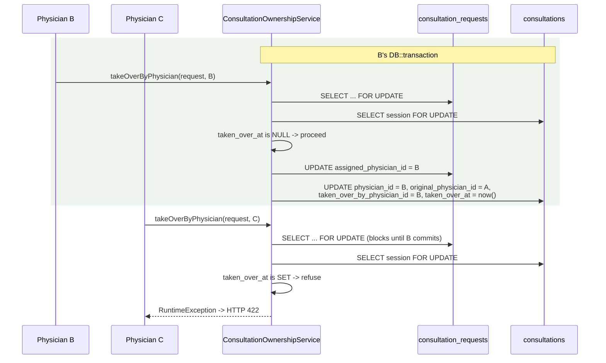
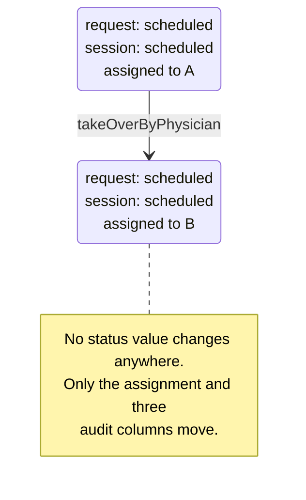

# Physician Takeover

> Terminology follows `docs/paper/glossary.md`. Figure and table numbers use the
> `X.n` placeholder pending final manuscript numbering.

## 1. Feature Name

Physician Takeover — another physician claims a **scheduled consultation** whose
assigned physician has not started it within a grace period after the slot's start
time.

## 2. Purpose

To stop a patient waiting indefinitely because the physician assigned to their
appointment did not arrive, without inventing a new workflow state or requiring an
administrator to intervene.

The design is deliberately minimal, and the migration says so directly: *"Takeover
deliberately introduces no new status value: a taken-over consultation stays
request_status = 'scheduled' / consultation_status = 'scheduled' and simply changes
hands."*

## 3. Actors / Roles

| Actor | Involvement |
|---|---|
| Claiming physician | Sees the Claim control in the consultation inbox once eligible, and claims. |
| Original physician | Loses the assignment; can no longer start the consultation. Not notified. |
| Patient | Notified that the consultation was reassigned. |

## 4. User Workflow

1. A consultation is scheduled to Physician A for 2:00 PM. A does not start it.
2. At 2:10 PM (slot start + `TAKEOVER_GRACE_MINUTES`), the row's Claim control
   becomes available in every other physician's inbox.
3. Physician B POSTs to `.../consultations/{consultation}/take-over`.
4. `takeOverByPhysician()` verifies eight preconditions under row locks, moves the
   assignment on **both** tables, and writes three audit columns.
5. The patient is notified: *"Another physician has taken over your scheduled
   consultation and will attend to you shortly."*
6. Physician B starts the consultation through the ordinary start flow, with the
   slot time-window guards **skipped**.

## 5. Routes

| Method | URI | Name |
|---|---|---|
| POST | `/physicians/{physician}/consultations/{consultation}/take-over` | `physician.consultations.take_over` |

## 6. Controllers

`PhysicianController::takeOverConsultation`, plus the private
`resolveTakeoverInfo()` and `physicianDisplayName()` that render eligibility into
the inbox.

The controller docblock states the division of labour precisely: *"Every
eligibility rule (status, grace period, already-claimed) is decided inside the
service under a row lock, never here and never in the browser."*

## 7. Services

`ConsultationOwnershipService::takeOverByPhysician()` and the public static
`ConsultationOwnershipService::takeoverEligibleAt(ScheduleSlot $slot)`.

`takeoverEligibleAt()` is exposed publicly *"so the physician inbox can render the
same boundary the transaction below enforces — the two can never drift apart."*
This is the one place in the system where a display rule and an enforcement rule
are guaranteed identical by sharing a method, and it is worth contrasting in the
manuscript with the 15-minute early-start allowance, which is duplicated as a
literal in two places (see `consultation-scheduling.md`, gap SC-4).

## 8. Models

`Consultation` (`consultation_requests`), `ConsultationSession` (`consultations`),
`ScheduleSlot` (`schedule_slots`).

`ConsultationSession` exposes `originalPhysician()`, `takenOverByPhysician()`, and
`wasTakenOver()`.

## 9. Database

Three columns on `consultations`, added by
`2026_09_01_120000_add_takeover_columns_to_consultations_table.php`:

| Column | Type | Meaning |
|---|---|---|
| `original_physician_id` | unsignedBigInteger, nullable, FK → `users.user_id` | The physician the consultation was scheduled to before any takeover. **Written once, on the first takeover, and never overwritten.** |
| `taken_over_by_physician_id` | unsignedBigInteger, nullable, FK → `users.user_id` | The physician who claimed it. Equal to `physician_id` today; kept separate so "who claimed it" stays distinguishable from "who ended up running it". |
| `taken_over_at` | dateTime, nullable | When the hand-off happened. |

Both foreign keys are `nullOnDelete()` + `cascadeOnUpdate()`.

The migration explains why nothing else needed a column: *"the remaining audit
facts need no columns because they are already derivable: original assignment time
is assigned_at, the scheduled time is the joined schedule_slots row, the moment
takeover became eligible is that slot's start plus
ConsultationOwnershipService::TAKEOVER_GRACE_MINUTES, and the physician who
actually started is physician_id together with started_at."* That is exactly the
kind of normalisation argument a panel will ask about, and it is the author's own.

**Also written:** `consultation_requests.assigned_physician_id` and
`consultations.physician_id`, both in the same transaction *"so they can never
disagree"*.

**Deliberately not written:** `schedule_slots.physician_id`. The slot keeps
recording who the consultation was originally scheduled to. This has a direct
consequence in `startByPhysician`, documented below.

## 10. Validation and Authorization

`authorizePhysician()` only — no request body is validated because the endpoint
takes no parameters beyond the route bindings.

The controller docblock notes the authorization chain relies on existing
conventions: `authorizePhysician()` rejects any non-physician and any physician
acting under someone else's route id, and `LoginRequest` already refuses non-active
accounts at sign-in.

Every other rule is enforced in the service under the lock.

## 11. Business Rules

`takeOverByPhysician()` enforces **eight** preconditions, in this order:

| # | Rule | Failure message |
|---|---|---|
| BR-1 | The request must be `scheduled` | "Only scheduled consultations that have not started can be taken over." |
| BR-2 | A session must exist | "This consultation has no session to take over." |
| BR-3 | `taken_over_at` must be null | "This consultation has already been claimed by another physician." |
| BR-4 | There must be an assigned physician to take over from | "This consultation has no assigned physician to take over from." |
| BR-5 | The claimant must not already be the assignee | "This consultation is already assigned to you." |
| BR-6 | The session must be `scheduled` with `started_at` null | "This consultation has already been started and can no longer be taken over." |
| BR-7 | The session must have a slot | "This consultation has no assigned schedule slot yet." |
| BR-8 | The slot must exist and be `booked` or `missed`, and `now() >= takeoverEligibleAt(slot)` | "The scheduled slot for this consultation is no longer valid." / "This consultation cannot be taken over until …" |

**Ordering is deliberate.** BR-3 is checked *before* BR-5 with an explicit comment:
*"Checked before the 'is it already mine' test below so that both sides of a
concurrent claim get the same honest answer."*

| Constant | Value | Source |
|---|---|---|
| `TAKEOVER_GRACE_MINUTES` | 10 | `ConsultationOwnershipService`, a class constant rather than config because *"this codebase already expresses its one other scheduling window (the 15-minute early-start allowance) the same way, and a single value does not earn the project's first config file"* |

**All eight rules are application-enforced.** There is **no database constraint**
of any kind behind takeover — not a check constraint, not a unique index, not a
trigger. The one-claim-only invariant (BR-3) is held entirely by re-reading
`taken_over_at` under the session row lock.

## 12. Concurrency

Takeover is the cleanest example in the system of lock-then-check producing a
single winner, and the service docblock states the mechanism explicitly: *"the
consultation_requests row is locked before the assignment is read, so two
physicians claiming simultaneously serialise here. The loser re-reads after the
winner commits, sees taken_over_at already set, and is refused — V1 allows exactly
one claim per consultation, which is also what stops a second takeover overwriting
original_physician_id with the first claimant."*



*Figure X.12 — Two physicians claiming simultaneously. The lock serialises them;
the re-read of `taken_over_at` is what rejects the loser.*

The belt-and-braces detail worth documenting: even if BR-3 somehow passed twice,
`'original_physician_id' => $session->original_physician_id ?? $originalPhysicianId`
would preserve the first value. The comment says the `??` *"keeps that intent
explicit."*

A test proves the behaviour with real concurrent transactions: *"allows exactly one
physician to win two concurrent claim attempts."*

## 13. Status / State Transitions

**There are none.** This is the feature's defining characteristic.



*Figure X.13 — Takeover changes ownership without changing state. A state diagram
of `request_status` or `consultation_status` will not show this transition at all —
document it as an assignment change, not a status change.*

## 14. Error and Edge-Case Handling

| Case | Response | Test |
|---|---|---|
| One second before the grace period | 422 with the eligible-at timestamp | "refuses a takeover one second before the grace period elapses" |
| Exactly at slot start + 10 minutes | Allowed | "allows a takeover at exactly the scheduled time plus the grace period" |
| Consultation already `active` | 422 | "cannot claim an already active consultation" |
| Consultation `completed` | 422 | "cannot claim a completed consultation" |
| Consultation `cancelled` | 422 | "cannot claim a cancelled consultation" |
| Second takeover attempt | 422 | "cannot claim a consultation a second time" |
| Claiming your own consultation | 422 | "refuses a physician claiming a consultation already assigned to themselves" |
| Nurse attempts a claim | 403 | "forbids a nurse from claiming a consultation" |
| Patient attempts a claim | 403 | "forbids a patient from claiming a consultation" |
| Physician under another's route id | 403 | "forbids a physician acting under another physician route id" |
| Two simultaneous claims | Exactly one wins | "allows exactly one physician to win two concurrent claim attempts" |
| Original physician tries to start after takeover | Refused | "stops the original physician starting the consultation after it is taken over" |
| Claiming physician starts after the slot window ended | Allowed | "lets the claiming physician start even after the original slot window has ended" |
| Video authorization after takeover | Moves to the claimant | "moves video consultation authorization to the claiming physician" |

**The interaction with `startByPhysician` is subtle and deliberate.** Because the
slot's `physician_id` is never rewritten, the claiming physician does not own the
slot. `startByPhysician` therefore matches the slot two ways:

```php
$claimedByTakeover = (int) $session->taken_over_by_physician_id === $physicianId;
$ownsSlot = $slot && (int) $slot->physician_id === $physicianId;

if (!$slot || !($ownsSlot || $claimedByTakeover) || !in_array($slot->status, ['booked','missed'], true)) {
    throw new \RuntimeException('The assigned schedule slot is not ready to start.');
}
```

and it skips the early/late time-window guards for a taken-over consultation,
because *"takeOverByPhysician only hands the consultation over once slot start +
the grace period has passed, so the 'too early'/'window ended' guards — which exist
to hold the scheduled physician to their slot — no longer apply."*

## 15. UI Implementation

Takeover has no page of its own. `resolveTakeoverInfo()` merges takeover fields
into every physician-inbox row, alongside a `takeover_url`. Its docblock states the
guarantee and its limit: the boundary comes from `takeoverEligibleAt()`, the same
helper the transaction uses, *"so the button the physician sees and the rule the
server enforces cannot drift apart. This is presentation only — a stale page that
still shows a Claim button is rejected by the service, not by this method."*

It also supplies `assigned_physician_name`, `is_assigned_to_me`, and
`is_actionable_by_me`. The last one exists so the inbox does not offer
Reject/Schedule/Start buttons that could only return 422 — the comment is explicit
that the backend refuses those actions for anyone else anyway, and *"this flag just
stops the inbox offering a button that can only 422."*

A test confirms the rendering side: *"exposes takeover availability in the physician
inbox only after the grace period."*

The patient sees only a notification. **The original physician is not notified**
that they lost the assignment.

## 16. Tests

| File | Cases | Coverage |
|---|---|---|
| `tests/Feature/PhysicianTakeoverTest.php` | **19** | Grace-period boundary on both sides, both-table assignment and audit columns, patient notification, original physician blocked from starting, claimant able to start including past the window, all three authorization refusals, all four ineligible statuses, double-claim, self-claim, concurrent claims, video authorization transfer, and inbox rendering |

This is among the best-tested features in the system — in clear contrast to
scheduling (no dedicated test file) and missed slots (no command test).

## 17. Source-Code Evidence

| Claim | Evidence |
|---|---|
| No new status value | `2026_09_01_120000_add_takeover_columns_to_consultations_table.php` docblock; `takeOverByPhysician` updates no status column |
| Grace period constant | `ConsultationOwnershipService::TAKEOVER_GRACE_MINUTES = 10` |
| Shared display/enforcement boundary | `public static function takeoverEligibleAt(ScheduleSlot $slot)` and its docblock |
| Eight preconditions under lock | `takeOverByPhysician`, two `lockForUpdate()` calls plus the slot lock |
| Ordering of BR-3 before BR-5 | The comment above the `taken_over_at !== null` check |
| First claimant preserved | `'original_physician_id' => $session->original_physician_id ?? $originalPhysicianId` |
| Both tables written together | `$consultation->update([...])` and `$session->update([...])` inside one transaction |
| Slot `physician_id` untouched | Absent from both update payloads; confirmed by the comment in `startByPhysician` |
| Start path recognises the claimant | `$claimedByTakeover` / `$ownsSlot` in `startByPhysician` |
| Notification type reused deliberately | Comment above `NotificationService::sendUnique(... CONSULTATION_ASSIGNED ...)`: *"CONSULTATION_ASSIGNED is reused rather than adding an enum case"* |

## 18. Limitations / Gaps

| # | Limitation |
|---|---|
| PT-1 | **Exactly one takeover per consultation, by design.** BR-3 makes a second claim impossible, so a consultation abandoned twice cannot be rescued a second time. The service docblock calls this "V1", indicating a known scope decision rather than an oversight. |
| PT-2 | **No database constraint backs any takeover rule.** All eight preconditions live in one service method. Nothing in the schema prevents `taken_over_at` being set twice, or `original_physician_id` being overwritten, by a write that bypasses the service. |
| PT-3 | **The original physician is not notified.** Only the patient receives a notification. A physician who was merely late discovers the loss by finding the consultation gone from their queue, or by a 422 on Start. |
| PT-4 | **The slot still belongs to the original physician.** `schedule_slots.physician_id` is deliberately unchanged, so the claiming physician runs a consultation on someone else's slot. This is coherent as an audit record, but it means slot-based reporting ("how many consultations did Dr. B hold?") will attribute the slot to Dr. A. |
| PT-5 | **Takeover is invisible to a status-based state diagram.** Because no status changes, any diagram or analytic built on `request_status` / `consultation_status` will not show that the consultation changed hands. The three audit columns are the only evidence. |
| PT-6 | **The grace period is a constant, not configuration.** Ten minutes is compiled in. The reasoning is documented (a single value not earning a config file), but `config/consultations.php` has since been created for intake — so the stated justification no longer strictly holds. |
| PT-7 | **`taken_over_by_physician_id` duplicates `physician_id` today.** The migration acknowledges they are equal and keeps them separate for future distinguishability. Until a second takeover becomes possible (PT-1), the column carries no additional information. |
