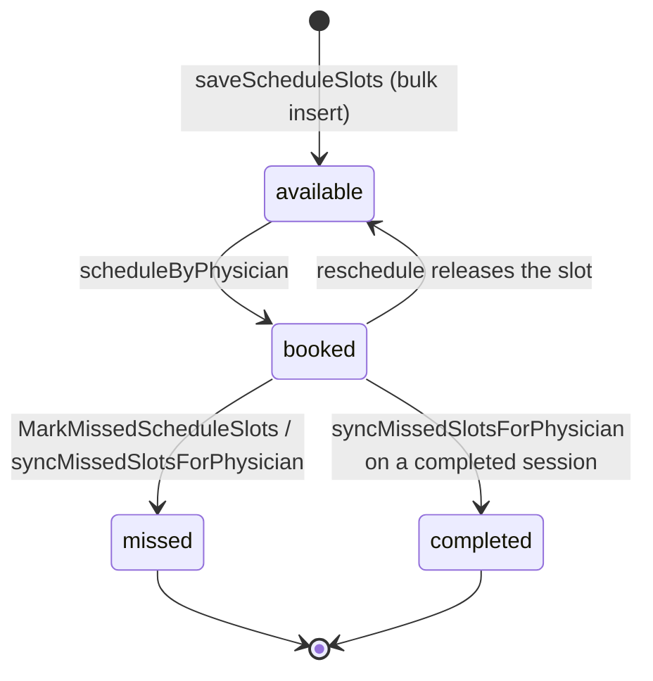

# Schedule Slot Management

> Terminology follows `docs/paper/glossary.md`. **This feature manages
> `schedule_slots` — concrete bookable appointment inventory for one calendar
> date. It is not "intake".** Recurring weekly intake hours are
> `physician_schedules` and are documented in `physician-intake.md`. Figure and
> table numbers use the `X.n` placeholder pending final manuscript numbering.

## 1. Feature Name

Schedule Slot Management — a physician generates a preview of candidate
appointment slots from a working-hours range, reviews it, and saves the selected
slots as bookable inventory.

## 2. Purpose

To create the `schedule_slots` rows that consultation scheduling later consumes.
The two-step generate-then-save design exists so a physician sees exactly what will
be created — including what was skipped and why — before anything is written.

The codebase is explicit that this is a different concept from intake. The comment
above the recurring-schedule section of `PhysicianController` reads: *"Deliberately
separate from the 'Schedule Availability' tab above: that tab manages
schedule_slots, concrete bookable appointment inventory for one calendar date."*
`routes/web.php` carries the same warning.

## 3. Actors / Roles

| Actor | Involvement |
|---|---|
| Physician | The only actor. Generates and saves their own slots. |

No patient or nurse ever reaches these endpoints, and no notification is sent.

## 4. User Workflow

1. Physician opens `GET /physicians/{physician}/scheduled_consultation`.
2. They enter a slot date, working start and end times, a slot duration, and
   optionally a break range, then POST to `.../scheduled_consultation/generate`.
3. The controller returns a **preview only — nothing is persisted** — as a list of
   candidate slots each pre-marked `selected: true`, plus a summary counting how
   many were skipped by break, by conflict, and by already being in the past.
4. The physician deselects any they do not want and POSTs the list to
   `.../scheduled_consultation/save`.
5. The save endpoint re-applies the past and conflict checks, bulk-inserts what
   survives, and returns a summary plus the refreshed upcoming-slot list.

## 5. Routes

| Method | URI | Name |
|---|---|---|
| GET | `/physicians/{physician}/scheduled_consultation` | `physician.scheduled_consultation` |
| GET | `/physicians/{physician}/scheduled_consultation/slots` | `physician.scheduled_consultation.slots` |
| POST | `/physicians/{physician}/scheduled_consultation/generate` | `physician.scheduled_consultation.generate` |
| POST | `/physicians/{physician}/scheduled_consultation/save` | `physician.scheduled_consultation.save` |

## 6. Controllers

`PhysicianController::scheduledConsultations`, `::scheduledConsultationSlots`,
`::generateScheduleSlots`, `::saveScheduleSlots`, plus the private
`combineDateAndTime`, `overlapsRange`, `overlapsExistingSlots`,
`getUpcomingSlotsForPhysician`, `getScheduledConsultationsForPhysician`, and
`syncMissedSlotsForPhysician`.

## 7. Services

**None.** Unlike every workflow transition, slot generation and saving are handled
entirely in the controller. There is no `ScheduleSlotService`, and neither endpoint
opens a transaction.

## 8. Models

`App\Models\ScheduleSlot` — table `schedule_slots`, PK `slot_id`, `slot_date` cast
to `date`, `start_time` and `end_time` left **uncast** as wall-clock strings.

## 9. Database

**Table `schedule_slots`** (`2026_08_04_170515`):

| Column | Type | Notes |
|---|---|---|
| `slot_id` | bigIncrements | **PK** |
| `physician_id` | unsignedBigInteger | FK → `users.user_id`, cascade on update and delete |
| `slot_date` | date | |
| `start_time`, `end_time` | time | wall-clock |
| `status` | enum | created as `available`/`booked`; extended on MySQL to `available`, `booked`, `missed`, `completed`, default `available` |
| `created_at`, `updated_at` | | |

The table declares a **composite unique index on
`(physician_id, slot_date, start_time)`**, named
`schedule_slots_physician_id_slot_date_start_time_unique` — verified against the
live MySQL schema with `SHOW INDEX FROM schedule_slots`. Note what it constrains:
one physician cannot have two slots *starting at the same time* on the same date.
It says nothing about `end_time`, so two slots with the same start and different
durations are also excluded, but two overlapping slots with **different** start
times are not.

The `missed` and `completed` values come from
`2026_08_05_125250_alter_status_enum_on_schedule_slots_table.php`, which returns
early on SQLite. **In the test database those two values are never constrained**;
on MySQL they are.

Saving uses `ScheduleSlot::insert($toInsert)` — a bulk query-builder insert, so
`created_at` and `updated_at` are set manually in the payload and **no model
events fire**.

## 10. Validation and Authorization

`authorizePhysician()` guards all four endpoints.

**`GenerateScheduleSlotsRequest`:**

| Field | Rule |
|---|---|
| `slot_date` | required, date, **`after_or_equal:today`** |
| `start_time` | required, `date_format:H:i` |
| `end_time` | required, `date_format:H:i`, `after:start_time` |
| `duration_minutes` | required, integer, **`in:15,30,45,60`** |
| `break_start_time` | nullable, `H:i`, `required_with:break_end_time` |
| `break_end_time` | nullable, `H:i`, `required_with:break_start_time`, `after:break_start_time` |

**`StoreScheduleSlotsRequest`:**

| Field | Rule |
|---|---|
| `slot_date` | required, date, `after_or_equal:today` |
| `slots` | required, array, min 1 |
| `slots.*.start_time` | required, `date_format:H:i:s` |
| `slots.*.end_time` | required, `date_format:H:i:s` |

Note the format difference: generation takes `H:i`, saving takes `H:i:s`.

Two checks cannot be expressed as rules and are performed in the controller: the
break range must lie inside working hours (422 *"Break range must be inside working
hours."*), and each saved slot's end must be later than its start (422 *"Each slot
end time must be later than start time."*).

## 11. Business Rules

| # | Rule | Enforced by | Enforcement type |
|---|---|---|---|
| BR-1 | Slots may only be generated for today or later | `after_or_equal:today` | **Application (validation)** |
| BR-2 | Duration is one of 15/30/45/60 minutes | `in:15,30,45,60` | **Application (validation)** |
| BR-3 | A partial trailing slot is never created | `if ($slotEnd->greaterThan($dayEnd)) break;` | **Application** |
| BR-4 | Already-elapsed slots are skipped | `if ($slotStart->lessThanOrEqualTo($now))` in **both** generate and save | **Application** |
| BR-5 | Slots overlapping the break are skipped | `overlapsRange()` | **Application** |
| BR-6 | Slots overlapping existing slots are skipped | `overlapsExistingSlots()` | **Application** |
| BR-7 | Slots within one save payload may not overlap each other | Each accepted slot is pushed into the in-memory `$existingSlots` collection as it is accepted | **Application** |
| BR-8 | A physician may only manage their own slots | `authorizePhysician()` + `physician_id` taken from the route-bound (and verified) user | **Application** |
| BR-9 | One physician cannot have two slots starting at the same time on the same date | Unique index `(physician_id, slot_date, start_time)` | **Database** |
| BR-10 | The break must lie inside working hours | Explicit controller check | **Application** |

**Overlap arithmetic.** Both helpers use the standard half-open interval test:

```php
return $slotStart->lessThan($existingEnd) && $slotEnd->greaterThan($existingStart);
```

So slots that merely touch at a boundary (09:00–09:30 and 09:30–10:00) do **not**
overlap. This matches the half-open `[start, end)` convention
`PhysicianAvailabilityService::evaluateMode()` uses for intake windows.

## 12. Concurrency

**There is none.** Neither `generateScheduleSlots` nor `saveScheduleSlots` opens a
`DB::transaction`, and neither takes a `lockForUpdate()`. This is the clearest
contrast in the system with the workflow transitions in
`ConsultationOwnershipService`, and it should be described accurately rather than
generalised:

- The conflict check (BR-6) reads existing slots into memory **before** the insert
  loop, and the bulk `insert()` happens afterwards. Two concurrent saves for the
  same physician and date could therefore each read the other's absence and both
  insert.
- What actually prevents a duplicate in that race is the **database unique index**
  (BR-9), which would reject an exact duplicate — but only an exact duplicate. Two
  *overlapping but not identical* slots (09:00–09:30 and 09:15–09:45) would both be
  inserted.

The justification for the lighter treatment is defensible: a physician manages only
their own slots, so the realistic concurrent actor is the same person in two tabs,
and the damage is redundant inventory rather than a corrupted workflow state. It is
still a genuine difference from the rest of the system and is recorded as gap SS-1.

## 13. Status / State Transitions



*Figure X.10 — `schedule_slots.status`. Slots are created only as `available`;
every later transition belongs to another feature.*

## 14. Error and Edge-Case Handling

| Case | Response | Evidence |
|---|---|---|
| Past date | Validation failure (`after_or_equal:today`) | `GenerateScheduleSlotsRequest` |
| Break outside working hours | 422 with an explanatory message | `generateScheduleSlots` |
| Slot end not after start in a save payload | 422 | `saveScheduleSlots` |
| Elapsed slot submitted by a direct POST | Skipped and counted in `skipped_by_past` | The comment states this is *"the only check a direct POST past that preview can't bypass — same reasoning as the symptom onset check in ConsultationController::store"* |
| Overlapping an existing slot | Skipped and counted in `skipped_by_conflict` | `overlapsExistingSlots` |
| Overlapping the break | Skipped and counted in `skipped_by_break` | `overlapsRange` |
| Nothing survives filtering | `saved_count: 0` with the skip counts; not an error | `saveScheduleSlots` |
| Another physician's route id | 403 | `authorizePhysician()` |

Note the system never *rejects* a conflicting slot — it silently skips it and
reports the count. That is a deliberate bulk-operation design: one bad candidate
does not fail the whole batch.

## 15. UI Implementation

`resources/views/physician/scheduled_consultation.blade.php`, reached by the
"Schedule Availability" tab.

The page renders the generated preview client-side from the JSON returned by the
generate endpoint, with each candidate carrying `selected: true` so the default
action saves everything. The `summary` object (`generated_count`,
`skipped_by_break`, `skipped_by_conflict`, `skipped_by_past`) is what lets the page
explain *why* fewer slots appeared than the working-hours range implies — which is
the whole reason generation and saving are separate requests.

`scheduledConsultationSlots` supplies the upcoming-slot list independently, so the
page can refresh inventory without re-running generation. `saveScheduleSlots`
returns the refreshed list in its own response for the same reason.

The page also triggers `syncMissedSlotsForPhysician()` through
`getScheduledConsultationsForPhysician()`, so simply opening it reconciles stale
booked slots — see `missed-schedule-slots.md`.

## 16. Tests

| File | Cases | Covers |
|---|---|---|
| `tests/Feature/PhysicianScheduleSlotPastTimeTest.php` | 5 | Elapsed slots excluded from today's preview while later ones survive; no past-skipping for a future date; elapsed slot rejected at save time; a same-day mixed payload partially saved; future-dated slots unaffected |

**Coverage gaps:** no test covers break-range handling (BR-5, BR-10), overlap
against existing slots (BR-6), intra-payload overlap (BR-7), the partial-trailing-slot
rule (BR-3), the duration whitelist (BR-2), or the unique index (BR-9).

## 17. Source-Code Evidence

| Claim | Evidence |
|---|---|
| Generate persists nothing | `generateScheduleSlots` returns `response()->json(['slots' => ..., 'summary' => ...])` with no write |
| Past check exists in both endpoints | `if ($slotStart->lessThanOrEqualTo($now))` in `generateScheduleSlots` and again in `saveScheduleSlots` |
| Direct-POST rationale | The comment above `$skippedByPast` in `saveScheduleSlots` |
| No partial trailing slot | `if ($slotEnd->greaterThan($dayEnd)) { break; }` |
| Half-open overlap test | `overlapsRange()` / `overlapsExistingSlots()` |
| Intra-payload overlap tracking | `$existingSlots->push((object) ['start_time' => ..., 'end_time' => ...]);` with its comment |
| Bulk insert, no model events | `ScheduleSlot::insert($toInsert)` with manual `created_at`/`updated_at` |
| No transaction or lock | Neither method contains `DB::transaction` or `lockForUpdate` |
| Slots vs intake are different concepts | The section comment above `consultationIntake()` and the matching comment in `routes/web.php` |
| Enum extension is MySQL-only | `2026_08_05_125250_alter_status_enum_on_schedule_slots_table.php` |

## 18. Limitations / Gaps

| # | Limitation |
|---|---|
| SS-1 | **No transaction and no locking.** This is the only multi-row write path outside `ConsultationOwnershipService`, and it takes neither. Two concurrent saves could each pass the conflict check and both insert. The unique index catches exact duplicates; **overlapping-but-distinct slots would both be created.** |
| SS-2 | **Conflict handling is silent.** Skipped slots are counted, not reported individually. A physician who submits twenty slots and gets twelve has no per-slot explanation of which twelve. |
| SS-3 | **Slots cannot be edited or deleted.** There is no update or destroy endpoint for `schedule_slots` — unlike `physician_schedules`, which has both. A mistakenly created slot stays until booked, missed, or completed. |
| SS-4 | **Bulk insert bypasses Eloquent.** `ScheduleSlot::insert()` fires no model events and applies no casts; the timestamps are hand-written. Anything later added as a model observer would not see these rows being created. |
| SS-5 | **Two time formats across one feature.** Generation validates `H:i` and saving validates `H:i:s`. The client must convert between them, and a hand-built request using the wrong format fails validation for a non-obvious reason. |
| SS-6 | **Thin test coverage.** Only the past-time rule is tested. Break handling, overlap detection in both forms, the duration whitelist, and the trailing-slot rule are all untested. |
| SS-7 | **`missed` and `completed` are unconstrained in tests.** The ALTER that adds them skips SQLite, so a test can insert a `schedule_slots.status` value that MySQL would reject. Any claim in the manuscript that the enum "enforces" these four values is true only of dev and production. |
