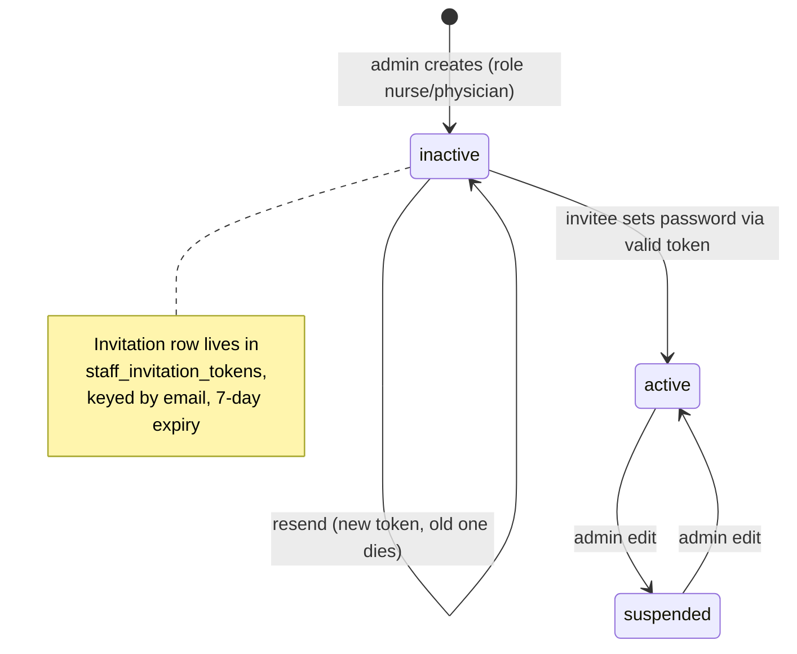

# Staff Account Invitation and Activation

> Terminology follows `docs/paper/glossary.md`. Figure and table numbers use the
> `X.n` placeholder pending final manuscript numbering.

## 1. Feature Name

Staff Account Invitation and Activation — how nurse and physician accounts are
provisioned, delivered, redeemed, revoked, and cleaned up.

## 2. Purpose

Nurses and physicians do not self-register, and **no administrator ever knows or
chooses their password**. An admin creates the account; the system mails a
one-time invitation link; the invitee sets their own password, and that act is
what activates and verifies the account.

The design purpose, stated in the source itself
(`Notifications\StaffAccountInvitation` class docblock and
`Auth\StaffInvitationController` docblock), is that the plaintext invitation token
exists only in memory for the lifetime of one notification — never in the database,
never in a log, never in a queue payload, never in flashed session input.

## 3. Actors / Roles

| Actor | Involvement |
|---|---|
| Admin | Creates the account, triggering the invitation. May resend. May revoke implicitly by changing the invitee's email. |
| Nurse, Physician (invitee) | Receives the emailed link, sets a password, activates the account. Unauthenticated throughout. |
| Scheduler | Runs `auth:clear-resets staff_invitations` daily to flush expired rows. |

Patients and admins are explicitly **not** part of this flow: the invitation path
is chosen by the submitted role matching `INVITED_ROLES`, and there is no separate
flag a caller could use to opt in.

## 4. User Workflow

1. Admin submits the create-user form with role `nurse` or `physician`. The form
   shows **no password field** for any role
   (`tests/Feature/Admin/StaffAccountCreationTest.php`, "the create form no longer
   asks for a password").
2. `Admin\UserManagementController::store` detects the invited path from the
   submitted role, and inside one `DB::transaction`:
   - creates the `users` row with `account_status = 'inactive'`,
     `email_verified_at = null`, and a **discarded random password**
     (`Hash::make(Str::random(64))`), required only because `users.password` is
     `NOT NULL`;
   - calls `Password::broker('staff_invitations')->createToken($user)` and keeps
     the returned plaintext token in a local variable.
3. **After the transaction commits**, the controller sends
   `StaffAccountInvitation` synchronously. A transport failure is caught and the
   admin is warned; the committed account and invitation survive.
4. The invitee opens `GET staff/activate/{token}?email=...`.
   `StaffInvitationController::create` resolves the invitee, checks eligibility,
   and confirms the token exists before rendering the form.
5. The invitee submits a password to `POST staff/activate`. Inside a
   `DB::transaction`, the broker's `reset()` callback re-checks eligibility, then
   force-fills `password`, `account_status = 'active'`,
   `email_verified_at = now()`, and a fresh `remember_token`. The broker deletes
   the token after the callback returns.
6. The invitee is redirected to login with *"Your account is now active."*

**Resend** (`resendInvitation`) covers every dead end: an expired link, a failed
first email, a lost link, and an invitation this controller revoked when an admin
corrected the address.

## 5. Routes

| Method | URI | Name | Middleware |
|---|---|---|---|
| GET | `staff/activate/{token}` | `staff.activate` | `guest`, `throttle:6,1` |
| POST | `staff/activate` | `staff.activate.store` | `guest`, `throttle:6,1` |
| POST | `/admin/users/{user}/resend-invitation` | `admin.users.resend_invitation` | `auth`, `verified`, `throttle:30,1` |

The activation routes sit in the `guest` group in `routes/auth.php` **deliberately
outside** the `auth`+`verified` group — the invitee has no password and is not
logged in. `routes/auth.php` carries a comment saying exactly this.

## 6. Controllers

- `Auth\StaffInvitationController` — `create`, `store`, and the private `invitee`,
  `isEligible`, `reject`, `broker`.
- `Admin\UserManagementController` — `store` (issues the first invitation),
  `resendInvitation`, `update` (revokes on email change), `invitationStates`
  (listing display), private `broker`.

## 7. Services

**None.** This feature deliberately uses **Laravel's password broker** rather than
a bespoke service or token system. The broker is obtained through
`Password::broker('staff_invitations')` in both controllers.

## 8. Models

- `App\Models\User` — supplies `User::INVITED_ROLES = ['nurse', 'physician']` and
  `User::awaitsStaffActivation()`, the single source of truth for eligibility:

  ```php
  return $this->account_status === 'inactive'
      && in_array($this->role, self::INVITED_ROLES, true);
  ```

  Its docblock states why it is shared: activation and resend must agree, or an
  admin could issue an invitation the activation flow then refuses.

- `App\Notifications\StaffAccountInvitation` — a plain `Notification`. It does
  **not** implement `ShouldQueue`, and the token constructor parameter is marked
  `#[\SensitiveParameter]`.

## 9. Database

**Table `staff_invitation_tokens`**
(`2026_08_25_000000_create_staff_invitation_tokens_table.php`):

| Column | Type | Notes |
|---|---|---|
| `email` | string(150) | **primary key** |
| `token` | string | stored as a **hash**, never plaintext |
| `created_at` | timestamp, nullable | |

The schema is exactly these three columns because Laravel's
`DatabaseTokenRepository::getPayload()` inserts exactly these three. An extra
`NOT NULL` column would break the insert — which is why the table has no `user_id`
and why invitations are **email-keyed** rather than user-keyed.
`tests/Feature/Auth/StaffInvitationTokenTest.php` asserts this directly: *"the
token table carries no user_id, so the custom primary key is irrelevant."*

**Broker configuration** (`config/auth.php`):

| Broker | Table | Expire | Throttle |
|---|---|---|---|
| `users` (password reset) | `password_reset_tokens` | 60 minutes | 60 s |
| `staff_invitations` | `staff_invitation_tokens` | **10080 minutes (7 days)** | 60 s |

The config comment explains the separation: expiry is per-broker, so sharing the
`users` broker would stretch every password reset to seven days. The
`staff_invitations` throttle guards resend against double-clicks — the repository
reports a token created inside the window as "recently created", so a second
request seconds later is refused instead of issuing a second link and a second
email. `createToken()` ignores throttle, so account creation is unaffected.

Also used: `users.account_status`, `users.email_verified_at`, `users.password`
(`NOT NULL`, the reason a filler password exists at all).

## 10. Validation and Authorization

**Activation** (`StaffInvitationController::store`): `token` required string;
`email` required email; `password` required, confirmed, `Rules\Password::defaults()`.

**Creation** (`Admin\UserManagementController::store`): on the invited path,
`account_status` is `['nullable', 'in:inactive']` — an admin **may not**
pre-activate an invited account. On the non-invited path, `password` becomes
required and `account_status` may be `active` or `inactive`.

**Authorization:**

- Admin actions go through the private `authorizeAdmin()`, which aborts 403 unless
  `Auth::user()->role === 'admin'`. No policy is involved.
- Activation is authorized by **token possession plus eligibility**, never by
  submitted input. `isEligible()` reads the stored record and *"deliberately never
  consults the submitted role"*.
- `resendInvitation` resolves the target purely by route-model binding and reads
  role and status from the row. `StaffInvitationResendTest.php` asserts that *"a
  submitted role or status cannot influence authorization or eligibility"* and
  that *"a submitted user id or email cannot retarget the invitation."*

## 11. Business Rules

| # | Rule | Enforced by | Enforcement type |
|---|---|---|---|
| BR-1 | Only an inactive nurse or physician may be activated | `User::awaitsStaffActivation()` via `isEligible()` | **Application** |
| BR-2 | The plaintext token is never persisted | `createToken()` stores a hash; the plaintext is held in a local variable and passed straight to the notification | **Application + framework** |
| BR-3 | The invitation notification must stay synchronous | `StaffAccountInvitation` does not implement `ShouldQueue`; `QUEUE_CONNECTION=database` would otherwise serialize the token into `jobs.payload` | **Application**, asserted by test |
| BR-4 | Account and invitation are written atomically | `DB::transaction` in `store()` wrapping both writes | **Application (transaction)** |
| BR-5 | Mail is sent only after commit, and a transport failure never rolls back | `try/catch (Throwable)` placed after the transaction returns | **Application** |
| BR-6 | Only the exception class is logged, never its message | `Log::error(..., ['exception' => $exception::class])` — Symfony transport failures embed the SMTP username | **Application** |
| BR-7 | Exactly one invitation per address is ever valid | `createToken()` deletes the previous row before inserting | **Application + database** (`email` is the primary key, so two rows cannot coexist) |
| BR-8 | Resend re-checks eligibility **under a row lock** | `DB::transaction` + `User::where(...)->lockForUpdate()->first()`, then re-checking `awaitsStaffActivation()` | **Application (pessimistic lock)** |
| BR-9 | Changing a pending invitee's email revokes their invitation first | `update()` calls `deleteToken($user)` **before** `fill()`, while the model still holds the old address | **Application** |
| BR-10 | An admin cannot flip a pending staff account to active | `update()` throws a `ValidationException` when activating an unverified invited role | **Application** |
| BR-11 | Every rejection returns one indistinguishable message | `StaffInvitationController::REJECTION` | **Application** |
| BR-12 | Expired rows are flushed daily | `auth:clear-resets staff_invitations` on the scheduler | **Application + scheduler** |

**Database-enforced vs application-enforced.** Only BR-7 has partial database
backing, and only incidentally: `staff_invitation_tokens.email` being the primary
key makes two simultaneous rows for one address impossible. Every other rule here —
including all the security-critical ones — is application logic. A direct database
write could activate an account without ever touching this flow.

## 12. Status / State Transitions



*Figure X.2 — Staff account activation states. The invitation itself has no status
column; its state is derived from the token row's existence and `created_at`.*

**Invitation state is derived, never stored.** `invitationStates()` computes
`missing` / `pending` / `expired` from `staff_invitation_tokens.created_at` plus
the configured lifetime. Its docblock explains why: *"a column would be a second
source of truth able to drift from the tokens the activation flow actually
honours."* These three are **display states for the admin listing**, not persisted
statuses — do not present them as an enum.

## 13. Error and Edge-Case Handling

| Case | Behaviour | Evidence |
|---|---|---|
| Invalid, expired, or consumed token | Redirect to login with the single `REJECTION` message | `StaffInvitationController::create` / `reject()` |
| Already-active account | Refused — `awaitsStaffActivation()` is false | `StaffAccountActivationTest`: "an already active account cannot be activated again" |
| Suspended account | Refused; an invitation cannot resurrect it | Same file: "a suspended account cannot be resurrected by an invitation" |
| Patient submitted to the staff flow | Refused | "a patient cannot be activated through the staff invitation flow" |
| Deleted user | Refused | "a deleted user cannot be activated" |
| Token replay | Refused; the broker consumes the token | "the invitation is consumed and cannot be replayed" |
| Failure mid-activation | The whole activation rolls back, account untouched | "a failure after the account is written rolls the whole activation back" |
| Role tampering during activation | Ignored; role is never read from input | "activation cannot change the role of the user" |
| Brute-force on the activation endpoint | `throttle:6,1` on both GET and POST | `StaffInvitationHardeningTest`: the GET limiter "also covers invalid tokens" |
| Account enumeration | An unknown address and a pending staff address are indistinguishable, and probing consumes the limiter | `StaffInvitationHardeningTest` |
| Token flashed as old input after a validation failure | Prevented by `dontFlash(['token'])` | "a rejected activation does not flash the invitation token as old input" |
| Mail transport failure on create | Warning redirect, no 500; account and invitation survive | `StaffInvitationMailFailureTest` |
| Mail transport failure on resend | Warning redirect; the **new** invitation stays valid | `StaffInvitationResendTest` |
| Token-creation failure on resend | Nothing sent, no partial state | Same file |
| Double-clicked resend | Refused with a "moments ago" warning rather than issuing a second link | `recentlyCreatedToken()` check |
| Two admins resending concurrently | Serialized by `lockForUpdate()`; never two valid invitations | "serialized resends never leave two valid invitations" |
| Duplicate email at creation | Rejected, and **no invitation is left behind** | `StaffAccountCreationTest` |
| Invitation write fails | The user row is rolled back | "the user is rolled back if the invitation cannot be written" |

## 14. UI Implementation

| View | Detail |
|---|---|
| `resources/views/admin/users/create.blade.php` | Posts to `route('admin.users.store')`. Fields: `first_name`, `last_name`, `email`, a `role` select, `clsu_id`, `department`, `contact_num`, `staff_position`, `specialization`. **There is no password input in the markup at all** — confirmed by reading the view, and asserted by test. |
| `resources/views/admin/users/index.blade.php` | Renders `@php($invitation = $invitations[$user->user_id] ?? null)` per row, showing the derived invitation label. The resend form (`route('admin.users.resend_invitation', $user)`) is rendered **only inside `@if($invitation)`**, so it appears only for accounts awaiting activation. Also renders `session('status')` and `session('warning')` banners — the warning banner is how mail-failure messages surface. |
| `resources/views/auth/activate-staff-account.blade.php` | Posts to `route('staff.activate.store')` with hidden `token` and hidden `email` inputs plus `password` and `password_confirmation`. It displays the invitee's name, email, and role so they can confirm the account before setting a password. |

No Alpine logic governs this feature beyond the shared password-reveal component.

## 15. Tests

This is the most heavily tested feature in the system — **9 files, 88 test cases.**

| File | Cases | Focus |
|---|---|---|
| `tests/Feature/Admin/StaffAccountCreationTest.php` | 21 | Invitation path selection, no admin-chosen password, submitted passwords ignored, rollback on token-write failure, non-admin rejection, patient/admin paths unaffected |
| `tests/Feature/Admin/StaffAccountInvitationEmailTest.php` | 13 | **Notification is not queueable**, correct recipients, activation URL contents, no temporary password in the email, 7-day statement, **plaintext token stored nowhere in the database** |
| `tests/Feature/Admin/StaffInvitationResendTest.php` | 23 | Eligibility, rotation, concurrency serialization, rate limiting, input-tampering resistance, mail failure, listing display |
| `tests/Feature/Admin/StaffInvitationRevocationTest.php` | 13 | Email-change revocation, cross-account redemption blocked, rollback, the activation guard on admin edit |
| `tests/Feature/Admin/StaffInvitationCleanupTest.php` | 6 | Scheduled cleanup, valid invitations survive, **password reset tokens never touched**, command registered on the scheduler |
| `tests/Feature/Admin/StaffInvitationMailFailureTest.php` | 6 | No 500, state survives, no leakage in the warning, safe logging |
| `tests/Feature/Auth/StaffAccountActivationTest.php` | 19 | The full activation matrix including replay, expiry, revocation, weak passwords, rollback, role tampering, rate limiting |
| `tests/Feature/Auth/StaffInvitationTokenTest.php` | 11 | Broker configured for exactly 7 days, reset broker untouched, hashed storage, expiry boundaries at ±1 minute, **the two brokers do not accept each other's tokens** |
| `tests/Feature/Auth/StaffInvitationHardeningTest.php` | 10 | Rate limiting, enumeration resistance, token not flashed |

## 16. Source-Code Evidence

| Claim | Evidence |
|---|---|
| Invitation path chosen by role | `UserManagementController::INVITED_ROLES`, `$invited = in_array($request->input('role'), self::INVITED_ROLES, true)` |
| Discarded filler password | `'password' => Hash::make(Str::random(64))` with an explanatory comment |
| Atomic account + token write | `[$user, $invitationToken] = DB::transaction(...)` |
| Mail after commit, failure caught | `try { $user->notify(...) } catch (Throwable $exception)` |
| Safe logging | `Log::error('Staff invitation email could not be sent.', ['user_id' => ..., 'exception' => $exception::class])` |
| Resend locks the row | `User::where('user_id', ...)->lockForUpdate()->first()` inside `DB::transaction` |
| Double-click guard | `$this->broker()->getRepository()->recentlyCreatedToken($user)` |
| Revoke-before-rename | `Password::broker('staff_invitations')->deleteToken($user)` before `$user->fill($validated)` |
| Activation guard on admin edit | `ValidationException::withMessages(['account_status' => ...])` in `update()` |
| Single rejection message | `StaffInvitationController::REJECTION` |
| Eligibility single source | `User::awaitsStaffActivation()` |
| Broker separation | `config/auth.php`, `passwords.staff_invitations` |
| Scheduled cleanup with explicit broker name | `routes/console.php`, `Schedule::command('auth:clear-resets staff_invitations')->daily()` |

## 17. Limitations / Gaps

| # | Limitation |
|---|---|
| S-1 | **Invitations are email-keyed, not user-keyed.** This is a forced consequence of reusing `DatabaseTokenRepository`, whose `getPayload()` inserts exactly `email`, `token`, `created_at`. It is why an email change must explicitly revoke the old invitation (BR-9); without that, the old link would remain redeemable against whoever is next assigned that address. The mitigation is application logic, not a constraint. |
| S-2 | **The scheduled cleanup only runs if the scheduler runs.** `auth:clear-resets staff_invitations` is registered in `routes/console.php` but fires only when `schedule:run` or `schedule:work` is actually invoked. On a deployment without cron, expired rows accumulate. They are still unusable — expiry is checked at redemption — so this is a hygiene issue, not a security hole. |
| S-3 | **The broker name is load-bearing.** Omitting `staff_invitations` from the `auth:clear-resets` argument would target `password_reset_tokens` instead. A test asserts the cleanup never touches password reset tokens, but the safety depends on one string in `routes/console.php`. |
| S-4 | **`INVITED_ROLES` is duplicated.** The same list exists as `User::INVITED_ROLES` and as the private `UserManagementController::INVITED_ROLES`. The controller's copy carries a comment saying it is "kept in step with StaffInvitationController", but nothing enforces that they stay equal. |
| S-5 | **No database-level guarantee of the invitation invariants.** Eligibility, single-valid-invitation, and the no-pre-activation rule are all application logic. The `email` primary key prevents duplicate rows for one address; nothing else is constrained. |
| S-6 | **No audit trail.** There is no record of which admin issued or resent an invitation, or when an account was activated beyond `email_verified_at`. Invitation state is derived and disappears once the token is consumed or cleaned up. |
