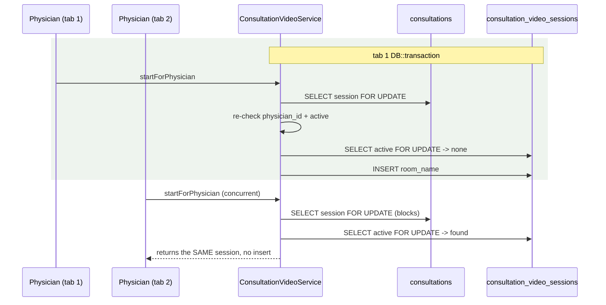
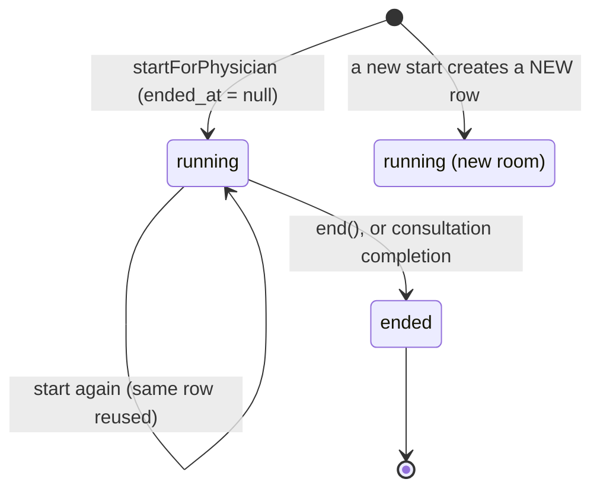

# Video Consultation

> Terminology follows `docs/paper/glossary.md`. Figure and table numbers use the
> `X.n` placeholder pending final manuscript numbering. **No credential value
> appears in this document — only configuration variable names.**

## 1. Feature Name

Video Consultation — a Jitsi-as-a-Service (8x8 JaaS) video call inside an active
**consultation session**, opened by the assigned physician and joined by the
patient.

## 2. Purpose

To add a synchronous video channel to the consultation without building a second
authorization model. The design principle is stated in the service:

> *"The ConsultationSession lifecycle is the source of truth for whether video is
> allowed — there is deliberately no separate video status machine."*
> — `ConsultationVideoService::assertConsultationIsActive`

## 3. Actors / Roles

| Actor | Involvement |
|---|---|
| Assigned physician | Starts and ends the call. Issued a **moderator** token. |
| Patient | May join a running call. Issued a **non-moderator** token. Can never create a room. |
| Nurse | Refused at the policy layer. |

## 4. User Workflow

1. The physician clicks Start on the messaging screen → `POST .../video/start`.
2. `ConsultationVideoService::startForPhysician()` locks the session, re-checks the
   assignment and active status, and either reuses the running video session or
   creates one with a fresh random room name.
3. The response carries everything the browser needs to boot the Jitsi IFrame —
   domain, prefixed room name, a signed JWT, display name, moderator flag — **and
   nothing more**.
4. The patient's presence poll reports `video.active: true`; a join affordance
   appears. Clicking it calls `POST .../video/join`, which **never creates** a room.
5. Either the physician clicks End (`POST .../video/end`), or the consultation is
   completed, which ends the call inside the completion transaction.

## 5. Routes

| Method | URI | Name | Middleware |
|---|---|---|---|
| POST | `/consultation-sessions/{session}/video/start` | `consultations.video.start` | `throttle:30,1` |
| POST | `/consultation-sessions/{session}/video/join` | `consultations.video.join` | `throttle:30,1` |
| POST | `/consultation-sessions/{session}/video/end` | `consultations.video.end` | — |

Start and join are throttled; end is not.

## 6. Controllers

`ConsultationVideoController::start`, `::join`, `::end`, plus private
`joinPayload`, `isAssignedPhysician`, `displayNameFor`.

## 7. Services

**`ConsultationVideoService`** — owns the lifecycle; every write locks the parent
`consultations` row first. Its docblock explains the choice: *"That row always
exists, so it serialises correctly on every driver — unlike locking the video row,
which may not exist yet and therefore cannot reliably block a concurrent insert.
This is the same pattern ConsultationOwnershipService uses."*

**`JitsiService`** — stateless token minting and room-name generation. *"It never
touches the database and never decides who is allowed into a room."*

## 8. Models

`App\Models\ConsultationVideoSession` — `belongsTo` the consultation session,
`isActive()` = `ended_at === null`.

`ConsultationSession::videoSessions()` (all, newest first) and
`::activeVideoSession()` — a `hasOne` filtered by `whereNull('ended_at')`.

## 9. Database

**`consultation_video_sessions`** (`2026_08_24_120000`):

| Column | Type | Notes |
|---|---|---|
| `id` | bigint | PK |
| `consultation_id` | FK → `consultations.id` | cascade on delete |
| `room_name` | string | **unique** |
| `ended_at` | dateTime, nullable | null ⇒ the call is running |
| `created_at`, `updated_at` | | |

**Index** on `(consultation_id, ended_at)` — supporting the active-session lookup.

The **unique index on `room_name`** is the only database-level protection in this
feature, and `JitsiService::generateRoomName()`'s docblock names it explicitly as
*"the final arbiter"* behind 128 bits of CSPRNG entropy.

**Configuration** (`config/services.php`, variable names only): `jitsi.domain`
(default `8x8.vc`), `jitsi.app_id`, `jitsi.api_key_id`, `jitsi.private_key`, and
`jitsi.jwt_ttl` (1800 seconds). The private key is read through `env()` with
literal `\n` sequences converted to real newlines.

## 10. Validation and Authorization

No request body is validated — all three endpoints take only the route-bound
session.

Authorization is by **policy**, and the policy chain is deliberately layered:

```php
public function joinVideo(User $user, ConsultationSession $session): bool
{
    return $this->sendMessage($user, $session);
}

public function startVideo(User $user, ConsultationSession $session): bool
{
    return $this->joinVideo($user, $session)
        && $user->role === 'physician'
        && (int) $session->physician_id === (int) $user->user_id;
}
```

`joinVideo` delegates to `sendMessage` **rather than `viewMessaging`** on purpose —
the docblock says *"viewMessaging also permits completed sessions, which must never
open or re-enter a room."* So video requires `consultation_status === 'active'`,
while reading messages does not.

`end` authorizes `startVideo`, making it physician-only too.

The service then **re-checks under the lock**: *"Re-checked under the lock: the
policy ran against a possibly stale model."*

## 11. Business Rules

| # | Rule | Enforced by | Enforcement type |
|---|---|---|---|
| BR-1 | Only the assigned physician may create a room | `startVideo` policy **and** a re-check under the lock | **Application (policy + lock)** |
| BR-2 | A patient may join but never create | `join()` returns 409 when `activeFor()` is null | **Application** |
| BR-3 | Video requires an `active` session **and** an `active` request | `assertConsultationIsActive()` checks both | **Application** |
| BR-4 | Nurses are excluded | Policy chain begins at `viewMessaging` | **Application (policy)** |
| BR-5 | At most one running video session per consultation | `activeVideoSession()->lockForUpdate()->first()` then reuse | **Application (lock)** |
| BR-6 | Room names are unique | Unique index on `room_name` | **Database** |
| BR-7 | Room names cannot carry identifying information | `bin2hex(random_bytes(16))` — pure lowercase hex | **Application (structural)** |
| BR-8 | The JWT grants access to exactly one room | `room` claim set to the bare name | **Application** |
| BR-9 | The JWT `room` claim uses the bare name; only the client identifier is prefixed | `issueToken()` vs `iframeRoomName()` | **Application** |
| BR-10 | Ending is idempotent | `end()` returns false when nothing is running | **Application** |
| BR-11 | Completing a consultation ends the call in the same transaction | `complete()` calls `$videoSessions->end()` last, inside its transaction | **Application (transaction)** |
| BR-12 | A passive poll never exposes a credential | `presence()` returns only `video.active` | **Application** |

BR-6 is the only database-enforced rule.

## 12. Concurrency

Both writes follow the project's lock-the-parent pattern:



*Figure X.17 — Two concurrent starts. Locking the always-present parent row is what
serialises them; the unique index on `room_name` is the backstop.*

Proven by test: *"cannot create a duplicate active video session from repeated
concurrent starts"* and *"locks the parent consultation session before reading the
active video session."*

## 13. Status / State Transitions

There is **no video status column**. State is derived from `ended_at`:



*Figure X.18 — Video session lifecycle. Ending is terminal for a row; starting again
creates a new row with a new room name — tested as "starts a brand new room after
the previous one was ended."*

## 14. Error and Edge-Case Handling

| Case | Response | Test |
|---|---|---|
| Unassigned physician starts | 403 | *"refuses to let an unassigned physician start"* |
| Patient starts | 403 | *"refuses to let a patient start a video consultation"* |
| Nurse starts or joins | 403 | *"refuses to let a nurse start or join"* |
| Patient joins before the physician starts | **409 Conflict**, and nothing is created | *"refuses to let the patient join before the physician has started, and creates nothing"* |
| Patient joins another patient's consultation | 403 | dedicated test |
| Video on a completed consultation | Refused | *"refuses video on a completed consultation"* |
| Video on a scheduled consultation | Refused | *"refuses video on a scheduled consultation that has not started"* |
| Physician starts twice | The existing session is reused | *"reuses the existing active video session"* |
| Patient ends | 403 | *"refuses to let a patient end"* |
| Guest on any endpoint | Refused | *"requires authentication for every video endpoint"* |
| Completion with no video session | Completes, creating none | `ConsultationCompletionVideoTest` |
| Completion rolls back | The video closure rolls back with it | *"rolls back the video closure when the completion transaction fails"* |
| Another consultation's call | Untouched | two dedicated tests |
| Takeover mid-schedule | Video authorization moves to the claimant | `PhysicianTakeoverTest` |
| Missing credential | *"fails loudly without naming the value when a credential is missing"* | `JitsiServiceTest` |
| Unparseable private key | Rejected *"without echoing it"* | `JitsiServiceTest` |

## 15. UI Implementation

Inside `messaging.blade.php`. Every claim below is asserted by
`ConsultationVideoJoinUiTest`:

- `videoActive` initialises to **false** and is **never seeded from the server**.
- The join affordance is gated on `videoActive`, and the page **never joins
  automatically**.
- Join is wired to the real authorized `/video/join` route, *"not a bypass"*.
- The Jitsi client is constructed **only** inside an authorized start/join success
  path — never on page load and never from the presence poll.
- The page reads **only the `active` boolean** from presence, *"never a room or
  credential field"*.
- The rendered page **never embeds a Jitsi credential or hard-coded app
  identifier**.
- `videoActive` resets to false at the point the consultation is marked completed.
- An in-progress call is torn down if presence reports the session is no longer
  active.
- The start affordance is offered to the **assigned physician only**.
- Start joins the room immediately; End tears the call down locally.

The card is shown by
`x-show="!inVideoCall && consultationStatus === 'active' && (isAssignedPhysician || videoActive)"`
— so a patient sees nothing at all until the physician has started.

## 16. Tests

**6 files, 74 cases** — the best-tested feature in the system alongside staff
invitations.

| File | Cases | Focus |
|---|---|---|
| `ConsultationVideoAccessTest.php` | 16 | Every authorization and state refusal, reuse, concurrency, follow-up isolation, end, restart, guest |
| `JitsiServiceTest.php` | 19 | RS256 signing verified against a public key, every claim, moderator flag, room-name entropy, **no key leakage**, **nothing written to the log**, failure modes |
| `ConsultationVideoJoinUiTest.php` | 12 | The entire client-side security posture listed above |
| `ConsultationCompletionVideoTest.php` | 11 | Completion closes the call atomically, history preserved, idempotency, isolation, rollback |
| `ConsultationVideoPresenceTest.php` | 9 | The `active` boolean only, no credential exposure, per-session isolation |
| `ConsultationVideoSessionTest.php` | 7 | History ordering, active detection, parent locking, unique room name, cascade delete, follow-up rooms |
| `JitsiConfigTest.php` | 5 | Expected keys, TTL, credentials resolve as strings, private key parses as PEM |

`JitsiConfigTest` is written so a failing assertion cannot print a secret — it
checks key presence, types, and PEM parseability rather than values.

## 17. Source-Code Evidence

| Claim | Evidence |
|---|---|
| No separate video status machine | `ConsultationVideoService::assertConsultationIsActive` docblock |
| Lock the parent, not the child | `ConsultationVideoService` class docblock |
| Re-check after the policy | `if ((int) $lockedSession->physician_id !== (int) $physician->user_id)` with its comment |
| Join never creates | `ConsultationVideoController::join` docblock and the 409 branch |
| Payload carries nothing extra | `joinPayload()` docblock: *"No app id, no api key id, no key material."* |
| Bare vs prefixed room name | `iframeRoomName()` docblock |
| Room-name entropy and lowercase | `generateRoomName()` docblock |
| Clock-skew backdating | `NBF_SKEW_SECONDS = 10` |
| Moderator flag | `'moderator' => $isModerator ? 'true' : 'false'` |
| Presence exposes only a boolean | The comment in `ConsultationMessageController::presence` |
| Completion ends the call inside the transaction | `complete()`'s final statement and its comment |

## 18. Limitations / Gaps

| # | Limitation |
|---|---|
| VC-1 | **The system depends on an external third party for its headline clinical feature.** 8x8 JaaS hosts every call. There is no fallback, no self-hosted Jitsi option, and no degraded mode — if JaaS is unreachable or the account lapses, video consultation stops entirely while messaging continues. |
| VC-2 | **JWT lifetime is fixed at 1800 seconds and is not configurable by environment.** `jwt_ttl => 1800` is a literal in `config/services.php`, not an `env()` call. A consultation running past 30 minutes relies on the client's already-joined session rather than a refreshed token; nothing re-issues one. |
| VC-3 | **No call metadata is recorded.** The table stores only the room name and start/end timestamps. There is no participant list, no join/leave events, no duration analytics, and no recording reference — so "how long was the video consultation?" is answerable only as `ended_at - created_at`, which measures the room's lifetime, not attendance. |
| VC-4 | **`end` is not throttled** while `start` and `join` are (`throttle:30,1`). The asymmetry appears deliberate but is undocumented. |
| VC-5 | **Ending is physician-only, and nothing ends an abandoned call.** If the physician closes their browser without clicking End and without completing the consultation, the row keeps `ended_at = null` indefinitely. There is no expiry command for video sessions — unlike intake sessions, which have `consultations:expire-intake-sessions`. The consultation's own completion is the only other closure path. |
| VC-6 | **A JaaS room outlives the token.** Ending the session marks `ended_at` in this database, but nothing tells 8x8 to terminate the room. Participants already inside may remain connected; the application simply stops offering entry. |
| VC-7 | **Room-name uniqueness relies on entropy plus a unique index, with no retry.** `generateRoomName()` deliberately does not consult the database. A collision — cryptographically negligible at 128 bits — would surface as an unhandled unique-constraint violation rather than a regenerate-and-retry. The test *"rejects a jitsi room name that is already in use"* confirms the index rejects it; nothing catches it. |
